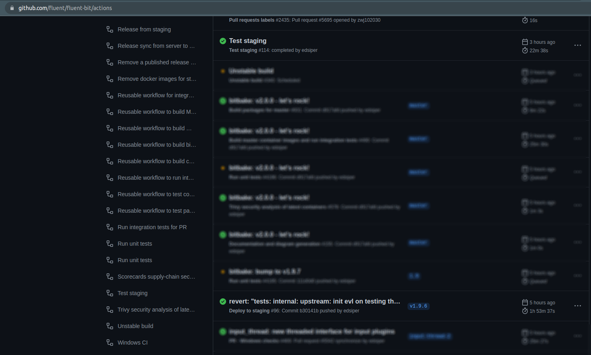
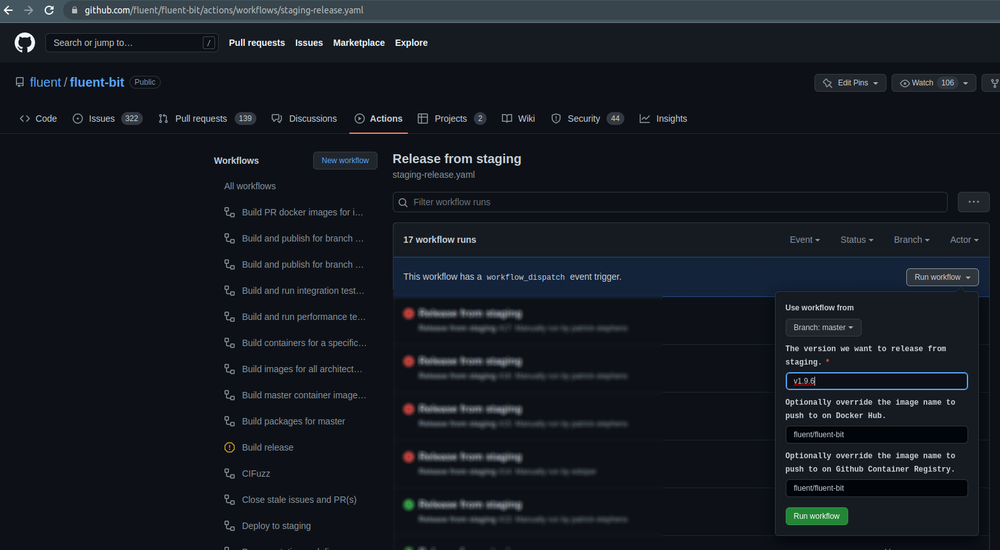
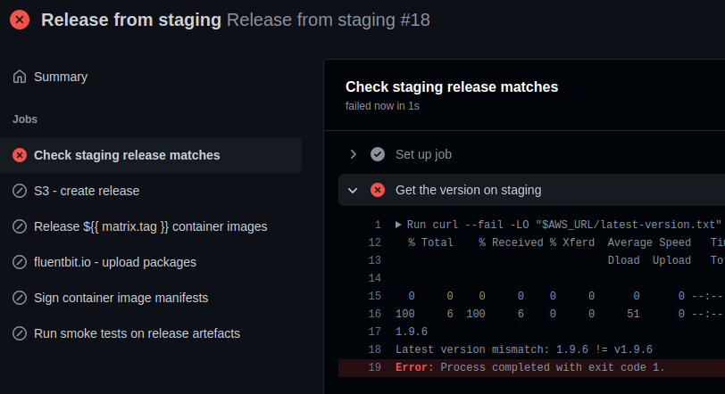
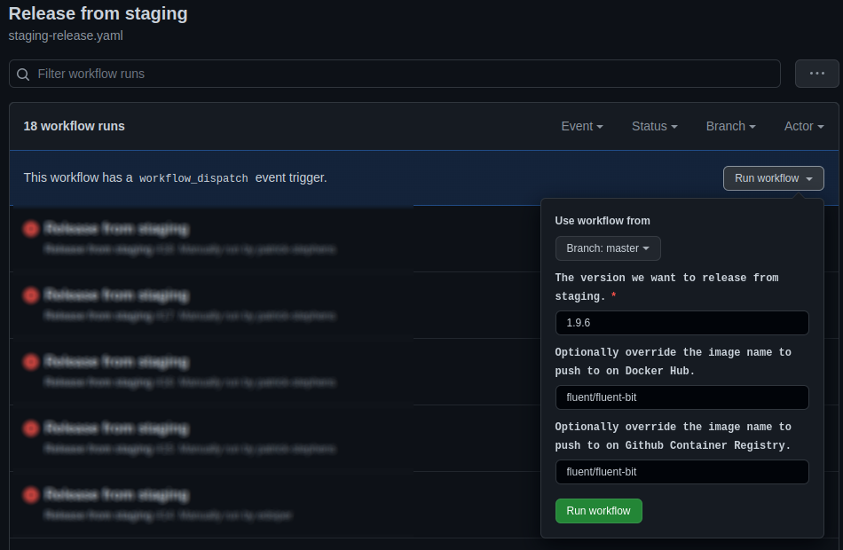
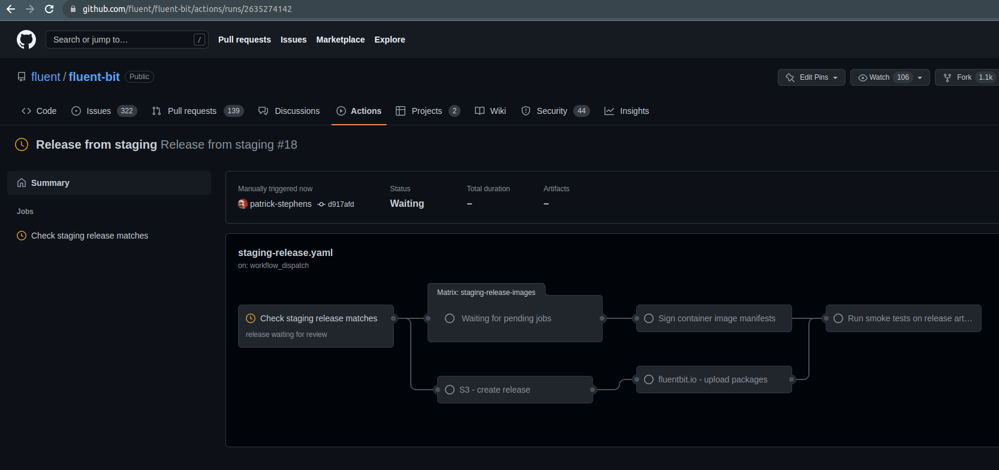
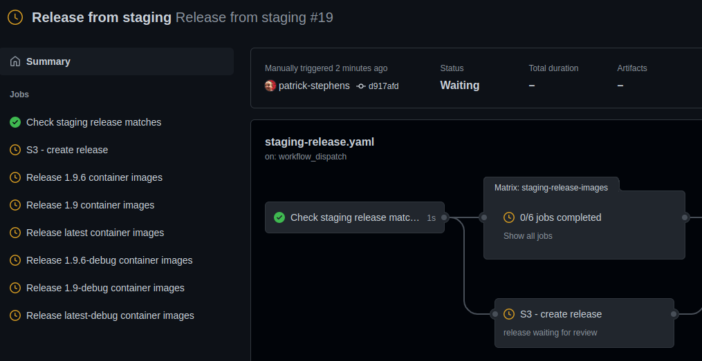

# Available workflows

| Workflow file                                         | Description               | Run event                                         |
| :---------------------------------------------------- | ------------------------  | ------------------------------------------------- |
| [build-master-packages](./build-master-packages.yaml) | Builds packages using `master` for certain targets | on new commit/push on master / manual |
| [cron-unstable-build](./cron-unstable-build.yaml) | Automated nightly builds of each supported branch | Scheduled/manual trigger |
| [master-integration-test](./master-integration-test.yaml)     | Runs the integration testing suite on master | on new commit/push on master |
| [staging-build](./staging-build.yaml)            | Builds the distro packages and docker images from a tagged release into staging (S3 and GHCR) | on new release/tag |
| [staging-test](./staging-test.yaml)            | Test the staging distro packages and docker images| manually or when `staging-build` completes successfully |
| [staging-release](./staging-release.yaml)        | Publishes the docker images/manifest on hub.docker.io/fluent/ and the distro packages | manual approval |
| [pr-closed-docker](./pr-closed-docker.yaml)      | Removes docker images for PR on hub.docker.io/fluentbitdev/| on pr closed|
| [pr-compile-check](./pr-compile-check.yaml)      | Runs some compilation sanity checks on a PR |
| [pr-integration-test](./pr-integration-test.yaml)     | Runs the integration testing suite on a PR branch | pr opened / label created 'ok-to-test' / on new commit/push on PR(s) |
| [pr-package-tests](./pr-package-tests.yaml)     | Runs the package build for all targets on a PR branch | pr opened / label created 'ok-package-test' / on new commit/push on PR(s) |
| [pr-perf-test](./pr-integration-test.yaml)     | Runs the performance testing suite on a PR branch | pr opened / label created 'ok-to-performance-test' / on new commit/push on PR(s) |
| [pr-stale](./pr-stale.yaml)                      | Closes stale PR(s) with no activity in 30 days | scheduled daily 01:30 AM UTC|
| [unit-tests](./unit-tests.yaml)     | Runs the unit tests suite on master push or new PR | PR opened, merge in master branch |

## Available labels

| Label name | Description |
| :----------|-------------|
| docs-required| default tag used to request documentation, has to be removed before merge |
| ok-package-test | Build for all possible targets |
| ok-to-test | run all integration tests |
| ok-to-merge | run mergebot and merge (rebase) current PR |
| ci/integration-docker-ok | integration test is able to build docker image |
| ci/integration-gcp-ok | integration test is able to run on GCP |
| long-term | long running pull request, don't close |
| exempt-stale | prevent stale checks running |

## Required secrets

* AWS_ACCESS_KEY_ID
* AWS_SECRET_ACCESS_KEY
* AWS_S3_BUCKET_STAGING
* AWS_S3_BUCKET_RELEASE
* GPG_PRIVATE_KEY
* GPG_PRIVATE_KEY_PASSPHRASE

These are only required for Cosign of the container images, will be skipped if not present:

* COSIGN_PRIVATE_KEY
* COSIGN_PRIVATE_KEY_PASSWORD - if set otherwise not required

## Environments

These environments are used:

* `unstable` for all nightly builds
* `staging` for all staging builds
* `release` for running the promotion of staging to release, this can have additional approvals added

If an environment is not present then it will be created but this may not have the appropriate permissions then.

## Pushing to Github Container Registry

Github actions require specific permissions to push to packages, see: <https://github.community/t/403-error-on-container-registry-push-from-github-action/173071/39>
For some reason this is not automatically done via permission inheritance or similar.

1. Verify you can push with a simple test, e.g. `docker pull alpine && docker tag alpine:latest ghcr.io/<repo>/fluent-bit:latest && docker push ghcr.io/<repo>/fluent-bit:latest`
2. Once this is working locally, you should then be able to set up action permissions for the repository. If you already have a package no need to push a test one.
3. Go to `https://github.com/users/USER/packages/container/fluent-bit/settings` and ensure the repository has access to `Write`.

## Version-specific targets

Each major version (e.g. 1.8 & 1.9) supports different targets to build for, e.g. 1.9 includes a CentOS 8 target and 1.8 has some other legacy targets.

This is all handled by the [build matrix generation composite action](../actions/generate-package-build-matrix/action.yaml).
This uses a [JSON file](../../packaging/build-config.json) to specify the targets so ensure this is updated.
The build matrix is then fed into the [reusable job](./call-build-linux-packages.yaml) that builds packages which will then fire for the appropriate targets.
The reusable job is used for all package builds including unstable/nightly and the PR `ok-package-test` triggered ones.

## Releases

The process at a high level is as follows:

1. Tag created with `v` prefix.
2. [Deploy to staging](https://github.com/fluent/fluent-bit/actions/workflows/staging-build.yaml) workflow runs.
3. [Test staging](https://github.com/fluent/fluent-bit/actions/workflows/staging-test.yaml) workflow runs.
4. Manually initiate [release from staging](https://github.com/fluent/fluent-bit/actions/workflows/staging-release.yaml) workflow.
5. A PR is auto-created to increment the minor version now for Fluent Bit using the [`update_version.sh`](../../update_version.sh) script.
6. Create PRs for doc updates - Windows & container versions. (WIP to automate).

Breaking the steps down.

### Deploy to staging and test

This should run automatically when a tag is created matching the `v*` regex.
It currently copes with 1.8+ builds although automation is only exercised for 1.9+ releases.

Once this is completed successfully the staging tests should also run automatically.

If both complete successfully then we are good to go.

Occasional failures are seen with package builds not downloading dependencies (CentOS 7 in particular seems bad for this).
A re-run of failed jobs should resolve this.

The workflow builds all Linux, macOS and Windows targets to a staging S3 bucket plus the container images to ghcr.io.

### Release from staging workflow

This is a manually initiated workflow, the intention is multiple staging builds can happen but we only release one.
Note that currently we do not support parallel staging builds of different versions, e.g. master and 1.9 branches.
**We can only release the previous staging build and there is a check to confirm version.**

Ensure AppVeyor build for the tag has completed successfully as well.

To trigger: <https://github.com/fluent/fluent-bit/actions/workflows/staging-release.yaml>

All this job does is copy the various artefacts from staging locations to release ones, it does not rebuild them.

With this example you can see we used the wrong `version` as it requires it without the `v` prefix (it is used for container tag, etc.) and so it fails.

Make sure to provide without the `v` prefix.

Once this workflow is initiated you then also need to have it approved by the designated "release team" otherwise it will not progress.

They will be notified for approval by Github.
Unfortunately it has to be approved for each job in the sequence rather than a global approval for the whole workflow although that can be useful to check between jobs.

This is quite useful to delay the final smoke test of packages until after the manual steps are done as it will then verify them all for you.

#### Packages server sync

The workflow above ensures all release artefacts are pushed to the appropriate container registry and S3 bucket for official releases.
The packages server then periodically syncs from this bucket to pull down and serve the new packages so there may be a delay (up to 1 hour) before it serves the new versions.
The syncs happen hourly.
See <https://github.com/fluent/fluent-bit-infra/blob/main/terraform/provision/package-server-provision.sh.tftpl> for details of the dedicated packages server.

The main reason for a separate server is to accurately track download statistics.
Container images are handled by ghcr.io and Docker Hub, not this server.

#### Transient container publishing failures

The parallel publishing of multiple container tags for the same image seems to fail occasionally with network errors, particularly more for ghcr.io than DockerHub.
This can be resolved by just re-running the failed jobs.

#### Windows builds from AppVeyor

This is automated, however confirm that the actual build is successful for the tag: <https://ci.appveyor.com/project/fluent/fluent-bit-2e87g/history>
If not then ask a maintainer to retrigger.

It can take a while to find the one for the specific tag...

#### ARM builds

All builds are carried out in containers and intended to be run on a valid Ubuntu host to match a standard Github Actions runner.
This can take some time for ARM as we have to emulate the architecture via QEMU.

<https://github.com/fluent/fluent-bit/pull/7527> introduces support to run ARM builds on a dedicated [actuated.dev](https://docs.actuated.dev/) ephemeral VM runner.
A self-hosted ARM runner is sponsored by [Equinix Metal](https://deploy.equinix.com/metal/) and provisioned for this per the [documentation](https://docs.actuated.dev/provision-server/).
For fork workflows, this should all be skipped and run on a normal Ubuntu Github hosted runner but be aware this may take some time.

### Manual release

As long as it is built to staging we can manually publish packages as well via the script here: <https://github.com/fluent/fluent-bit/blob/master/packaging/update-repos.sh>

Containers can be promoted manually too, ensure to include all architectures and signatures.

### Create PRs

Once releases are published we need to provide PRs for the following documentation updates:

1. Windows checksums: <https://docs.fluentbit.io/manual/installation/downloads/windows#installation-packages>
2. Container versions: <https://docs.fluentbit.io/manual/installation/downloads/docker#tags-and-versions>

<https://github.com/fluent/fluent-bit-docs> is the repo for updates to docs.

Take the checksums from the release process above, the AppVeyor stage provides them all and we attempt to auto-create the PR with it.

## Unstable/nightly builds

These happen every 24 hours and [reuse the same workflow](./cron-unstable-build.yaml) as the staging build so are identical except they skip the upload to S3 step.
This means all targets are built nightly for `master` and `2.1` branches including container images and Linux, macOS and Windows packages.

The container images are available here (the tag refers to the branch):

* [ghcr.io/fluent/fluent-bit/unstable:2.1](ghcr.io/fluent/fluent-bit/unstable:2.1)
* [ghcr.io/fluent/fluent-bit/unstable:master](ghcr.io/fluent/fluent-bit/unstable:master)
* [ghcr.io/fluent/fluent-bit/unstable:windows-2022-2.1](ghcr.io/fluent/fluent-bit/unstable:windows-2022-2.1)
* [ghcr.io/fluent/fluent-bit/unstable:windows-2022-master](ghcr.io/fluent/fluent-bit/unstable:windows-2022-master)

The Linux, macOS and Windows packages are available to download from the specific workflow run.

## Integration tests

On every commit to `master` we rebuild the [packages](./build-master-packages.yaml) and [container images](./master-integration-test.yaml).
The container images are then used to [run the integration tests](./master-integration-test.yaml) from the <https://github.com/fluent/fluent-bit-ci> repository.
The container images are available as:

* [ghcr.io/fluent/fluent-bit/master:x86_64](ghcr.io/fluent/fluent-bit/master:x86_64)

## PR checks

Various workflows are run for PRs automatically:

* [Unit tests](./unit-tests.yaml)
* [Compile checks on CentOS 7 compilers](./pr-compile-check.yaml)
* [Linting](./pr-lint.yaml)
* [Windows builds](./pr-windows-build.yaml)
* [Fuzzing](./pr-fuzz.yaml)
* [Container image builds](./pr-image-tests.yaml)
* [Install script checks](./pr-install-script.yaml)

We try to guard these to only trigger when relevant files are changed to reduce any delays or resources used.
**All should be able to be triggered manually for explicit branches as well.**

The following workflows can be triggered manually for specific PRs too:

* [Integration tests](./pr-integration-test.yaml): Build a container image and run the integration tests as per commits to `master`.
* [Performance tests](./pr-perf-test.yaml): WIP to trigger a performance test on a dedicated VM and collect the results as a PR comment.
* [Full package build](./pr-package-tests.yaml): builds all Linux, macOs and Windows packages as well as container images.

To trigger these, apply the relevant label.
