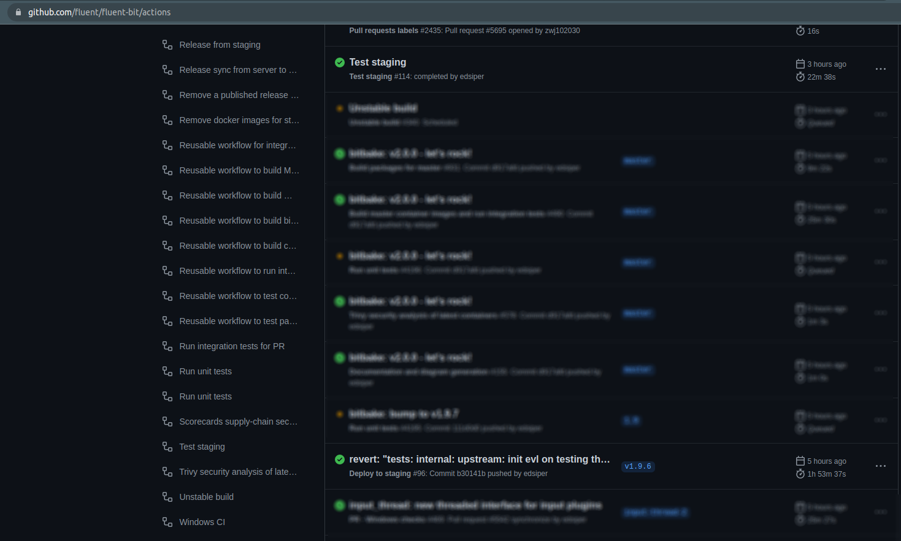
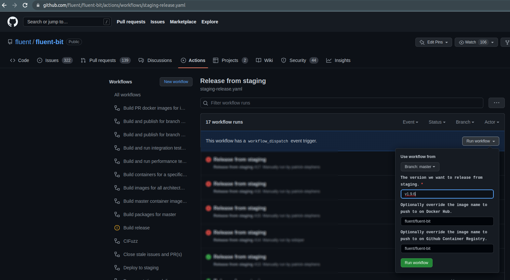
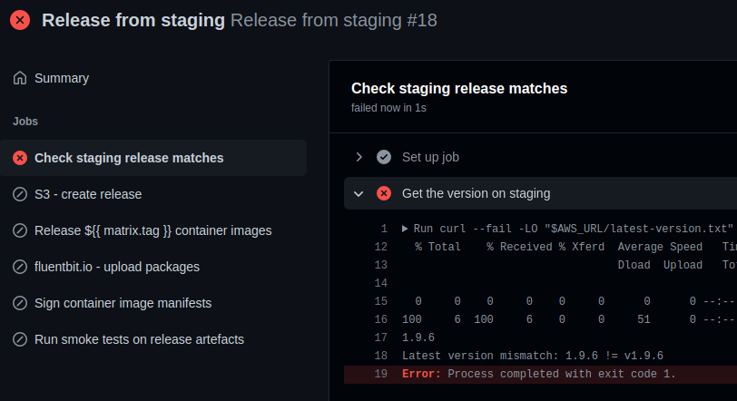
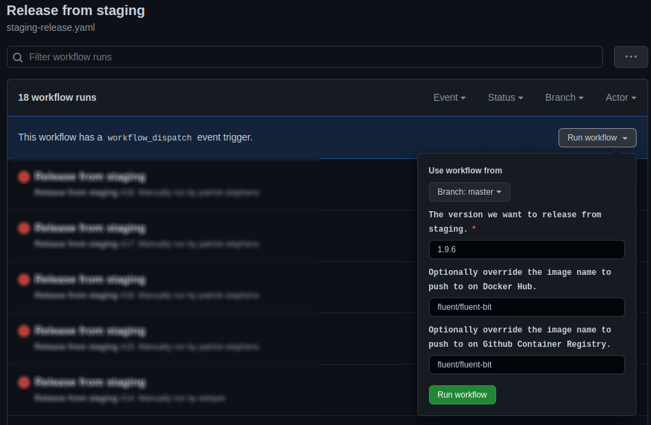
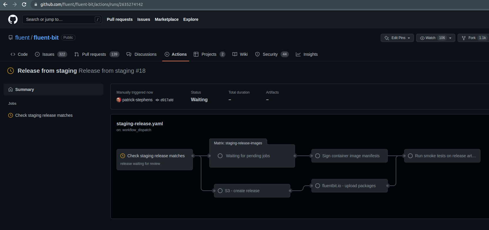
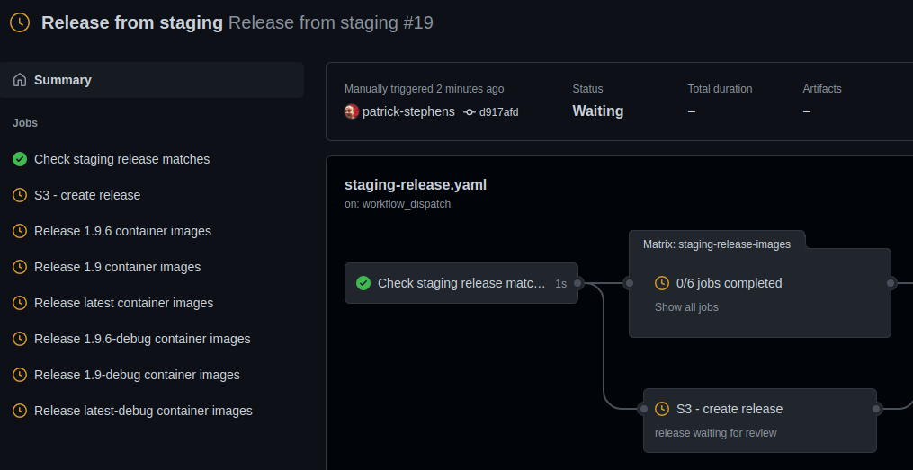

# Available workflows

| Workflow file                                         | Description               | Run event                                         |
| :---------------------------------------------------- | ------------------------  | ------------------------------------------------- |
| [build-master-packages](./build-master-packages.yaml) | Builds packages using `master` for certain targets | on new commit/push on master / manual |
| [cron-unstable-build](./cron-unstable-build.yaml) | Automated nightly builds of each supported branch | Scheduled/manual trigger |
| [master-integration-test](./master-integration-test.yaml)     | Runs the integration testing suite on master | on new commit/push on master |
| [staging-build](./staging-build.yaml)            | Builds the distro packages and docker images from a tagged release into staging (S3 and GHCR) | on new release/tag |
| [staging-test](./staging-test.yaml)            | Test the staging distro packages and docker images| manually or when `staging-build` completes successfully |
| [staging-release](./staging-release.yaml)        | Publishes the docker images/manifest on hub.docker.io/fluent/ and the distro packages | manual approval |
| [pr-closed-docker](./pr-closed-docker.yaml)      | Removes docker images for PR on hub.docker.io/fluentbitdev/| on pr closed|
| [pr-compile-check](./pr-compile-check.yaml)      | Runs some compilation sanity checks on a PR |
| [pr-integration-test](./pr-integration-test.yaml)     | Runs the integration testing suite on a PR branch | pr opened / label created 'ok-to-test' / on new commit/push on PR(s) |
| [pr-package-tests](./pr-package-tests.yaml)     | Runs the package build for all targets on a PR branch | pr opened / label created 'ok-package-test' / on new commit/push on PR(s) |
| [pr-perf-test](./pr-integration-test.yaml)     | Runs the performance testing suite on a PR branch | pr opened / label created 'ok-to-performance-test' / on new commit/push on PR(s) |
| [pr-stale](./pr-stale.yaml)                      | Closes stale PR(s) with no activity in 30 days | scheduled daily 01:30 AM UTC|
| [unit-tests](./unit-tests.yaml)     | Runs the unit tests suite on master push or new PR | PR opened, merge in master branch |

## Available labels

| Label name | Description |
| :----------|-------------|
| docs-required| default tag used to request documentation, has to be removed before merge |
| ok-package-test | Build for all possible targets |
| ok-to-test | run all integration tests |
| ok-to-merge | run mergebot and merge (rebase) current PR |
| ci/integration-docker-ok | integration test is able to build docker image |
| ci/integration-gcp-ok | integration test is able to run on GCP |
| long-term | long running pull request, don't close |
| exempt-stale | prevent stale checks running |

## Required secrets

* AWS_ACCESS_KEY_ID
* AWS_SECRET_ACCESS_KEY
* AWS_S3_BUCKET_STAGING
* AWS_S3_BUCKET_RELEASE
* GPG_PRIVATE_KEY
* GPG_PRIVATE_KEY_PASSPHRASE

These are only required for Cosign of the container images, will be skipped if not present:

* COSIGN_PRIVATE_KEY
* COSIGN_PRIVATE_KEY_PASSWORD - if set otherwise not required

## Environments

These environments are used:

* `unstable` for all nightly builds
* `staging` for all staging builds
* `release` for running the promotion of staging to release, this can have additional approvals added

If an environment is not present then it will be created but this may not have the appropriate permissions then.

## Pushing to Github Container Registry

Github actions require specific permissions to push to packages, see: <https://github.community/t/403-error-on-container-registry-push-from-github-action/173071/39>
For some reason this is not automatically done via permission inheritance or similar.

1. Verify you can push with a simple test, e.g. `docker pull alpine && docker tag alpine:latest ghcr.io/<repo>/fluent-bit:latest && docker push ghcr.io/<repo>/fluent-bit:latest`
2. Once this is working locally, you should then be able to set up action permissions for the repository. If you already have a package no need to push a test one.
3. Go to `https://github.com/users/USER/packages/container/fluent-bit/settings` and ensure the repository has access to `Write`.

## Version-specific targets

Each major version (e.g. 1.8 & 1.9) supports different targets to build for, e.g. 1.9 includes a CentOS 8 target and 1.8 has some other legacy targets.

This is all handled by the [build matrix generation composite action](../actions/generate-package-build-matrix/action.yaml).
This uses a [JSON file](../../packaging/build-config.json) to specify the targets so ensure this is updated.
The build matrix is then fed into the [reusable job](./call-build-linux-packages.yaml) that builds packages which will then fire for the appropriate targets.
The reusable job is used for all package builds including unstable/nightly and the PR `ok-package-test` triggered ones.

## Releases

The process at a high level is as follows:

1. Tag created with `v` prefix.
2. [Deploy to staging](https://github.com/fluent/fluent-bit/actions/workflows/staging-build.yaml) workflow runs.
3. [Test staging](https://github.com/fluent/fluent-bit/actions/workflows/staging-test.yaml) workflow runs.
4. Manually initiate [release from staging](https://github.com/fluent/fluent-bit/actions/workflows/staging-release.yaml) workflow.
5. A PR is auto-created to increment the minor version now for Fluent Bit using the [`update_version.sh`](../../update_version.sh) script.
6. Create PRs for doc updates - Windows & container versions. (WIP to automate).

Breaking the steps down.

### Deploy to staging and test

This should run automatically when a tag is created matching the `v*` regex.
It currently copes with 1.8+ builds although automation is only exercised for 1.9+ releases.

Once this is completed successfully the staging tests should also run automatically.



If both complete successfully then we are good to go.

Occasional failures are seen with package builds not downloading dependencies (CentOS 7 in particular seems bad for this).
A re-run of failed jobs should resolve this.

The workflow builds all Linux, macOS and Windows targets to a staging S3 bucket plus the container images to ghcr.io.

### Release from staging workflow

This is a manually initiated workflow, the intention is multiple staging builds can happen but we only release one.
Note that currently we do not support parallel staging builds of different versions, e.g. master and 1.9 branches.
**We can only release the previous staging build and there is a check to confirm version.**

Ensure AppVeyor build for the tag has completed successfully as well.

To trigger: <https://github.com/fluent/fluent-bit/actions/workflows/staging-release.yaml>

All this job does is copy the various artefacts from staging locations to release ones, it does not rebuild them.



With this example you can see we used the wrong `version` as it requires it without the `v` prefix (it is used for container tag, etc.) and so it fails.



Make sure to provide without the `v` prefix.



Once this workflow is initiated you then also need to have it approved by the designated "release team" otherwise it will not progress.



They will be notified for approval by Github.
Unfortunately it has to be approved for each job in the sequence rather than a global approval for the whole workflow although that can be useful to check between jobs.



This is quite useful to delay the final smoke test of packages until after the manual steps are done as it will then verify them all for you.

#### Packages server sync

The workflow above ensures all release artefacts are pushed to the appropriate container registry and S3 bucket for official releases.
The packages server then periodically syncs from this bucket to pull down and serve the new packages so there may be a delay (up to 1 hour) before it serves the new versions.
The syncs happen hourly.
See <https://github.com/fluent/fluent-bit-infra/blob/main/terraform/provision/package-server-provision.sh.tftpl> for details of the dedicated packages server.

The main reason for a separate server is to accurately track download statistics.
Container images are handled by ghcr.io and Docker Hub, not this server.

#### Required configuration metadata for new releases

Every release using these updated workflows must publish both files:

* `fluent-bit-schema-<version>.json`
* `fluent-bit-schema-pretty-<version>.json`

`<version>` is numeric without the tag's `v` prefix, for example `5.1.3`.
The embedded `fluent-bit.version` may have one optional `v`; the validator
normalizes that prefix explicitly. Release dispatch inputs must omit `v` because
package paths and container tags use the numeric version throughout the workflow.

These are Fluent Bit configuration metadata, not JSON Schema standard documents;
no `$schema` field is required. `.github/scripts/release_metadata.py` validates
nonempty strict JSON, `fluent-bit.version`, `schema_version`, `os`, and the plugin
catalogs `customs`, `inputs`, `filters`, and `outputs`. The `processors` catalog is
required from 4.0 onward; 2.x/3.x metadata predates that catalog. Catalog entries
must have the appropriate plugin type, unique nonempty name, description string,
and properties object. The regular and pretty variants must represent the same
JSON. Input, filter and output catalogs must be nonempty; custom and processor
catalogs may legitimately be empty.

Generation uses the immutable production manifest built for the release, without
a TTY (which can mix console output into JSON):

```sh
docker run --rm --platform linux/amd64 "$IMAGE@$DIGEST" -J > "fluent-bit-schema-$VERSION.json"
# The helper generates and validates both variants in one command:
python3 .github/scripts/release_metadata.py generate \
  --image "$IMAGE@$DIGEST" --version "$VERSION" --directory metadata
```

`staging-build` runs automatically on tags or through manual dispatch. Successful
schema generation is part of its reusable image build; artifact download,
validation and explicit uploads of both files to staging are required.
`staging-test` starts automatically only on successful staging builds. Its manual
trigger cannot publish an official release.

`staging-release` is the official manual promotion path for current and maintenance
versions (2.0, 2.1, 3.0, 3.1, 3.2, 4.0, 4.2, and 5.1 in the existing release steps).
It resolves version-specific immutable production/debug manifests, regenerates
metadata from the production image and compares it with both staged files.
It retains the validated staging files as a run artifact before any publication.
Version, series and latest Linux tags are promoted from those pinned manifests.
The public metadata gate precedes Linux, Windows, macOS, source, package-index and
container publication. GitHub release creation has an explicit dependency on that
gate, independent of the selected maintenance-series condition.

The authoritative packages URL convention is:

```text
https://packages.fluentbit.io/<version>/fluent-bit-schema-<version>.json
https://packages.fluentbit.io/<version>/fluent-bit-schema-pretty-<version>.json
```

This follows `staging-release-packages-index`'s `BASE_URL` and the version-directory
keys in `AWS_S3_BUCKET_RELEASE`. `releases.fluentbit.io` serves the separate source
release bucket and is not the configured destination for these metadata files.
The [infra sync configuration](https://github.com/fluent/fluent-bit-infra/blob/main/terraform/provision/package-server-provision.sh.tftpl)
and packages-server sync description above are operational references, not a reason
to accept authenticated S3 reads as public verification.

Both files are also attached to every GitHub release step, including maintenance
releases, with unmatched-file failures enabled and overwrite enabled for reruns:

```text
https://github.com/fluent/fluent-bit/releases/download/v<version>/fluent-bit-schema-<version>.json
https://github.com/fluent/fluent-bit/releases/download/v<version>/fluent-bit-schema-pretty-<version>.json
```

After uploading, the verifier downloads both files anonymously using curl with
curlrc disabled, HTTPS redirects only, and no authentication/cookies. It requires
successful HTTP responses, validates the downloaded JSON and version, and compares
both JSON and exact bytes against the retained publication artifact. The packages
check retries both files up to 75 times with 60-second delays, allowing the hourly
sync to catch up. Each request has a 10-second connect and 30-second total timeout;
including the subprocess deadline, the maximum retry budget is about 162 minutes.
The publication job has a 180-minute timeout. GitHub asset verification uses 10
attempts at 30-second intervals. Persistent 403/404, network errors, malformed or
stale content all fail the workflow with the exact URL and repair suggestions.
Documentation/version-update jobs require successful GitHub asset verification.
A failure after partial upload can leave public files or a GitHub release visible;
the workflow remains failed until verification succeeds.

No bucket policy or ACL is changed. Existing scoped upload credentials and public
serving/sync/CDN configuration must permit these exact version-directory JSON keys.
If production denies downloads or omits them from sync, the release fails until the
operators repair that configuration. Run promotion for maintenance versions from
the updated default-branch workflow. Before tagging on a maintained branch, adopt
the generation helper and staging changes there; if dispatching promotion from that
branch, adopt the promotion changes as well. An old branch/tag's unchanged workflow
cannot acquire this guarantee from a merge to master alone. Release environment
controls should restrict promotion to reviewed workflow refs; changing those
controls or production infrastructure is outside this patch.

Nightly (`unstable-*` prereleases), PR, and master development builds are not
official versioned releases. Their development labels can be used for generation,
but official staging and promotion do not allow that version-check exception.
The manual `packaging/update-repos.sh` recovery path with `AWS_SYNC=true` requires
`RELEASE_VERSION`, regenerates against the pinned staging image, compares staged
files, and verifies both public locations before proceeding. It preserves the
existing final dry-run behavior and does not upload metadata or change permissions.
Local repository preparation with `AWS_SYNC=false` is not a publication path.
Direct ad hoc bucket writes cannot be guarded by a repository workflow and must
not be used to declare release success.

##### Recovery without rebuilding or retagging

1. For missing/invalid staging artifacts, rerun the tagged staging build with the
   updated tooling. Confirm both explicit filenames and the embedded version.
   Do not generate from master, a debug image, or another release's image.
2. If promotion preflight reports a mismatch, inspect the staged version and image
   digest. Restore the intended immutable release image/staging artifacts; do not
   edit a version string in the JSON to make it pass.
3. For a partial S3 copy or propagation failure, repair only the affected object
   keys or serving/sync configuration, then rerun failed promotion jobs. The
   retained artifact supplies both files; explicit `s3 cp` safely overwrites each
   key and checks again. Neither wildcard sync nor deletion is used for metadata.
4. For partial GitHub asset uploads, rerun the GitHub release job. Both files are
   uploaded again with overwrite enabled and then fetched anonymously. The
   existing release is updated rather than deleted/recreated.
5. If the run artifact has expired, rerun all promotion jobs to regenerate the
   validation artifact from the intended pinned version image. Record the failure
   and repair; do not report release success while a verification job is failed.

For read-only diagnosis against downloaded run artifacts:

```sh
python3 .github/scripts/release_metadata.py validate --version 5.1.3 --directory metadata
python3 .github/scripts/release_metadata.py verify --version 5.1.3 --directory metadata --attempts 1
python3 .github/scripts/release_metadata.py verify --version 5.1.3 --directory metadata \
  --github-repository fluent/fluent-bit --attempts 1
```

##### Historical availability

This is a new-release guarantee after adoption, not a statement that previous
releases have complete metadata. Read-only probes on 2026-10-04 UTC of both
`packages.fluentbit.io/5.1.3/` JSON keys returned HTTP 404 with S3 `NoSuchKey`
responses via curl. Python HTTP requests returned 403, including for the key-file
control URL; that 403 alone does not distinguish a missing object from access or
request filtering. The v5.1.3 GitHub release API reported no attached assets, and
the expected GitHub JSON download URL returned 404. These identify historical
gaps at the configured URLs at probe time, not a complete historical inventory.
No old releases, objects, permissions, or infrastructure were modified.

##### Focused verification

```sh
python3 -m pip install PyYAML==6.0.2
python3 -m unittest discover -s .github/scripts/tests -p 'test_release_*.py' -v
actionlint -shellcheck='' .github/workflows/call-build-images.yaml \
  .github/workflows/staging-build.yaml .github/workflows/staging-release.yaml \
  .github/workflows/test-release-metadata.yaml
bash -n packaging/update-repos.sh
```

The focused CI workflow runs the same metadata/anonymous HTTP tests and dependency
checks plus actionlint. Tests cover missing/empty/malformed files, wrong versions,
missing metadata/catalog structure, mismatched variants, branch compatibility,
403/404, transient failures, content mismatch, and successful public verification.
They use a local HTTP server and test no production writes. Native plugin scenarios
and Valgrind/Leaks are not applicable to this workflow/Python-only change.

#### Transient container publishing failures

The parallel publishing of multiple container tags for the same image seems to fail occasionally with network errors, particularly more for ghcr.io than DockerHub.
This can be resolved by just re-running the failed jobs.

#### Windows builds from AppVeyor

This is automated, however confirm that the actual build is successful for the tag: <https://ci.appveyor.com/project/fluent/fluent-bit-2e87g/history>
If not then ask a maintainer to retrigger.

It can take a while to find the one for the specific tag...

#### ARM builds

All builds are carried out in containers and intended to be run on a valid Ubuntu host to match a standard Github Actions runner.
This can take some time for ARM as we have to emulate the architecture via QEMU.

<https://github.com/fluent/fluent-bit/pull/7527> introduces support to run ARM builds on a dedicated [actuated.dev](https://docs.actuated.dev/) ephemeral VM runner.
A self-hosted ARM runner is sponsored by [Equinix Metal](https://deploy.equinix.com/metal/) and provisioned for this per the [documentation](https://docs.actuated.dev/provision-server/).
For fork workflows, this should all be skipped and run on a normal Ubuntu Github hosted runner but be aware this may take some time.

### Manual release

As long as it is built to staging we can manually publish packages as well via the script here: <https://github.com/fluent/fluent-bit/blob/master/packaging/update-repos.sh>

Containers can be promoted manually too, ensure to include all architectures and signatures.

### Create PRs

Once releases are published we need to provide PRs for the following documentation updates:

1. Windows checksums: <https://docs.fluentbit.io/manual/installation/windows#installation-packages>
2. Container versions: <https://docs.fluentbit.io/manual/installation/docker#tags-and-versions>

<https://github.com/fluent/fluent-bit-docs> is the repo for updates to docs.

Take the checksums from the release process above, the AppVeyor stage provides them all and we attempt to auto-create the PR with it.

## Unstable/nightly builds

These happen every 24 hours and [reuse the same workflow](./cron-unstable-build.yaml) as the staging build so are identical except they skip the upload to S3 step.
This means all targets are built nightly for `master` and `2.1` branches including container images and Linux, macOS and Windows packages.

The container images are available here (the tag refers to the branch):

* [ghcr.io/fluent/fluent-bit/unstable:2.1](ghcr.io/fluent/fluent-bit/unstable:2.1)
* [ghcr.io/fluent/fluent-bit/unstable:master](ghcr.io/fluent/fluent-bit/unstable:master)
* [ghcr.io/fluent/fluent-bit/unstable:windows-2022-2.1](ghcr.io/fluent/fluent-bit/unstable:windows-2022-2.1)
* [ghcr.io/fluent/fluent-bit/unstable:windows-2022-master](ghcr.io/fluent/fluent-bit/unstable:windows-2022-master)

The Linux, macOS and Windows packages are available to download from the specific workflow run.

## Integration tests

On every commit to `master` we rebuild the [packages](./build-master-packages.yaml) and [container images](./master-integration-test.yaml).
The container images are then used to [run the integration tests](./master-integration-test.yaml) from the <https://github.com/fluent/fluent-bit-ci> repository.
The container images are available as:

* [ghcr.io/fluent/fluent-bit/master:x86_64](ghcr.io/fluent/fluent-bit/master:x86_64)

## PR checks

Various workflows are run for PRs automatically:

* [Unit tests](./unit-tests.yaml)
* [Compile checks on CentOS 7 compilers](./pr-compile-check.yaml)
* [Linting](./pr-lint.yaml)
* [Windows builds](./pr-windows-build.yaml)
* [Fuzzing](./pr-fuzz.yaml)
* [Container image builds](./pr-image-tests.yaml)
* [Install script checks](./pr-install-script.yaml)

We try to guard these to only trigger when relevant files are changed to reduce any delays or resources used.
**All should be able to be triggered manually for explicit branches as well.**

The following workflows can be triggered manually for specific PRs too:

* [Integration tests](./pr-integration-test.yaml): Build a container image and run the integration tests as per commits to `master`.
* [Performance tests](./pr-perf-test.yaml): WIP to trigger a performance test on a dedicated VM and collect the results as a PR comment.
* [Full package build](./pr-package-tests.yaml): builds all Linux, macOs and Windows packages as well as container images.

To trigger these, apply the relevant label.
