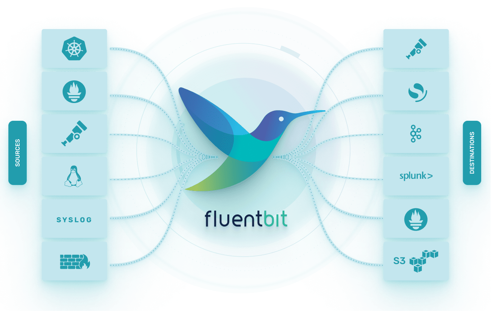

# 

### CI Status

| CI Workflow             | Status                                                                                                                                                     |
|-------------------------|-------------------------------------------------------------------------------------------------------------------------------------------------------------|
| Unit Tests (`master`)   | [](https://github.com/fluent/fluent-bit/actions/workflows/unit-tests.yaml) |
| Integration Tests       | [](https://github.com/fluent/fluent-bit/actions/workflows/master-integration-test.yaml) |
| Arm builds              | <a href="https://actuated.dev/"></img></a> |
| Latest Release Pipeline | [](https://github.com/fluent/fluent-bit/actions/workflows/staging-release.yaml) |

---

## About

[Fluent Bit](https://fluentbit.io) is a lightweight and high-performance Telemetry Agent designed to collect, process, and forward **Logs**, **Metrics**, and **Traces** from any source to any destination.

It's part of the Graduated [Fluentd](https://fluentd.org) Ecosystem and a CNCF [Cloud Native Computing Foundation](https://cncf.io) project.

Fluent Bit supports a wide array of platforms, including Linux, Windows, MacOS, BSD, and Embedded environments, and is built for maximum efficiency with minimal CPU and memory footprint.



---

## 📌 Roadmap & Maintenance

We follow a fast-paced development cycle, with major releases every 3–4 months.
The active development branch (`master`) is currently focused on **v5.0** (development).

For version-specific maintenance timelines and policies, see our [MAINTENANCE.md](https://github.com/fluent/fluent-bit/blob/master/MAINTENANCE.md).

To track upcoming milestones, visit the [project roadmap](https://github.com/fluent/fluent-bit/wiki/Fluent-Bit-Roadmap).

---

## Key Features

- ⚡ **High Performance** with low memory footprint
- 📦 **Pluggable Architecture**: 70+ built-in plugins for Inputs, Filters, and Outputs
- 🧠 **SQL Stream Processing**: Perform analytics and transformations with SQL queries
- 🔒 **Secure Networking**: Built-in TLS/SSL support and async I/O
- 📊 **Monitoring**: Expose internal metrics over HTTP/Prometheus
- 🧩 **Extensibility**:
  - Write plugins in **C**, filters in **Lua**, and outputs in **Go**
- 🔌 **Supports Logs, Metrics, and Traces** with unified processing and delivery

---

## Documentation

Our official documentation includes installation guides, plugin usage, developer resources, and more:

📚 [https://docs.fluentbit.io](https://docs.fluentbit.io)

---

## Quick Start

Build from source:

```bash
cd build
cmake ..
make
bin/fluent-bit -i cpu -o stdout -f 1
```

More details: [Build & Install](https://docs.fluentbit.io/manual/installation/downloads/source/build-and-install)

#### Requirements

- CMake >= 3.0
- Flex & Bison
- YAML and OpenSSL headers

---

## Install Fluent Bit

- [Linux packages (Debian, Ubuntu, RHEL, etc.)](https://docs.fluentbit.io/manual/installation/downloads/linux)
- [Docker images](https://docs.fluentbit.io/manual/installation/downloads/docker)
- [Windows binaries](https://docs.fluentbit.io/manual/installation/downloads/windows)

---

## Plugins: Inputs, Filters, Outputs

Fluent Bit is fully modular. It supports:

- [Input Plugins](https://docs.fluentbit.io/manual/pipeline/inputs): collect logs/metrics/traces
- [Filter Plugins](https://docs.fluentbit.io/manual/pipeline/filters): enrich and transform data
- [Output Plugins](https://docs.fluentbit.io/manual/pipeline/outputs): deliver data to external services

See the full plugin list in our [documentation](https://docs.fluentbit.io/manual/pipeline/inputs).

---

## 🚀 Production Usage

Fluent Bit is deployed **over 10 million times daily** and has surpassed **15 billion downloads**.

Used by companies like:


> Want to add your logo? [Open an issue](https://github.com/fluent/fluent-bit/issues).

---

## Contributing

Fluent Bit is open to community contributions!

- 🤝 [Join our community](https://fluentbit.io/community/)
- 🛠 [CONTRIBUTING.md](CONTRIBUTING.md)
- 🚀 [Developer Guide](DEVELOPER_GUIDE.md)

---

## Community & Contact

- 💬 [Slack](http://slack.fluentd.org) (`#fluent-bit` channel)
- 🐦 [Twitter](https://twitter.com/fluentbit)

---

## License

[Apache License v2.0](http://www.apache.org/licenses/LICENSE-2.0)

---

## Authors

Fluent Bit is a CNCF graduated project, sponsored and maintained by major cloud providers and a growing community of contributors and maintainers from across the Cloud Native ecosystem.

👉 [See Contributors](https://github.com/fluent/fluent-bit/graphs/contributors)
