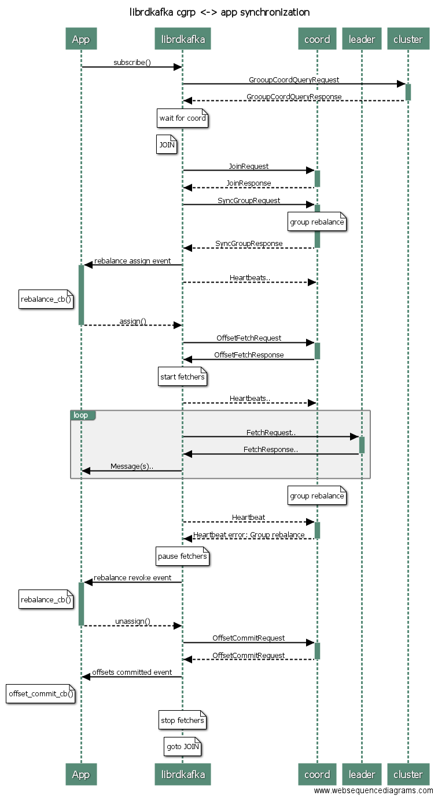

# Introduction to librdkafka - the Apache Kafka C/C++ client library


librdkafka is a high performance C implementation of the Apache
Kafka client, providing a reliable and performant client for production use.
librdkafka also provides a native C++ interface.

<!-- markdown-toc start - Don't edit this section. Run M-x markdown-toc-refresh-toc -->
**Table of Contents**

- [Introduction to librdkafka - the Apache Kafka C/C++ client library](#introduction-to-librdkafka---the-apache-kafka-cc-client-library)
    - [Performance](#performance)
        - [High throughput](#high-throughput)
        - [Low latency](#low-latency)
            - [Latency measurement](#latency-measurement)
        - [Compression](#compression)
    - [Message reliability](#message-reliability)
        - [Producer message delivery success](#producer-message-delivery-success)
        - [Producer message delivery failure](#producer-message-delivery-failure)
            - [Error: Timed out in transmission queue](#error-timed-out-in-transmission-queue)
            - [Error: Timed out in flight to/from broker](#error-timed-out-in-flight-tofrom-broker)
            - [Error: Temporary broker-side error](#error-temporary-broker-side-error)
            - [Error: Temporary errors due to stale metadata](#error-temporary-errors-due-to-stale-metadata)
            - [Error: Local time out](#error-local-time-out)
            - [Error: Permanent errors](#error-permanent-errors)
        - [Producer retries](#producer-retries)
        - [Reordering](#reordering)
        - [Idempotent Producer](#idempotent-producer)
            - [Guarantees](#guarantees)
            - [Ordering and message sequence numbers](#ordering-and-message-sequence-numbers)
            - [Partitioner considerations](#partitioner-considerations)
            - [Message timeout considerations](#message-timeout-considerations)
            - [Leader change](#leader-change)
            - [Error handling](#error-handling)
                - [RD_KAFKA_RESP_ERR_OUT_OF_ORDER_SEQUENCE_NUMBER](#rdkafkaresperroutofordersequencenumber)
                - [RD_KAFKA_RESP_ERR_DUPLICATE_SEQUENCE_NUMBER](#rdkafkaresperrduplicatesequencenumber)
                - [RD_KAFKA_RESP_ERR_UNKNOWN_PRODUCER_ID](#rdkafkaresperrunknownproducerid)
                - [Standard errors](#standard-errors)
                - [Message persistence status](#message-persistence-status)
        - [Transactional Producer](#transactional-producer)
            - [Error handling](#error-handling-1)
            - [Old producer fencing](#old-producer-fencing)
            - [Configuration considerations](#configuration-considerations)
        - [Exactly Once Semantics (EOS) and transactions](#exactly-once-semantics-eos-and-transactions)
    - [Usage](#usage)
        - [Documentation](#documentation)
        - [Initialization](#initialization)
        - [Configuration](#configuration)
            - [Example](#example)
        - [Termination](#termination)
            - [High-level KafkaConsumer](#high-level-kafkaconsumer)
            - [Producer](#producer)
            - [Admin API client](#admin-api-client)
            - [Speeding up termination](#speeding-up-termination)
        - [Threads and callbacks](#threads-and-callbacks)
        - [Brokers](#brokers)
            - [SSL](#ssl)
            - [OAUTHBEARER with support for OIDC](#oauthbearer-with-support-for-oidc)
            - [Sparse connections](#sparse-connections)
                - [Random broker selection](#random-broker-selection)
                - [Persistent broker connections](#persistent-broker-connections)
            - [Connection close](#connection-close)
            - [Fetch From Follower](#fetch-from-follower)
        - [Logging](#logging)
            - [Debug contexts](#debug-contexts)
        - [Feature discovery](#feature-discovery)
        - [Producer API](#producer-api)
        - [Simple Consumer API (legacy)](#simple-consumer-api-legacy)
            - [Offset management](#offset-management)
                - [Auto offset commit](#auto-offset-commit)
                - [At-least-once processing](#at-least-once-processing)
                - [Auto offset reset](#auto-offset-reset)
        - [Consumer groups](#consumer-groups)
            - [Static consumer groups](#static-consumer-groups)
        - [Topics](#topics)
            - [Unknown or unauthorized topics](#unknown-or-unauthorized-topics)
            - [Topic metadata propagation for newly created topics](#topic-metadata-propagation-for-newly-created-topics)
            - [Topic auto creation](#topic-auto-creation)
        - [Metadata](#metadata)
            - [< 0.9.3](#-093)
            - [> 0.9.3](#-093)
            - [Query reasons](#query-reasons)
            - [Caching strategy](#caching-strategy)
        - [Fatal errors](#fatal-errors)
            - [Fatal producer errors](#fatal-producer-errors)
            - [Fatal consumer errors](#fatal-consumer-errors)
    - [Compatibility](#compatibility)
        - [Broker version compatibility](#broker-version-compatibility)
            - [Broker version >= 0.10.0.0 (or trunk)](#broker-version--01000-or-trunk)
            - [Broker versions 0.9.0.x](#broker-versions-090x)
            - [Broker versions 0.8.x.y](#broker-versions-08xy)
            - [Detailed description](#detailed-description)
        - [Supported KIPs](#supported-kips)
        - [Supported protocol versions](#supported-protocol-versions)
- [Recommendations for language binding developers](#recommendations-for-language-binding-developers)
    - [Expose the configuration interface pass-thru](#expose-the-configuration-interface-pass-thru)
    - [Error constants](#error-constants)
    - [Reporting client software name and version to broker](#reporting-client-software-name-and-version-to-broker)
    - [Documentation reuse](#documentation-reuse)
    - [Community support](#community-support)

<!-- markdown-toc end -->


## Performance

librdkafka is a multi-threaded library designed for use on modern hardware and
it attempts to keep memory copying to a minimum. The payload of produced or
consumed messages may pass through without any copying
(if so desired by the application) putting no limit on message sizes.

librdkafka allows you to decide if high throughput is the name of the game,
or if a low latency service is required, or a balance between the two, all
through the configuration property interface.

The single most important configuration properties for performance tuning is
`linger.ms` - how long to wait for `batch.num.messages` or `batch.size` to
fill up in the local per-partition queue before sending the batch of messages
to the broker.

In low throughput scenarios, a lower value improves latency.
As throughput increases, the cost of each broker request becomes significant
impacting both maximum throughput and latency. For higher throughput
applications, latency will typically be lower using a higher `linger.ms` due
to larger batches resulting in a lesser number of requests, yielding decreased
per-message load on the broker. A good general purpose setting is 5ms.
For applications seeking maximum throughput, the recommended value is >= 50ms.


### High throughput

The key to high throughput is message batching - waiting for a certain amount
of messages to accumulate in the local queue before sending them off in
one large message set or batch to the peer. This amortizes the messaging
overhead and eliminates the adverse effect of the round trip time (rtt).

`linger.ms` (also called `queue.buffering.max.ms`) allows librdkafka to
wait up to the specified amount of time to accumulate up to
`batch.num.messages` or `batch.size` in a single batch (MessageSet) before
sending to the broker. The larger the batch the higher the throughput.
Enabling `msg` debugging (set `debug` property to `msg`) will emit log
messages for the accumulation process which lets you see what batch sizes
are being produced.

Example using `linger.ms=1`:

```
... test [0]: MessageSet with 1514 message(s) delivered
... test [3]: MessageSet with 1690 message(s) delivered
... test [0]: MessageSet with 1720 message(s) delivered
... test [3]: MessageSet with 2 message(s) delivered
... test [3]: MessageSet with 4 message(s) delivered
... test [0]: MessageSet with 4 message(s) delivered
... test [3]: MessageSet with 11 message(s) delivered
```

Example using `linger.ms=1000`:
```
... test [0]: MessageSet with 10000 message(s) delivered
... test [0]: MessageSet with 10000 message(s) delivered
... test [0]: MessageSet with 4667 message(s) delivered
... test [3]: MessageSet with 10000 message(s) delivered
... test [3]: MessageSet with 10000 message(s) delivered
... test [3]: MessageSet with 4476 message(s) delivered

```


The default setting of `linger.ms=5` is not suitable for
high throughput, it is recommended to set this value to >50ms, with
throughput leveling out somewhere around 100-1000ms depending on
message produce pattern and sizes.

These setting are set globally (`rd_kafka_conf_t`) but applies on a
per topic+partition basis.


### Low latency

When low latency messaging is required the `linger.ms` should be
tuned to the maximum permitted producer-side latency.
Setting `linger.ms` to 0 or 0.1 will make sure messages are sent as
soon as possible.
Lower buffering time leads to smaller batches and larger per-message overheads,
increasing network, memory and CPU usage for producers, brokers and consumers.

See [How to decrease message latency](https://github.com/edenhill/librdkafka/wiki/How-to-decrease-message-latency) for more info.


#### Latency measurement

End-to-end latency is preferably measured by synchronizing clocks on producers
and consumers and using the message timestamp on the consumer to calculate
the full latency. Make sure the topic's `log.message.timestamp.type` is set to
the default `CreateTime` (Kafka topic configuration, not librdkafka topic).

Latencies are typically incurred by the producer, network and broker, the
consumer effect on end-to-end latency is minimal.

To break down the end-to-end latencies and find where latencies are adding up
there are a number of metrics available through librdkafka statistics
on the producer:

 * `brokers[].int_latency` is the time, per message, between produce()
   and the message being written to a MessageSet and ProduceRequest.
   High `int_latency` indicates CPU core contention: check CPU load and,
   involuntary context switches (`/proc/<..>/status`).
   Consider using a machine/instance with more CPU cores.
   This metric is only relevant on the producer.

 * `brokers[].outbuf_latency` is the time, per protocol request
   (such as ProduceRequest), between the request being enqueued (which happens
   right after int_latency) and the time the request is written to the
   TCP socket connected to the broker.
   High `outbuf_latency` indicates CPU core contention or network congestion:
   check CPU load and socket SendQ (`netstat -anp | grep :9092`).

 * `brokers[].rtt` is the time, per protocol request, between the request being
   written to the TCP socket and the time the response is received from
   the broker.
   High `rtt` indicates broker load or network congestion:
   check broker metrics, local socket SendQ, network performance, etc.

 * `brokers[].throttle` is the time, per throttled protocol request, the
   broker throttled/delayed handling of a request due to usage quotas.
   The throttle time will also be reflected in `rtt`.

 * `topics[].batchsize` is the size of individual Producer MessageSet batches.
   See below.

 * `topics[].batchcnt` is the number of messages in individual Producer
   MessageSet batches. Due to Kafka protocol overhead a batch with few messages
   will have a higher relative processing and size overhead than a batch
   with many messages.
   Use the `linger.ms` client configuration property to set the maximum
   amount of time allowed for accumulating a single batch, the larger the
   value the larger the batches will grow, thus increasing efficiency.
   When producing messages at a high rate it is recommended to increase
   linger.ms, which will improve throughput and in some cases also latency.


See [STATISTICS.md](STATISTICS.md) for the full definition of metrics.
A JSON schema for the statistics is available in
[statistics-schema.json](src/statistics-schema.json).


### Compression

Producer message compression is enabled through the `compression.codec`
configuration property.

Compression is performed on the batch of messages in the local queue, the
larger the batch the higher likelyhood of a higher compression ratio.
The local batch queue size is controlled through the `batch.num.messages`,
`batch.size`, and `linger.ms` configuration properties as described in the
**High throughput** chapter above.


## Message reliability

Message reliability is an important factor of librdkafka - an application
can rely fully on librdkafka to deliver a message according to the specified
configuration (`request.required.acks` and `message.send.max.retries`, etc).

If the topic configuration property `request.required.acks` is set to wait
for message commit acknowledgements from brokers (any value but 0, see
[`CONFIGURATION.md`](CONFIGURATION.md)
for specifics) then librdkafka will hold on to the message until
all expected acks have been received, gracefully handling the following events:

  * Broker connection failure
  * Topic leader change
  * Produce errors signaled by the broker
  * Network problems

We recommend `request.required.acks` to be set to `all` to make sure
produced messages are acknowledged by all in-sync replica brokers.

This is handled automatically by librdkafka and the application does not need
to take any action at any of the above events.
The message will be resent up to `message.send.max.retries` times before
reporting a failure back to the application.

The delivery report callback is used by librdkafka to signal the status of
a message back to the application, it will be called once for each message
to report the status of message delivery:

  * If `error_code` is non-zero the message delivery failed and the error_code
    indicates the nature of the failure (`rd_kafka_resp_err_t` enum).
  * If `error_code` is zero the message has been successfully delivered.

See Producer API chapter for more details on delivery report callback usage.

The delivery report callback is optional but highly recommended.


### Producer message delivery success

When a ProduceRequest is successfully handled by the broker and a
ProduceResponse is received (also called the ack) without an error code
the messages from the ProduceRequest are enqueued on the delivery report
queue (if a delivery report callback has been set) and will be passed to
the application on the next invocation rd_kafka_poll().


### Producer message delivery failure

The following sub-chapters explains how different produce errors
are handled.

If the error is retryable and there are remaining retry attempts for
the given message(s), an automatic retry will be scheduled by librdkafka,
these retries are not visible to the application.

Only permanent errors and temporary errors that have reached their maximum
retry count will generate a delivery report event to the application with an
error code set.

The application should typically not attempt to retry producing the message
on failure, but instead configure librdkafka to perform these retries
using the `retries` and `retry.backoff.ms` configuration properties.


#### Error: Timed out in transmission queue

Internal error ERR__TIMED_OUT_QUEUE.

The connectivity to the broker may be stalled due to networking contention,
local or remote system issues, etc, and the request has not yet been sent.

The producer can be certain that the message has not been sent to the broker.

This is a retryable error, but is not counted as a retry attempt
since the message was never actually transmitted.

A retry by librdkafka at this point will not cause duplicate messages.


#### Error: Timed out in flight to/from broker

Internal error ERR__TIMED_OUT, ERR__TRANSPORT.

Same reasons as for `Timed out in transmission queue` above, with the
difference that the message may have been sent to the broker and might
be stalling waiting for broker replicas to ack the message, or the response
could be stalled due to networking issues.
At this point the producer can't know if the message reached the broker,
nor if the broker wrote the message to disk and replicas.

This is a retryable error.

A retry by librdkafka at this point may cause duplicate messages.


#### Error: Temporary broker-side error

Broker errors ERR_REQUEST_TIMED_OUT, ERR_NOT_ENOUGH_REPLICAS,
ERR_NOT_ENOUGH_REPLICAS_AFTER_APPEND.

These errors are considered temporary and librdkafka is will retry them
if permitted by configuration.


#### Error: Temporary errors due to stale metadata

Broker errors ERR_LEADER_NOT_AVAILABLE, ERR_NOT_LEADER_FOR_PARTITION.

These errors are considered temporary and a retry is warranted, a metadata
request is automatically sent to find a new leader for the partition.

A retry by librdkafka at this point will not cause duplicate messages.


#### Error: Local time out

Internal error ERR__MSG_TIMED_OUT.

The message could not be successfully transmitted before `message.timeout.ms`
expired, typically due to no leader being available or no broker connection.
The message may have been retried due to other errors but
those error messages are abstracted by the ERR__MSG_TIMED_OUT error code.

Since the `message.timeout.ms` has passed there will be no more retries
by librdkafka.


#### Error: Permanent errors

Any other error is considered a permanent error and the message
will fail immediately, generating a delivery report event with the
distinctive error code.

The full list of permanent errors depend on the broker version and
will likely grow in the future.

Typical permanent broker errors are:
 * ERR_CORRUPT_MESSAGE
 * ERR_MSG_SIZE_TOO_LARGE  - adjust client's or broker's `message.max.bytes`.
 * ERR_UNKNOWN_TOPIC_OR_PART - topic or partition does not exist,
                               automatic topic creation is disabled on the
                               broker or the application is specifying a
                               partition that does not exist.
 * ERR_RECORD_LIST_TOO_LARGE
 * ERR_INVALID_REQUIRED_ACKS
 * ERR_TOPIC_AUTHORIZATION_FAILED
 * ERR_UNSUPPORTED_FOR_MESSAGE_FORMAT
 * ERR_CLUSTER_AUTHORIZATION_FAILED


### Producer retries

The ProduceRequest itself is not retried, instead the messages
are put back on the internal partition queue by an insert sort
that maintains their original position (the message order is defined
at the time a message is initially appended to a partition queue, i.e., after
partitioning).
A backoff time (`retry.backoff.ms`) is set on the retried messages which
effectively blocks retry attempts until the backoff time has expired.


### Reordering

As for all retries, if `max.in.flight` > 1 and `retries` > 0, retried messages
may be produced out of order, since a sub-sequent message in a sub-sequent
ProduceRequest may already be in-flight (and accepted by the broker)
by the time the retry for the failing message is sent.

Using the Idempotent Producer prevents reordering even with `max.in.flight` > 1,
see [Idempotent Producer](#idempotent-producer) below for more information.


### Idempotent Producer

librdkafka supports the idempotent producer which provides strict ordering and
and exactly-once producer guarantees.
The idempotent producer is enabled by setting the `enable.idempotence`
configuration property to `true`, this will automatically adjust a number of
other configuration properties to adhere to the idempotency requirements,
see the documentation of `enable.idempotence` in [CONFIGURATION.md](CONFIGURATION.md) for
more information.
Producer instantiation will fail if the user supplied an incompatible value
for any of the automatically adjusted properties, e.g., it is an error to
explicitly set `acks=1` when `enable.idempotence=true` is set.


#### Guarantees

There are three types of guarantees that the idempotent producer can satisfy:

 * Exactly-once - a message is only written to the log once.
                  Does NOT cover the exactly-once consumer case.
 * Ordering - a series of messages are written to the log in the
              order they were produced.
 * Gap-less - **EXPERIMENTAL** a series of messages are written once and
              in order without risk of skipping messages. The sequence
              of messages may be cut short and fail before all
              messages are written, but may not fail individual
              messages in the series.
              This guarantee is disabled by default, but may be enabled
              by setting `enable.gapless.guarantee` if individual message
              failure is a concern.
              Messages that fail due to exceeded timeout (`message.timeout.ms`),
              are permitted by the gap-less guarantee and may cause
              gaps in the message series without raising a fatal error.
              See **Message timeout considerations** below for more info.
              **WARNING**: This is an experimental property subject to
                           change or removal.

All three guarantees are in effect when idempotence is enabled, only
gap-less may be disabled individually.


#### Ordering and message sequence numbers

librdkafka maintains the original produce() ordering per-partition for all
messages produced, using an internal per-partition 64-bit counter
called the msgid which starts at 1. This msgid allows messages to be
re-inserted in the partition message queue in the original order in the
case of retries.

The Idempotent Producer functionality in the Kafka protocol also has
a per-message sequence number, which is a signed 32-bit wrapping counter that is
reset each time the Producer's ID (PID) or Epoch changes.

The librdkafka msgid is used, along with a base msgid value stored
at the time the PID/Epoch was bumped, to calculate the Kafka protocol's
message sequence number.

With Idempotent Producer enabled there is no risk of reordering despite
`max.in.flight` > 1 (capped at 5).

**Note**: "MsgId" in log messages refer to the librdkafka msgid, while "seq"
          refers to the protocol message sequence, "baseseq" is the seq of
          the first message in a batch.
          MsgId starts at 1, while message seqs start at 0.


The producer statistics also maintain two metrics for tracking the next
expected response sequence:

 * `next_ack_seq` - the next sequence to expect an acknowledgement for, which
                    is the last successfully produced MessageSet's last
                    sequence + 1.
 * `next_err_seq` - the next sequence to expect an error for, which is typically
                    the same as `next_ack_seq` until an error occurs, in which
                    case the `next_ack_seq` can't be incremented (since no
                    messages were acked on error). `next_err_seq` is used to
                    properly handle sub-sequent errors due to a failing
                    first request.

**Note**: Both are exposed in partition statistics.


#### Partitioner considerations

Strict ordering is guaranteed on a **per partition** basis.

An application utilizing the idempotent producer should not mix
producing to explicit partitions with partitioner-based partitions
since messages produced for the latter are queued separately until
a topic's partition count is known, which would insert these messages
after the partition-explicit messages regardless of produce order.


#### Message timeout considerations

If messages time out (due to `message.timeout.ms`) while in the producer queue
there will be gaps in the series of produced messages.

E.g., Messages 1,2,3,4,5 are produced by the application.
      While messages 2,3,4 are transmitted to the broker the connection to
      the broker goes down.
      While the broker is down the message timeout expires for message 2 and 3.
      As the connection comes back up messages 4, 5 are transmitted to the
      broker, resulting in a final written message sequence of 1, 4, 5.

The producer gracefully handles this case by draining the in-flight requests
for a given partition when one or more of its queued (not transmitted)
messages are timed out. When all requests are drained the Epoch is bumped and
the base sequence number is reset to the first message in the queue, effectively
skipping the timed out messages as if they had never existed from the
broker's point of view.
The message status for timed out queued messages will be
`RD_KAFKA_MSG_STATUS_NOT_PERSISTED`.

If messages time out while in-flight to the broker (also due to
`message.timeout.ms`), the protocol request will fail, the broker
connection will be closed by the client, and the timed out messages will be
removed from the producer queue. In this case the in-flight messages may be
written to the topic log by the broker, even though
a delivery report with error `ERR__MSG_TIMED_OUT` will be raised, since
the producer timed out the request before getting an acknowledgement back
from the broker.
The message status for timed out in-flight messages will be
`RD_KAFKA_MSG_STATUS_POSSIBLY_PERSISTED`, indicating that the producer
does not know if the messages were written and acked by the broker,
or dropped in-flight.

An application may inspect the message status by calling
`rd_kafka_message_status()` on the message in the delivery report callback,
to see if the message was (possibly) persisted (written to the topic log) by
the broker or not.

Despite the graceful handling of timeouts, we recommend to use a
large `message.timeout.ms` to minimize the risk of timeouts.

**Warning**: `enable.gapless.guarantee` does not apply to timed-out messages.

**Note**: `delivery.timeout.ms` is an alias for `message.timeout.ms`.


#### Leader change

There are corner cases where an Idempotent Producer has outstanding
ProduceRequests in-flight to the previous leader while a new leader is elected.

A leader change is typically triggered by the original leader
failing or terminating, which has the risk of also failing (some of) the
in-flight ProduceRequests to that broker. To recover the producer to a
consistent state it will not send any ProduceRequests for these partitions to
the new leader broker until all responses for any outstanding ProduceRequests
to the previous partition leader has been received, or these requests have
timed out.
This drain may take up to `min(socket.timeout.ms, message.timeout.ms)`.
If the connection to the previous broker goes down the outstanding requests
are failed immediately.


#### Error handling

Background:
The error handling for the Idempotent Producer, as initially proposed
in the [EOS design document](https://docs.google.com/document/d/11Jqy_GjUGtdXJK94XGsEIK7CP1SnQGdp2eF0wSw9ra8),
missed some corner cases which are now being addressed in [KIP-360](https://cwiki.apache.org/confluence/display/KAFKA/KIP-360%3A+Improve+handling+of+unknown+producer).
There were some intermediate fixes and workarounds prior to KIP-360 that proved
to be incomplete and made the error handling in the client overly complex.
With the benefit of hindsight the librdkafka implementation will attempt
to provide correctness from the lessons learned in the Java client and
provide stricter and less complex error handling.

The follow sections describe librdkafka's handling of the
Idempotent Producer specific errors that may be returned by the broker.


##### RD_KAFKA_RESP_ERR_OUT_OF_ORDER_SEQUENCE_NUMBER

This error is returned by the broker when the sequence number in the
ProduceRequest is larger than the expected next sequence
for the given PID+Epoch+Partition (last BaseSeq + msgcount + 1).
Note: sequence 0 is always accepted.

If the failed request is the head-of-line (next expected sequence to be acked)
it indicates desynchronization between the client and broker:
the client thinks the sequence number is correct but the broker disagrees.
There is no way for the client to recover from this scenario without
risking message loss or duplication, and it is not safe for the
application to manually retry messages.
A fatal error (`RD_KAFKA_RESP_ERR_OUT_OF_ORDER_SEQUENCE_NUMBER`) is raised.

When the request is not head-of-line the previous request failed
(for any reason), which means the messages in the current request
can be retried after waiting for all outstanding requests for this
partition to drain and then reset the Producer ID and start over.


**Java Producer behaviour**:
Fail the batch, reset the pid, and then continue producing
(and retrying sub-sequent) messages. This will lead to gaps
in the message series.


##### RD_KAFKA_RESP_ERR_DUPLICATE_SEQUENCE_NUMBER

Returned by broker when the request's base sequence number is
less than the expected sequence number (which is the last written
sequence + msgcount).
Note: sequence 0 is always accepted.

This error is typically benign and occurs upon retrying a previously successful
send that was not acknowledged.

The messages will be considered successfully produced but will have neither
timestamp or offset set.


**Java Producer behaviour:**
Treats the message as successfully delivered.


##### RD_KAFKA_RESP_ERR_UNKNOWN_PRODUCER_ID

Returned by broker when the PID+Epoch is unknown, which may occur when
the PID's state has expired (due to topic retention, DeleteRercords,
or compaction).

The Java producer added quite a bit of error handling for this case,
extending the ProduceRequest protocol to return the logStartOffset
to give the producer a chance to differentiate between an actual
UNKNOWN_PRODUCER_ID or topic retention having deleted the last
message for this producer (effectively voiding the Producer ID cache).
This workaround proved to be error prone (see explanation in KIP-360)
when the partition leader changed.

KIP-360 suggests removing this error checking in favour of failing fast,
librdkafka follows suite.


If the response is for the first ProduceRequest in-flight
and there are no messages waiting to be retried nor any ProduceRequests
unaccounted for, then the error is ignored and the epoch is incremented,
this is likely to happen for an idle producer who's last written
message has been deleted from the log, and thus its PID state.
Otherwise the producer raises a fatal error
(RD_KAFKA_RESP_ERR_UNKNOWN_PRODUCER_ID) since the delivery guarantees can't
be satisfied.


**Java Producer behaviour:**
Retries the send in some cases (but KIP-360 will change this).
Not a fatal error in any case.


##### Standard errors

All the standard Produce errors are handled in the usual way,
permanent errors will fail the messages in the batch, while
temporary errors will be retried (if retry count permits).

If a permanent error is returned for a batch in a series of in-flight batches,
the sub-sequent batches will fail with
RD_KAFKA_RESP_ERR_OUT_OF_ORDER_SEQUENCE_NUMBER since the sequence number of the
failed batched was never written to the topic log and next expected sequence
thus not incremented on the broker.

A fatal error (RD_KAFKA_RESP_ERR__GAPLESS_GUARANTEE) is raised to satisfy
the gap-less guarantee (if `enable.gapless.guarantee` is set) by failing all
queued messages.


##### Message persistence status

To help the application decide what to do in these error cases, a new
per-message API is introduced, `rd_kafka_message_status()`,
which returns one of the following values:

 * `RD_KAFKA_MSG_STATUS_NOT_PERSISTED` - the message has never
   been transmitted to the broker, or failed with an error indicating
   it was not written to the log.
   Application retry will risk ordering, but not duplication.
 * `RD_KAFKA_MSG_STATUS_POSSIBLY_PERSISTED` - the message was transmitted
   to the broker, but no acknowledgement was received.
   Application retry will risk ordering and duplication.
 * `RD_KAFKA_MSG_STATUS_PERSISTED` - the message was written to the log by
   the broker and fully acknowledged.
   No reason for application to retry.

This method should be called by the application on delivery report error.


### Transactional Producer


#### Error handling

Using the transactional producer simplifies error handling compared to the
standard or idempotent producer, a transactional application will only need
to care about these different types of errors:

 * Retriable errors - the operation failed due to temporary problems,
   such as network timeouts, the operation may be safely retried.
   Use `rd_kafka_error_is_retriable()` to distinguish this case.
 * Abortable errors - if any of the transactional APIs return a non-fatal
   error code the current transaction has failed and the application
   must call `rd_kafka_abort_transaction()`, rewind its input to the
   point before the current transaction started, and attempt a new transaction
   by calling `rd_kafka_begin_transaction()`, etc.
   Use `rd_kafka_error_txn_requires_abort()` to distinguish this case.
 * Fatal errors - the application must cease operations and destroy the
   producer instance.
   Use `rd_kafka_error_is_fatal()` to distinguish this case.
 * For all other errors returned from the transactional API: the current
   recommendation is to treat any error that has neither retriable, abortable,
   or fatal set, as a fatal error.

While the application should log the actual fatal or abortable errors, there
is no need for the application to handle the underlying errors specifically.


#### Old producer fencing

If a new transactional producer instance is started with the same
`transactional.id`, any previous still running producer
instance will be fenced off at the next produce, commit or abort attempt, by
raising a fatal error with the error code set to
`RD_KAFKA_RESP_ERR__FENCED`.


#### Configuration considerations

To make sure messages time out (in case of connectivity problems, etc) within
the transaction, the `message.timeout.ms` configuration property must be
set lower than the `transaction.timeout.ms`, this is enforced when
creating the producer instance.
If `message.timeout.ms` is not explicitly configured it will be adjusted
automatically.


### Exactly Once Semantics (EOS) and transactions

librdkafka supports Exactly One Semantics (EOS) as defined in [KIP-98](https://cwiki.apache.org/confluence/display/KAFKA/KIP-98+-+Exactly+Once+Delivery+and+Transactional+Messaging).
For more on the use of transactions, see [Transactions in Apache Kafka](https://www.confluent.io/blog/transactions-apache-kafka/).

See [examples/transactions.c](examples/transactions.c) for an example
transactional EOS application.

**Warning**
If the broker version is older than Apache Kafka 2.5.0 then one transactional
producer instance per consumed input partition is required.
For 2.5.0 and later a single producer instance may be used regardless of
the number of input partitions.
See KIP-447 for more information.


## Usage

### Documentation

The librdkafka API is documented in the [`rdkafka.h`](src/rdkafka.h)
header file, the configuration properties are documented in
[`CONFIGURATION.md`](CONFIGURATION.md)

### Initialization

The application needs to instantiate a top-level object `rd_kafka_t` which is
the base container, providing global configuration and shared state.
It is created by calling `rd_kafka_new()`.

It also needs to instantiate one or more topics (`rd_kafka_topic_t`) to be used
for producing to or consuming from. The topic object holds topic-specific
configuration and will be internally populated with a mapping of all available
partitions and their leader brokers.
It is created by calling `rd_kafka_topic_new()`.

Both `rd_kafka_t` and `rd_kafka_topic_t` comes with a configuration API which
is optional.
Not using the API will cause librdkafka to use its default values which are
documented in [`CONFIGURATION.md`](CONFIGURATION.md).

**Note**: An application may create multiple `rd_kafka_t` objects and
	they share no state.

**Note**: An `rd_kafka_topic_t` object may only be used with the `rd_kafka_t`
	object it was created from.


### Configuration

To ease integration with the official Apache Kafka software and lower
the learning curve, librdkafka implements identical configuration
properties as found in the official clients of Apache Kafka.

Configuration is applied prior to object creation using the
`rd_kafka_conf_set()` and `rd_kafka_topic_conf_set()` APIs.

**Note**: The `rd_kafka.._conf_t` objects are not reusable after they have been
	passed to `rd_kafka.._new()`.
	The application does not need to free any config resources after a
	`rd_kafka.._new()` call.

#### Example

```c
    rd_kafka_conf_t *conf;
    rd_kafka_conf_res_t res;
    rd_kafka_t *rk;
    char errstr[512];

    conf = rd_kafka_conf_new();

    res = rd_kafka_conf_set(conf, "compression.codec", "snappy",
                            errstr, sizeof(errstr));
    if (res != RD_KAFKA_CONF_OK)
        fail("%s\n", errstr);

    res = rd_kafka_conf_set(conf, "batch.num.messages", "100",
                            errstr, sizeof(errstr));
    if (res != RD_KAFKA_CONF_OK)
        fail("%s\n", errstr);

    rk = rd_kafka_new(RD_KAFKA_PRODUCER, conf, errstr, sizeof(errstr));
    if (!rk) {
        rd_kafka_conf_destroy(rk);
        fail("Failed to create producer: %s\n", errstr);
    }

    /* Note: librdkafka takes ownership of the conf object on success */
```

Configuration properties may be set in any order (except for interceptors) and
may be overwritten before being passed to `rd_kafka_new()`.
`rd_kafka_new()` will verify that the passed configuration is consistent
and will fail and return an error if incompatible configuration properties
are detected. It will also emit log warnings for deprecated and problematic
configuration properties.


### Termination

librdkafka is asynchronous in its nature and performs most operation in its
background threads.

Calling the librdkafka handle destructor tells the librdkafka background
threads to finalize their work, close network connections, clean up, etc, and
may thus take some time. The destructor (`rd_kafka_destroy()`) will block
until all background threads have terminated.

If the destructor blocks indefinitely it typically means there is an outstanding
object reference, such as a message or topic object, that was not destroyed
prior to destroying the client handle.

All objects except for the handle (C: `rd_kafka_t`,
C++: `Consumer,KafkaConsumer,Producer`), such as topic objects, messages,
`topic_partition_t`, `TopicPartition`, events, etc, **MUST** be
destroyed/deleted prior to destroying or closing the handle.

For C, make sure the following objects are destroyed prior to calling
`rd_kafka_consumer_close()` and `rd_kafka_destroy()`:
 * `rd_kafka_message_t`
 * `rd_kafka_topic_t`
 * `rd_kafka_topic_partition_t`
 * `rd_kafka_topic_partition_list_t`
 * `rd_kafka_event_t`
 * `rd_kafka_queue_t`

For C++ make sure the following objects are deleted prior to
calling `KafkaConsumer::close()` and delete on the Consumer, KafkaConsumer or
Producer handle:
 * `Message`
 * `Topic`
 * `TopicPartition`
 * `Event`
 * `Queue`


#### High-level KafkaConsumer

Proper termination sequence for the high-level KafkaConsumer is:
```c
     /* 1) Leave the consumer group, commit final offsets, etc. */
     rd_kafka_consumer_close(rk);

     /* 2) Destroy handle object */
     rd_kafka_destroy(rk);
```

**NOTE**: There is no need to unsubscribe prior to calling `rd_kafka_consumer_close()`.

**NOTE**: Any topic objects created must be destroyed prior to rd_kafka_destroy()

Effects of not doing the above, for:
 1. Final offsets are not committed and the consumer will not actively leave
    the group, it will be kicked out of the group after the `session.timeout.ms`
    expires. It is okay to omit the `rd_kafka_consumer_close()` call in case
    the application does not want to wait for the blocking close call.
 2. librdkafka will continue to operate on the handle. Actual memory leaks.


#### Producer

The proper termination sequence for Producers is:

```c
     /* 1) Make sure all outstanding requests are transmitted and handled. */
     rd_kafka_flush(rk, 60*1000); /* One minute timeout */

     /* 2) Destroy the topic and handle objects */
     rd_kafka_topic_destroy(rkt);  /* Repeat for all topic objects held */
     rd_kafka_destroy(rk);
```

Effects of not doing the above, for:
 1. Messages in-queue or in-flight will be dropped.
 2. librdkafka will continue to operate on the handle. Actual memory leaks.


#### Admin API client

Unlike the Java Admin client, the Admin APIs in librdkafka are available
on any type of client instance and can be used in combination with the
client type's main functionality, e.g., it is perfectly fine to call
`CreateTopics()` in your running producer, or `DeleteRecords()` in your
consumer.

If you need a client instance to only perform Admin API operations the
recommendation is to create a producer instance since it requires less
configuration (no `group.id`) than the consumer and is generally more cost
efficient.
We do recommend that you set `allow.auto.create.topics=false` to avoid
topic metadata lookups to unexpectedly have the broker create topics.


#### Speeding up termination
To speed up the termination of librdkafka an application can set a
termination signal that will be used internally by librdkafka to quickly
cancel any outstanding I/O waits.
Make sure you block this signal in your application.

```c
   char tmp[16];
   snprintf(tmp, sizeof(tmp), "%i", SIGIO);  /* Or whatever signal you decide */
   rd_kafka_conf_set(rk_conf, "internal.termination.signal", tmp, errstr, sizeof(errstr));
```


### Threads and callbacks

librdkafka uses multiple threads internally to fully utilize modern hardware.
The API is completely thread-safe and the calling application may call any
of the API functions from any of its own threads at any time.

A poll-based API is used to provide signaling back to the application,
the application should call rd_kafka_poll() at regular intervals.
The poll API will call the following configured callbacks (optional):

  * `dr_msg_cb` - Message delivery report callback - signals that a message has
    been delivered or failed delivery, allowing the application to take action
    and to release any application resources used in the message.
  * `error_cb` - Error callback - signals an error. These errors are usually of
    an informational nature, i.e., failure to connect to a broker, and the
    application usually does not need to take any action.
    The type of error is passed as a rd_kafka_resp_err_t enum value,
    including both remote broker errors as well as local failures.
    An application typically does not have to perform any action when
    an error is raised through the error callback, the client will
    automatically try to recover from all errors, given that the
    client and cluster is correctly configured.
    In some specific cases a fatal error may occur which will render
    the client more or less inoperable for further use:
    if the error code in the error callback is set to
    `RD_KAFKA_RESP_ERR__FATAL` the application should retrieve the
    underlying fatal error and reason using the `rd_kafka_fatal_error()` call,
    and then begin terminating the instance.
    The Event API's EVENT_ERROR has a `rd_kafka_event_error_is_fatal()`
    function, and the C++ EventCb has a `fatal()` method, to help the
    application determine if an error is fatal or not.
  * `stats_cb` - Statistics callback - triggered if `statistics.interval.ms`
    is configured to a non-zero value, emitting metrics and internal state
    in JSON format, see [STATISTICS.md].
  * `throttle_cb` - Throttle callback - triggered whenever a broker has
    throttled (delayed) a request.

These callbacks will also be triggered by `rd_kafka_flush()`,
`rd_kafka_consumer_poll()`, and any other functions that serve queues.


Optional callbacks not triggered by poll, these may be called spontaneously
from any thread at any time:

  * `log_cb` - Logging callback - allows the application to output log messages
    generated by librdkafka.
  * `partitioner_cb` - Partitioner callback - application provided message partitioner.
    The partitioner may be called in any thread at any time, it may be
    called multiple times for the same key.
    Partitioner function contraints:
      - MUST NOT call any rd_kafka_*() functions
      - MUST NOT block or execute for prolonged periods of time.
      - MUST return a value between 0 and partition_cnt-1, or the
        special RD_KAFKA_PARTITION_UA value if partitioning
        could not be performed.


### Brokers

On initialization, librdkafka only needs a partial list of
brokers (at least one), called the bootstrap brokers.
The client will connect to the bootstrap brokers specified by the
`bootstrap.servers` configuration property and query cluster Metadata
information which contains the full list of brokers, topic, partitions and their
leaders in the Kafka cluster.

Broker names are specified as `host[:port]` where the port is optional
(default 9092) and the host is either a resolvable hostname or an IPv4 or IPv6
address.
If host resolves to multiple addresses librdkafka will round-robin the
addresses for each connection attempt.
A DNS record containing all broker address can thus be used to provide a
reliable bootstrap broker.


#### SSL

If the client is to connect to a broker's SSL endpoints/listeners the client
needs to be configured with `security.protocol=SSL` for just SSL transport or
`security.protocol=SASL_SSL` for SASL authentication and SSL transport.
The client will try to verify the broker's certificate by checking the
CA root certificates, if the broker's certificate can't be verified
the connection is closed (and retried). This is to protect the client
from connecting to rogue brokers.

The CA root certificate defaults are system specific:
 * On Linux, Mac OSX, and other Unix-like system the OpenSSL default
   CA path will be used, also called the OPENSSLDIR,  which is typically
   `/etc/ssl/certs` (on Linux, typcially in the `ca-certificates` package) and
   `/usr/local/etc/openssl` on Mac OSX (Homebrew).
 * On Windows the Root certificate store is used, unless
   `ssl.ca.certificate.stores` is configured in which case certificates are
   read from the specified stores.
 * If OpenSSL is linked statically, librdkafka will set the default CA
   location to the first of a series of probed paths (see below).

If the system-provided default CA root certificates are not sufficient to
verify the broker's certificate, such as when a self-signed certificate
or a local CA authority is used, the CA certificate must be specified
explicitly so that the client can find it.
This can be done either by providing a PEM file (e.g., `cacert.pem`)
as the `ssl.ca.location` configuration property, or by passing an in-memory
PEM, X.509/DER or PKCS#12 certificate to `rd_kafka_conf_set_ssl_cert()`.

It is also possible to disable broker certificate verification completely
by setting `enable.ssl.certificate.verification=false`, but this is not
recommended since it allows for rogue brokers and man-in-the-middle attacks,
and should only be used for testing and troubleshooting purposes.

CA location probe paths (see [rdkafka_ssl.c](src/rdkafka_ssl.c) for full list)
used when OpenSSL is statically linked:

    "/etc/pki/tls/certs/ca-bundle.crt",
    "/etc/ssl/certs/ca-bundle.crt",
    "/etc/pki/tls/certs/ca-bundle.trust.crt",
    "/etc/pki/ca-trust/extracted/pem/tls-ca-bundle.pem",
    "/etc/ssl/ca-bundle.pem",
    "/etc/pki/tls/cacert.pem",
    "/etc/ssl/cert.pem",
    "/etc/ssl/cacert.pem",
    "/etc/certs/ca-certificates.crt",
    "/etc/ssl/certs/ca-certificates.crt",
    "/etc/ssl/certs",
    "/usr/local/etc/ssl/cert.pem",
    "/usr/local/etc/ssl/cacert.pem",
    "/usr/local/etc/ssl/certs/cert.pem",
    "/usr/local/etc/ssl/certs/cacert.pem",
    etc..


On **Windows** the Root certificate store is read by default, but any number
of certificate stores can be read by setting the `ssl.ca.certificate.stores`
configuration property to a comma-separated list of certificate store names.
The predefined system store names are:

 * `MY` - User certificates
 * `Root` - System CA certificates (default)
 * `CA` - Intermediate CA certificates
 * `Trust` - Trusted publishers

For example, to read both intermediate and root CAs, set
`ssl.ca.certificate.stores=CA,Root`.


#### OAUTHBEARER with support for OIDC

OAUTHBEARER with OIDC provides a method for the client to authenticate to the
Kafka cluster by requesting an authentication token from an issuing server
and passing the retrieved token to brokers during connection setup.

To use this authentication method the client needs to be configured as follows:

  * `security.protocol` - set to `SASL_SSL` or `SASL_PLAINTEXT`.
  * `sasl.mechanism` - set to `OAUTHBEARER`.
  * `sasl.oauthbearer.method` - set to `OIDC`.
  * `sasl.oauthbearer.token.endpoint.url` - OAUTH issuer token
     endpoint HTTP(S) URI used to retrieve the token.
  * `sasl.oauthbearer.client.id` - public identifier for the application.
    It must be unique across all clients that the authorization server handles.
  * `sasl.oauthbearer.client.secret` - secret known only to the
    application and the authorization server.
    This should be a sufficiently random string that is not guessable.
  * `sasl.oauthbearer.scope` - clients use this to specify the scope of the
    access request to the broker.
  * `sasl.oauthbearer.extensions` - (optional) additional information to be
    provided to the broker. A comma-separated list of key=value pairs.
    For example:
    `supportFeatureX=true,organizationId=sales-emea`


#### Sparse connections

The client will only connect to brokers it needs to communicate with, and
only when necessary.

Examples of needed broker connections are:

 * leaders for partitions being consumed from
 * leaders for partitions being produced to
 * consumer group coordinator broker
 * cluster controller for Admin API operations


##### Random broker selection

When there is no broker connection and a connection to any broker
is needed, such as on startup to retrieve metadata, the client randomly selects
a broker from its list of brokers, which includes both the configured bootstrap
brokers (including brokers manually added with `rd_kafka_brokers_add()`), as
well as the brokers discovered from cluster metadata.
Brokers with no prior connection attempt are tried first.

If there is already an available broker connection to any broker it is used,
rather than connecting to a new one.

The random broker selection and connection scheduling is triggered when:
 * bootstrap servers are configured (`rd_kafka_new()`)
 * brokers are manually added (`rd_kafka_brokers_add()`).
 * a consumer group coordinator needs to be found.
 * acquiring a ProducerID for the Idempotent Producer.
 * cluster or topic metadata is being refreshed.

A single connection attempt will be performed, and the broker will
return to an idle INIT state on failure to connect.

The random broker selection is rate-limited to:
10 < `reconnect.backoff.ms`/2 < 1000 milliseconds.

**Note**: The broker connection will be maintained until it is closed
          by the broker (idle connection reaper).

##### Persistent broker connections

While the random broker selection is useful for one-off queries, there
is need for the client to maintain persistent connections to certain brokers:
 * Consumer: the group coordinator.
 * Consumer: partition leader for topics being fetched from.
 * Producer: partition leader for topics being produced to.

These dependencies are discovered and maintained automatically, marking
matching brokers as persistent, which will make the client maintain connections
to these brokers at all times, reconnecting as necessary.


#### Connection close

A broker connection may be closed by the broker, intermediary network gear,
due to network errors, timeouts, etc.
When a broker connection is closed, librdkafka will back off the next reconnect
attempt (to the given broker) for `reconnect.backoff.ms` -25% to +50% jitter,
this value is increased exponentially for each connect attempt until
`reconnect.backoff.max.ms` is reached, at which time the value is reset
to `reconnect.backoff.ms`.

The broker will disconnect clients that have not sent any protocol requests
within `connections.max.idle.ms` (broker configuration propertion, defaults
to 10 minutes), but there is no fool proof way for the client to know that it
was a deliberate close by the broker and not an error. To avoid logging these
deliberate idle disconnects as errors the client employs some logic to try to
classify a disconnect as an idle disconnect if no requests have been sent in
the last `socket.timeout.ms` or there are no outstanding, or
queued, requests waiting to be sent. In this case the standard "Disconnect"
error log is silenced (will only be seen with debug enabled).

Otherwise, if a connection is closed while there are requests in-flight
the logging level will be LOG_WARNING (4), else LOG_INFO (6).

`log.connection.close=false` may be used to silence all disconnect logs,
but it is recommended to instead rely on the above heuristics.


#### Fetch From Follower

librdkafka supports consuming messages from follower replicas
([KIP-392](https://cwiki.apache.org/confluence/display/KAFKA/KIP-392%3A+Allow+consumers+to+fetch+from+closest+replica)).
This is enabled by setting the `client.rack` configuration property which
corresponds to `broker.rack` on the broker. The actual assignment of
consumers to replicas is determined by the configured `replica.selector.class`
on the broker.


### Logging

#### Debug contexts

Extensive debugging of librdkafka can be enabled by setting the
`debug` configuration property to a CSV string of debug contexts:

Debug context | Type     | Description
--------------|----------|----------------------
generic       | *        | General client instance level debugging. Includes initialization and termination debugging.
broker        | *        | Broker and connection state debugging.
topic         | *        | Topic and partition state debugging. Includes leader changes.
metadata      | *        | Cluster and topic metadata retrieval debugging.
feature       | *        | Kafka protocol feature support as negotiated with the broker.
queue         | producer | Message queue debugging.
msg           | *        | Message debugging. Includes information about batching, compression, sizes, etc.
protocol      | *        | Kafka protocol request/response debugging. Includes latency (rtt) printouts.
cgrp          | consumer | Low-level consumer group state debugging.
security      | *        | Security and authentication debugging.
fetch         | consumer | Consumer message fetch debugging. Includes decision when and why messages are fetched.
interceptor   | *        | Interceptor interface debugging.
plugin        | *        | Plugin loading debugging.
consumer      | consumer | High-level consumer debugging.
admin         | admin    | Admin API debugging.
eos           | producer | Idempotent Producer debugging.
mock          | *        | Mock cluster functionality debugging.
assignor      | consumer | Detailed consumer group partition assignor debugging.
conf          | *        | Display set configuration properties on startup.
all           | *        | All of the above.


Suggested debugging settings for troubleshooting:

Problem space          | Type     | Debug setting
-----------------------|----------|-------------------
Producer not delivering messages to broker | producer | `broker,topic,msg`
Consumer not fetching messages | consumer | Start with `consumer`, or use `cgrp,fetch` for detailed information.
Consumer starts reading at unexpected offset | consumer | `consumer` or `cgrp,fetch`
Authentication or connectivity issues | * | `broker,auth`
Protocol handling or latency | * | `broker,protocol`
Topic leader and state | * | `topic,metadata`


### Feature discovery

Apache Kafka broker version 0.10.0 added support for the ApiVersionRequest API
which allows a client to query a broker for its range of supported API versions.

librdkafka supports this functionality and will query each broker on connect
for this information (if `api.version.request=true`) and use it to enable or disable
various protocol features, such as MessageVersion 1 (timestamps), KafkaConsumer, etc.

If the broker fails to respond to the ApiVersionRequest librdkafka will
assume the broker is too old to support the API and fall back to an older
broker version's API. These fallback versions are hardcoded in librdkafka
and is controlled by the `broker.version.fallback` configuration property.


### Producer API

After setting up the `rd_kafka_t` object with type `RD_KAFKA_PRODUCER` and one
or more `rd_kafka_topic_t` objects librdkafka is ready for accepting messages
to be produced and sent to brokers.

The `rd_kafka_produce()` function takes the following arguments:

  * `rkt` - the topic to produce to, previously created with
	  `rd_kafka_topic_new()`
  * `partition` - partition to produce to. If this is set to
	  `RD_KAFKA_PARTITION_UA` (UnAssigned) then the configured partitioner
		  function will be used to select a target partition.
  * `msgflags` - 0, or one of:
	  * `RD_KAFKA_MSG_F_COPY` - librdkafka will immediately make a copy of
	    the payload. Use this when the payload is in non-persistent
	    memory, such as the stack.
	  * `RD_KAFKA_MSG_F_FREE` - let librdkafka free the payload using
	    `free(3)` when it is done with it.

	These two flags are mutually exclusive and neither need to be set in
	which case the payload is neither copied nor freed by librdkafka.

	If `RD_KAFKA_MSG_F_COPY` flag is not set no data copying will be
	performed and librdkafka will hold on the payload pointer until
	the message has been delivered or fails.
	The delivery report callback will be called when librdkafka is done
	with the message to let the application regain ownership of the
	payload memory.
	The application must not free the payload in the delivery report
	callback if `RD_KAFKA_MSG_F_FREE is set`.
  * `payload`,`len` - the message payload
  * `key`,`keylen` - an optional message key which can be used for partitioning.
	  It will be passed to the topic partitioner callback, if any, and
	  will be attached to the message when sending to the broker.
  * `msg_opaque` - an optional application-provided per-message opaque pointer
	  that will be provided in the message delivery callback to let
	  the application reference a specific message.


`rd_kafka_produce()` is a non-blocking API, it will enqueue the message
on an internal queue and return immediately.
If the number of queued messages would exceed the `queue.buffering.max.messages`
configuration property then `rd_kafka_produce()` returns -1 and sets errno
to `ENOBUFS` and last_error to `RD_KAFKA_RESP_ERR__QUEUE_FULL`, thus
providing a backpressure mechanism.


`rd_kafka_producev()` provides an alternative produce API that does not
require a topic `rkt` object and also provides support for extended
message fields, such as timestamp and headers.


**Note**: See `examples/rdkafka_performance.c` for a producer implementation.


### Simple Consumer API (legacy)

NOTE: For the high-level KafkaConsumer interface see rd_kafka_subscribe (rdkafka.h) or KafkaConsumer (rdkafkacpp.h)

The consumer API is a bit more stateful than the producer API.
After creating `rd_kafka_t` with type `RD_KAFKA_CONSUMER` and
`rd_kafka_topic_t` instances the application must also start the consumer
for a given partition by calling `rd_kafka_consume_start()`.

`rd_kafka_consume_start()` arguments:

  * `rkt` - the topic to start consuming from, previously created with
    	  `rd_kafka_topic_new()`.
  * `partition` - partition to consume from.
  * `offset` - message offset to start consuming from. This may either be an
    	     absolute message offset or one of the three special offsets:
	     `RD_KAFKA_OFFSET_BEGINNING` to start consuming from the beginning
	     of the partition's queue (oldest message), or
	     `RD_KAFKA_OFFSET_END` to start consuming at the next message to be
	     produced to the partition, or
	     `RD_KAFKA_OFFSET_STORED` to use the offset store.

After a topic+partition consumer has been started librdkafka will attempt
to keep `queued.min.messages` messages in the local queue by repeatedly
fetching batches of messages from the broker. librdkafka will fetch all
consumed partitions for which that broker is a leader, through a single
request.

This local message queue is then served to the application through three
different consume APIs:

  * `rd_kafka_consume()` - consumes a single message
  * `rd_kafka_consume_batch()` - consumes one or more messages
  * `rd_kafka_consume_callback()` - consumes all messages in the local
    queue and calls a callback function for each one.

These three APIs are listed above the ascending order of performance,
`rd_kafka_consume()` being the slowest and `rd_kafka_consume_callback()` being
the fastest. The different consume variants are provided to cater for different
application needs.

A consumed message, as provided or returned by each of the consume functions,
is represented by the `rd_kafka_message_t` type.

`rd_kafka_message_t` members:

  * `err` - Error signaling back to the application. If this field is non-zero
    	  the `payload` field should be considered an error message and
	  `err` is an error code (`rd_kafka_resp_err_t`).
	  If `err` is zero then the message is a proper fetched message
	  and `payload` et.al contains message payload data.
  * `rkt`,`partition` - Topic and partition for this message or error.
  * `payload`,`len` - Message payload data or error message (err!=0).
  * `key`,`key_len` - Optional message key as specified by the producer
  * `offset` - Message offset

Both the `payload` and `key` memory, as well as the message as a whole, is
owned by librdkafka and must not be used after an `rd_kafka_message_destroy()`
call. librdkafka will share the same messageset receive buffer memory for all
message payloads of that messageset to avoid excessive copying which means
that if the application decides to hang on to a single `rd_kafka_message_t`
it will hinder the backing memory to be released for all other messages
from the same messageset.

When the application is done consuming messages from a topic+partition it
should call `rd_kafka_consume_stop()` to stop the consumer. This will also
purge any messages currently in the local queue.


**Note**: See `examples/rdkafka_performance.c` for a consumer implementation.


#### Offset management

Broker based offset management is available for broker version >= 0.9.0
in conjunction with using the high-level KafkaConsumer interface (see
rdkafka.h or rdkafkacpp.h)

Offset management is also available through a deprecated local offset file,
where the offset is periodically written to a local file for each
topic+partition according to the following topic configuration properties:

  * `enable.auto.commit`
  * `auto.commit.interval.ms`
  * `offset.store.path`
  * `offset.store.sync.interval.ms`

The legacy `auto.commit.enable` topic configuration property is only to be used
with the legacy low-level consumer.
Use `enable.auto.commit` with the modern KafkaConsumer.


##### Auto offset commit

The consumer will automatically commit offsets every `auto.commit.interval.ms`
when `enable.auto.commit` is enabled (default).

Offsets to be committed are kept in a local in-memory offset store,
this offset store is updated by `consumer_poll()` (et.al) to
store the offset of the last message passed to the application
(per topic+partition).

##### At-least-once processing
Since auto commits are performed in a background thread this may result in
the offset for the latest message being committed before the application has
finished processing the message. If the application was to crash or exit
prior to finishing processing, and the offset had been auto committed,
the next incarnation of the consumer application would start at the next
message, effectively missing the message that was processed when the
application crashed.
To avoid this scenario the application can disable the automatic
offset **store** by setting `enable.auto.offset.store` to false
and manually **storing** offsets after processing by calling
`rd_kafka_offsets_store()`.
This gives an application fine-grained control on when a message
is eligible for committing without having to perform the commit itself.
`enable.auto.commit` should be set to true when using manual offset storing.
The latest stored offset will be automatically committed every
`auto.commit.interval.ms`.

**Note**: Only greater offsets are committed, e.g., if the latest committed
          offset was 10 and the application performs an offsets_store()
          with offset 9, that offset will not be committed.


##### Auto offset reset

The consumer will by default try to acquire the last committed offsets for
each topic+partition it is assigned using its configured `group.id`.
If there is no committed offset available, or the consumer is unable to
fetch the committed offsets, the policy of `auto.offset.reset` will kick in.
This configuration property may be set to one the following values:

 * `earliest` - start consuming the earliest message of the partition.
 * `latest` - start consuming the next message to be produced to the partition.
 * `error` - don't start consuming but isntead raise a consumer error
              with error-code `RD_KAFKA_RESP_ERR__AUTO_OFFSET_RESET` for
              the topic+partition. This allows the application to decide what
              to do in case there is no committed start offset.


### Consumer groups

Broker based consumer groups (requires Apache Kafka broker >=0.9) are supported,
see KafkaConsumer in rdkafka.h or rdkafkacpp.h

The following diagram visualizes the high-level balanced consumer group state
flow and synchronization between the application, librdkafka consumer,
group coordinator, and partition leader(s).




#### Static consumer groups

By default Kafka consumers are rebalanced each time a new consumer joins
the group or an existing member leaves. This is what is known as a dynamic
membership. Apache Kafka >= 2.3.0 introduces static membership.
Unlike dynamic membership, static members can leave and rejoin a group
within the `session.timeout.ms` without triggering a rebalance, retaining
their existing partitions assignment.

To enable static group membership configure each consumer instance
in the group with a unique `group.instance.id`.

Consumers with `group.instance.id` set will not send a leave group request on
close - session timeout, change of subscription, or a new group member joining
the group, are the only mechanisms that will trigger a group rebalance for
static consumer groups.

If a new consumer joins the group with same `group.instance.id` as an
existing consumer, the existing consumer will be fenced and raise a fatal error.
The fatal error is propagated as a consumer error with error code
`RD_KAFKA_RESP_ERR__FATAL`, use `rd_kafka_fatal_error()` to retrieve
the original fatal error code and reason.

To read more about static group membership, see [KIP-345](https://cwiki.apache.org/confluence/display/KAFKA/KIP-345%3A+Introduce+static+membership+protocol+to+reduce+consumer+rebalances).


### Topics

#### Unknown or unauthorized topics

If a consumer application subscribes to non-existent or unauthorized topics
a consumer error will be propagated for each unavailable topic with the
error code set to either `RD_KAFKA_RESP_ERR_UNKNOWN_TOPIC_OR_PART` or a
broker-specific error code, such as
`RD_KAFKA_RESP_ERR_TOPIC_AUTHORIZATION_FAILED`.

As the topic metadata is refreshed every `topic.metadata.refresh.interval.ms`
the unavailable topics are re-checked for availability, but the same error
will not be raised again for the same topic.

If a consumer has Describe (ACL) permissions for a topic but not Read it will
be able to join a consumer group and start consuming the topic, but the Fetch
requests to retrieve messages from the broker will fail with
`RD_KAFKA_RESP_ERR_TOPIC_AUTHORIZATION_FAILED`.
This error will be raised to the application once per partition and
assign()/seek() and the fetcher will back off the next fetch 10 times longer than
the `fetch.error.backoff.ms` (but at least 1 second).
It is recommended that the application takes appropriate action when this
occurs, for instance adjusting its subscription or assignment to exclude the
unauthorized topic.


#### Topic metadata propagation for newly created topics

Due to the asynchronous nature of topic creation in Apache Kafka it may
take some time for a newly created topic to be known by all brokers in the
cluster.
If a client tries to use a topic after topic creation but before the topic
has been fully propagated in the cluster it will seem as if the topic does not
exist which would raise `RD_KAFKA_RESP_ERR__UNKNOWN_TOPIC` (et.al)
errors to the application.
To avoid these temporary errors being raised, the client will not flag
a topic as non-existent until a propagation time has elapsed, this propagation
defaults to 30 seconds and can be configured with
`topic.metadata.propagation.max.ms`.
The per-topic max propagation time starts ticking as soon as the topic is
referenced (e.g., by produce()).

If messages are produced to unknown topics during the propagation time, the
messages will be queued for later delivery to the broker when the topic
metadata has propagated.
Should the topic propagation time expire without the topic being seen the
produced messages will fail with `RD_KAFKA_RESP_ERR__UNKNOWN_TOPIC`.

**Note**: The propagation time will not take affect if a topic is known to
          the client and then deleted, in this case the topic will immediately
          be marked as non-existent and remain non-existent until a topic
          metadata refresh sees the topic again (after the topic has been
          re-created).


#### Topic auto creation

Topic auto creation is supported by librdkafka, if a non-existent topic is
referenced by the client (by produce to, or consuming from, the topic, etc)
the broker will automatically create the topic (with default partition counts
and replication factor) if the broker configuration property
`auto.create.topics.enable=true` is set.

*Note*: A topic that is undergoing automatic creation may be reported as
unavailable, with e.g., `RD_KAFKA_RESP_ERR_UNKNOWN_TOPIC_OR_PART`, during the
time the topic is being created and partition leaders are elected.

While topic auto creation may be useful for producer applications, it is not
particularily valuable for consumer applications since even if the topic
to consume is auto created there is nothing writing messages to the topic.
To avoid consumers automatically creating topics the
`allow.auto.create.topics` consumer configuration property is set to
`false` by default, preventing the consumer to trigger automatic topic
creation on the broker. This requires broker version v0.11.0.0 or later.
The `allow.auto.create.topics` property may be set to `true` to allow
auto topic creation, which also requires `auto.create.topics.enable=true` to
be configured on the broker.


### Metadata

#### < 0.9.3
Previous to the 0.9.3 release librdkafka's metadata handling
was chatty and excessive, which usually isn't a problem in small
to medium-sized clusters, but in large clusters with a large amount
of librdkafka clients the metadata requests could hog broker CPU and bandwidth.

#### > 0.9.3

The remaining Metadata sections describe the current behaviour.

**Note:** "Known topics" in the following section means topics for
          locally created `rd_kafka_topic_t` objects.


#### Query reasons

There are four reasons to query metadata:

 * brokers - update/populate cluster broker list, so the client can
             find and connect to any new brokers added.

 * specific topic - find leader or partition count for specific topic

 * known topics - same, but for all locally known topics.

 * all topics - get topic names for consumer group wildcard subscription
                matching

The above list is sorted so that the sub-sequent entries contain the
information above, e.g., 'known topics' contains enough information to
also satisfy 'specific topic' and 'brokers'.


#### Caching strategy

The prevalent cache timeout is `metadata.max.age.ms`, any cached entry
will remain authoritative for this long or until a relevant broker error
is returned.


 * brokers - eternally cached, the broker list is additative.

 * topics - cached for `metadata.max.age.ms`


### Fatal errors

If an unrecoverable error occurs, a fatal error is triggered in one
or more of the follow ways depending on what APIs the application is utilizing:

 * C: the `error_cb` is triggered with error code `RD_KAFKA_RESP_ERR__FATAL`,
   the application should call `rd_kafka_fatal_error()` to retrieve the
   underlying fatal error code and error string.
 * C: an `RD_KAFKA_EVENT_ERROR` event is triggered and
   `rd_kafka_event_error_is_fatal()` returns true: the fatal error code
   and string are available through `rd_kafka_event_error()`, and `.._string()`.
 * C and C++: any API call may return `RD_KAFKA_RESP_ERR__FATAL`, use
   `rd_kafka_fatal_error()` to retrieve the underlying fatal error code
   and error string.
 * C++: an `EVENT_ERROR` event is triggered and `event.fatal()` returns true:
   the fatal error code and string are available through `event.err()` and
   `event.str()`.


An application may call `rd_kafka_fatal_error()` at any time to check if
a fatal error has been raised.


#### Fatal producer errors

The idempotent producer guarantees of ordering and no duplicates also
requires a way for the client to fail gracefully when these guarantees
can't be satisfied.

If a fatal error has been raised, sub-sequent use of the following API calls
will fail:

 * `rd_kafka_produce()`
 * `rd_kafka_producev()`
 * `rd_kafka_produce_batch()`

The underlying fatal error code will be returned, depending on the error
reporting scheme for each of those APIs.


When a fatal error has occurred the application should call `rd_kafka_flush()`
to wait for all outstanding and queued messages to drain before terminating
the application.
`rd_kafka_purge(RD_KAFKA_PURGE_F_QUEUE)` is automatically called by the client
when a producer fatal error has occurred, messages in-flight are not purged
automatically to allow waiting for the proper acknowledgement from the broker.
The purged messages in queue will fail with error code set to
`RD_KAFKA_RESP_ERR__PURGE_QUEUE`.


#### Fatal consumer errors

A consumer configured for static group membership (`group.instance.id`) may
raise a fatal error if a new consumer instance is started with the same
instance id, causing the existing consumer to be fenced by the new consumer.

This fatal error is propagated on the fenced existing consumer in multiple ways:
 * `error_cb` (if configured) is triggered.
 * `rd_kafka_consumer_poll()` (et.al) will return a message object
   with the `err` field set to `RD_KAFKA_ERR__FATAL`.
 * any sub-sequent calls to state-changing consumer calls will
   return `RD_KAFKA_ERR___FATAL`.
   This includes `rd_kafka_subscribe()`, `rd_kafka_assign()`,
   `rd_kafka_consumer_close()`, `rd_kafka_commit*()`, etc.

The consumer will automatically stop consuming when a fatal error has occurred
and no further subscription, assignment, consumption or offset committing
will be possible. At this point the application should simply destroy the
consumer instance and terminate the application since it has been replaced
by a newer instance.


## Compatibility

### Broker version compatibility

librdkafka supports all released Apache Kafka broker versions since 0.8.0.0.0,
but not all features may be available on all broker versions since some
features rely on newer broker functionality.

**Current defaults:**
 * `api.version.request=true`
 * `broker.version.fallback=0.10.0`
 * `api.version.fallback.ms=0` (never revert to `broker.version.fallback`)

Depending on what broker version you are using, please configure your
librdkafka based client as follows:

#### Broker version >= 0.10.0.0 (or trunk)

For librdkafka >= v1.0.0 there is no need to set any api.version-related
configuration parameters, the defaults are tailored for broker version 0.10.0.0
or later.

For librdkafka < v1.0.0, please specify:
```
api.version.request=true
api.version.fallback.ms=0
```


#### Broker versions 0.9.0.x

```
api.version.request=false
broker.version.fallback=0.9.0.x  (the exact 0.9.0.. version you are using)
```

#### Broker versions 0.8.x.y

```
api.version.request=false
broker.version.fallback=0.8.x.y  (your exact 0.8... broker version)
```

#### Detailed description

Apache Kafka version 0.10.0.0 added support for
[KIP-35](https://cwiki.apache.org/confluence/display/KAFKA/KIP-35+-+Retrieving+protocol+version) -
querying the broker for supported API request types and versions -
allowing the client to figure out what features it can use.
But for older broker versions there is no way for the client to reliably know
what protocol features the broker supports.

To alleviate this situation librdkafka has three configuration properties:
 * `api.version.request=true|false` - enables the API version request,
   this requires a >= 0.10.0.0 broker and will cause a disconnect on
   brokers 0.8.x - this disconnect is recognized by librdkafka and on the next
   connection attempt (which is immediate) it will disable the API version
   request and use `broker.version.fallback` as a basis of available features.
   **NOTE**: Due to a bug in broker version 0.9.0.0 & 0.9.0.1 the broker will
   not close the connection when receiving the API version request, instead
   the request will time out in librdkafka after 10 seconds and it will fall
   back to `broker.version.fallback` on the next immediate connection attempt.
 * `broker.version.fallback=X.Y.Z.N` - if the API version request fails
   (if `api.version.request=true`) or API version requests are disabled
   (`api.version.request=false`) then this tells librdkafka what version the
   broker is running and adapts its feature set accordingly.
 * `api.version.fallback.ms=MS` - In the case where `api.version.request=true`
   and the API version request fails, this property dictates for how long
   librdkafka will use `broker.version.fallback` instead of
   `api.version.request=true`. After `MS` has passed the API version request
   will be sent on any new connections made for the broker in question.
   This allows upgrading the Kafka broker to a new version with extended
   feature set without needing to restart or reconfigure the client
   (given that `api.version.request=true`).

*Note: These properties applies per broker.*

The API version query was disabled by default (`api.version.request=false`) in
librdkafka up to and including v0.9.5 due to the afforementioned bug in
broker version 0.9.0.0 & 0.9.0.1, but was changed to `true` in
librdkafka v0.11.0.


### Supported KIPs

The [Apache Kafka Implementation Proposals (KIPs)](https://cwiki.apache.org/confluence/display/KAFKA/Kafka+Improvement+Proposals) supported by librdkafka.


| KIP                                                                      | Kafka release               | Status                                                                                        |
|--------------------------------------------------------------------------|-----------------------------|-----------------------------------------------------------------------------------------------|
| KIP-1 - Stop accepting request.required.acks > 1                         | 0.9.0.0                     | Not enforced on client (due to backwards compat with brokers  <0.8.3)                         |
| KIP-4 - Metadata protocol changes                                        | 0.9.0.0, 0.10.0.0, 0.10.1.0 | Supported                                                                                     |
| KIP-8 - Producer flush()                                                 | 0.9.0.0                     | Supported                                                                                     |
| KIP-12 - SASL Kerberos                                                   | 0.9.0.0                     | Supported (uses SSPI/logged-on-user on Windows, full KRB5 keytabs on Unix)                    |
| KIP-13 - Protocol request throttling (enforced on broker)                | 0.9.0.0                     | Supported                                                                                     |
| KIP-15 - Producer close with timeout                                     | 0.9.0.0                     | Supported (through flush() + destroy())                                                       |
| KIP-19 - Request timeouts                                                | 0.9.0.0                     | Supported                                                                                     |
| KIP-22 - Producer pluggable partitioner                                  | 0.9.0.0                     | Supported (not supported by Go, .NET and Python)                                              |
| KIP-31 - Relative offsets in messagesets                                 | 0.10.0.0                    | Supported                                                                                     |
| KIP-35 - ApiVersionRequest                                               | 0.10.0.0                    | Supported                                                                                     |
| KIP-40 - ListGroups and DescribeGroups                                   | 0.9.0.0                     | Supported                                                                                     |
| KIP-41 - max.poll.records                                                | 0.10.0.0                    | Supported through batch consumption interface (not supported by .NET and Go)                  |
| KIP-42 - Producer and Consumer interceptors                              | 0.10.0.0                    | Supported (not supported by Go, .NET and Python)                                              |
| KIP-43 - SASL PLAIN and handshake                                        | 0.10.0.0                    | Supported                                                                                     |
| KIP-48 - Delegation tokens                                               | 1.1.0                       | Not supported                                                                                 |
| KIP-54 - Sticky partition assignment strategy                            | 0.11.0.0                    | Supported but not available, use KIP-429 instead.                                             |
| KIP-57 - Interoperable LZ4 framing                                       | 0.10.0.0                    | Supported                                                                                     |
| KIP-62 - max.poll.interval and background heartbeats                     | 0.10.1.0                    | Supported                                                                                     |
| KIP-70 - Proper client rebalance event on unsubscribe/subscribe          | 0.10.1.0                    | Supported                                                                                     |
| KIP-74 - max.partition.fetch.bytes                                       | 0.10.1.0                    | Supported                                                                                     |
| KIP-78 - Retrieve Cluster Id                                             | 0.10.1.0                    | Supported (not supported by .NET)                                                             |
| KIP-79 - OffsetsForTimes                                                 | 0.10.1.0                    | Supported                                                                                     |
| KIP-81 - Consumer pre-fetch buffer size                                  | 2.4.0 (WIP)                 | Supported                                                                                     |
| KIP-82 - Record Headers                                                  | 0.11.0.0                    | Supported                                                                                     |
| KIP-84 - SASL SCRAM                                                      | 0.10.2.0                    | Supported                                                                                     |
| KIP-85 - SASL config properties                                          | 0.10.2.0                    | Supported                                                                                     |
| KIP-86 - Configurable SASL callbacks                                     | 2.0.0                       | Not supported                                                                                 |
| KIP-88 - AdminAPI: ListGroupOffsets                                      | 0.10.2.0                    | Not supported                                                                                 |
| KIP-91 - Intuitive timeouts in Producer                                  | 2.1.0                       | Supported                                                                                     |
| KIP-92 - Per-partition lag metrics in Consumer                           | 0.10.2.0                    | Supported                                                                                     |
| KIP-97 - Backwards compatibility with older brokers                      | 0.10.2.0                    | Supported                                                                                     |
| KIP-98 - EOS                                                             | 0.11.0.0                    | Supported                                                                                     |
| KIP-102 - Close with timeout in consumer                                 | 0.10.2.0                    | Not supported                                                                                 |
| KIP-107 - AdminAPI: DeleteRecordsBefore                                  | 0.11.0.0                    | Supported                                                                                     |
| KIP-110 - ZStd compression                                               | 2.1.0                       | Supported                                                                                     |
| KIP-117 - AdminClient                                                    | 0.11.0.0                    | Supported                                                                                     |
| KIP-124 - Request rate quotas                                            | 0.11.0.0                    | Partially supported (depending on protocol request)                                           |
| KIP-126 - Producer ensure proper batch size after compression            | 0.11.0.0                    | Supported                                                                                     |
| KIP-133 - AdminAPI: DescribeConfigs and AlterConfigs                     | 0.11.0.0                    | Supported                                                                                     |
| KIP-140 - AdminAPI: ACLs                                                 | 0.11.0.0                    | Not supported                                                                                 |
| KIP-144 - Broker reconnect backoff                                       | 0.11.0.0                    | Supported                                                                                     |
| KIP-152 - Improved SASL auth error messages                              | 1.0.0                       | Supported                                                                                     |
| KIP-192 - Cleaner idempotence semantics                                  | 1.0.0                       | Not supported (superceeded by KIP-360)                                                        |
| KIP-195 - AdminAPI: CreatePartitions                                     | 1.0.0                       | Supported                                                                                     |
| KIP-204 - AdminAPI: DeleteRecords                                        | 1.1.0                       | Supported                                                                                     |
| KIP-219 - Client-side throttling                                         | 2.0.0                       | Not supported                                                                                 |
| KIP-222 - AdminAPI: Consumer group operations                            | 2.0.0                       | Not supported (but some APIs available outside Admin client)                                  |
| KIP-223 - Consumer partition lead metric                                 | 2.0.0                       | Not supported                                                                                 |
| KIP-226 - AdminAPI: Dynamic broker config                                | 1.1.0                       | Supported                                                                                     |
| KIP-227 - Consumer Incremental Fetch                                     | 1.1.0                       | Not supported                                                                                 |
| KIP-229 - AdminAPI: DeleteGroups                                         | 1.1.0                       | Supported                                                                                     |
| KIP-235 - DNS alias for secure connections                               | 2.1.0                       | Not supported                                                                                 |
| KIP-249 - AdminAPI: Deletegation Tokens                                  | 2.0.0                       | Not supported                                                                                 |
| KIP-255 - SASL OAUTHBEARER                                               | 2.0.0                       | Supported                                                                                     |
| KIP-266 - Fix indefinite consumer timeouts                               | 2.0.0                       | Supported (bound by session.timeout.ms and max.poll.interval.ms)                              |
| KIP-289 - Consumer group.id default to NULL                              | 2.2.0                       | Supported                                                                                     |
| KIP-294 - SSL endpoint verification                                      | 2.0.0                       | Supported                                                                                     |
| KIP-302 - Use all addresses for resolved broker hostname                 | 2.1.0                       | Supported                                                                                     |
| KIP-320 - Consumer: handle log truncation                                | 2.1.0, 2.2.0                | Not supported                                                                                 |
| KIP-322 - DeleteTopics disabled error code                               | 2.1.0                       | Supported                                                                                     |
| KIP-339 - AdminAPI: incrementalAlterConfigs                              | 2.3.0                       | Not supported                                                                                 |
| KIP-341 - Update Sticky partition assignment data                        | 2.3.0                       | Not supported (superceeded by KIP-429)                                                        |
| KIP-342 - Custom SASL OAUTHBEARER extensions                             | 2.1.0                       | Supported                                                                                     |
| KIP-345 - Consumer: Static membership                                    | 2.4.0                       | Supported                                                                                     |
| KIP-357 - AdminAPI: list ACLs per principal                              | 2.1.0                       | Not supported                                                                                 |
| KIP-359 - Producer: use EpochLeaderId                                    | 2.4.0                       | Not supported                                                                                 |
| KIP-360 - Improve handling of unknown Idempotent Producer                | 2.5.0                       | Supported                                                                                     |
| KIP-361 - Consumer: add config to disable auto topic creation            | 2.3.0                       | Supported                                                                                     |
| KIP-368 - SASL periodic reauth                                           | 2.2.0                       | Not supported                                                                                 |
| KIP-369 - Always roundRobin partitioner                                  | 2.4.0                       | Not supported                                                                                 |
| KIP-389 - Consumer group max size                                        | 2.2.0                       | Supported (error is propagated to application, but the consumer does not raise a fatal error) |
| KIP-392 - Allow consumers to fetch from closest replica                  | 2.4.0                       | Supported                                                                                     |
| KIP-394 - Consumer: require member.id in JoinGroupRequest                | 2.2.0                       | Supported                                                                                     |
| KIP-396 - AdminAPI: commit/list offsets                                  | 2.4.0                       | Not supported (but some APIs available outside Admin client)                                  |
| KIP-412 - AdminAPI: adjust log levels                                    | 2.4.0                       | Not supported                                                                                 |
| KIP-421 - Variables in client config files                               | 2.3.0                       | Not applicable (librdkafka, et.al, does not provide a config file interface, and shouldn't)   |
| KIP-429 - Consumer: incremental rebalance protocol                       | 2.4.0                       | Supported                                                                                     |
| KIP-430 - AdminAPI: return authorized operations in Describe.. responses | 2.3.0                       | Not supported                                                                                 |
| KIP-436 - Start time in stats                                            | 2.3.0                       | Supported                                                                                     |
| KIP-447 - Producer scalability for EOS                                   | 2.5.0                       | Supported                                                                                     |
| KIP-455 - AdminAPI: Replica assignment                                   | 2.4.0 (WIP)                 | Not supported                                                                                 |
| KIP-460 - AdminAPI: electPreferredLeader                                 | 2.4.0                       | Not supported                                                                                 |
| KIP-464 - AdminAPI: defaults for createTopics                            | 2.4.0                       | Supported                                                                                     |
| KIP-467 - Per-message (sort of) error codes in ProduceResponse           | 2.4.0 (WIP)                 | Not supported                                                                                 |
| KIP-480 - Sticky partitioner                                             | 2.4.0                       | Supported                                                                                     |
| KIP-482 - Optional fields in Kafka protocol                              | 2.4.0                       | Partially supported (ApiVersionRequest)                                                       |
| KIP-496 - AdminAPI: delete offsets                                       | 2.4.0                       | Supported                                                                                     |
| KIP-511 - Collect Client's Name and Version                              | 2.4.0                       | Supported                                                                                     |
| KIP-514 - Bounded flush()                                                | 2.4.0                       | Supported                                                                                     |
| KIP-517 - Consumer poll() metrics                                        | 2.4.0                       | Not supported                                                                                 |
| KIP-518 - Allow listing consumer groups per state                        | 2.6.0                       | Not supported                                                                                 |
| KIP-519 - Make SSL engine configurable                                   | 2.6.0                       | Supported                                                                                     |
| KIP-525 - Return topic metadata and configs in CreateTopics response     | 2.4.0                       | Not supported                                                                                 |
| KIP-526 - Reduce Producer Metadata Lookups for Large Number of Topics    | 2.5.0                       | Not supported                                                                                 |
| KIP-533 - Add default API timeout to AdminClient                         | 2.5.0                       | Not supported                                                                                 |
| KIP-546 - Add Client Quota APIs to AdminClient                           | 2.6.0                       | Not supported                                                                                 |
| KIP-559 - Make the Kafka Protocol Friendlier with L7 Proxies             | 2.5.0                       | Not supported                                                                                 |
| KIP-568 - Explicit rebalance triggering on the Consumer                  | 2.6.0                       | Not supported                                                                                 |
| KIP-659 - Add metadata to DescribeConfigsResponse                        | 2.6.0                       | Not supported                                                                                 |
| KIP-580 - Exponential backoff for Kafka clients                          | WIP                         | Partially supported                                                                           |
| KIP-584 - Versioning scheme for features                                 | WIP                         | Not supported                                                                                 |
| KIP-588 - Allow producers to recover gracefully from txn timeouts        | 2.8.0 (WIP)                 | Not supported                                                                                 |
| KIP-601 - Configurable socket connection timeout                         | 2.7.0                       | Supported                                                                                     |
| KIP-602 - Use all resolved addresses by default                          | 2.6.0                       | Supported                                                                                     |
| KIP-651 - Support PEM format for SSL certs and keys                      | 2.7.0                       | Supported                                                                                     |
| KIP-654 - Aborted txns with non-flushed msgs should not be fatal         | 2.7.0                       | Supported                                                                                     |
| KIP-735 - Increase default consumer session timeout                      | 3.0.0                       | Supported                                                                                     |
| KIP-768 - SASL/OAUTHBEARER OIDC support                                  | 3.0                         | Supported                                                                                     |


### Supported protocol versions

"Kafka max" is the maximum ApiVersion supported in Apache Kafka 2.4.0, while
"librdkafka max" is the maximum ApiVersion supported in the latest
release of librdkafka.


| ApiKey  | Request name        | Kafka max   | librdkafka max          |
| ------- | ------------------- | ----------- | ----------------------- |
| 0       | Produce             | 7           | 7                       |
| 1       | Fetch               | 11          | 11                      |
| 2       | ListOffsets         | 5           | 1                       |
| 3       | Metadata            | 8           | 2                       |
| 8       | OffsetCommit        | 7           | 7                       |
| 9       | OffsetFetch         | 5           | 1                       |
| 10      | FindCoordinator     | 2           | 2                       |
| 11      | JoinGroup           | 5           | 5                       |
| 12      | Heartbeat           | 3           | 3                       |
| 13      | LeaveGroup          | 3           | 1                       |
| 14      | SyncGroup           | 3           | 3                       |
| 15      | DescribeGroups      | 4           | 0                       |
| 16      | ListGroups          | 2           | 0                       |
| 17      | SaslHandshake       | 1           | 1                       |
| 18      | ApiVersions         | 3           | 3                       |
| 19      | CreateTopics        | 5           | 4                       |
| 20      | DeleteTopics        | 3           | 1                       |
| 21      | DeleteRecords       | 2           | 1                       |
| 22      | InitProducerId      | 4           | 4                       |
| 24      | AddPartitionsToTxn  | 1           | 0                       |
| 25      | AddOffsetsToTxn     | 1           | 0                       |
| 26      | EndTxn              | 1           | 1                       |
| 28      | TxnOffsetCommit     | 2           | 0                       |
| 32      | DescribeConfigs     | 2           | 1                       |
| 33      | AlterConfigs        | 1           | 0                       |
| 36      | SaslAuthenticate    | 1           | 0                       |
| 37      | CreatePartitions    | 1           | 0                       |
| 42      | DeleteGroups        | 2           | 1                       |
| 47      | OffsetDelete        | 0           | 0                       |


# Recommendations for language binding developers

These recommendations are targeted for developers that wrap librdkafka
with their high-level languages, such as confluent-kafka-go or node-rdkafka.

## Expose the configuration interface pass-thru

librdkafka's string-based key=value configuration property interface controls
most runtime behaviour and evolves over time.
Most features are also only configuration-based, meaning they do not require a
new API (SSL and SASL are two good examples which are purely enabled through
configuration properties) and thus no changes needed to the binding/application
code.

If your language binding/applications allows configuration properties to be set
in a pass-through fashion without any pre-checking done by your binding code it
means that a simple upgrade of the underlying librdkafka library (but not your
bindings) will provide new features to the user.

## Error constants

The error constants, both the official (value >= 0) errors as well as the
internal (value < 0) errors, evolve constantly.
To avoid hard-coding them to expose to your users, librdkafka provides an API
to extract the full list programmatically during runtime or for
code generation, see `rd_kafka_get_err_descs()`.

## Reporting client software name and version to broker

[KIP-511](https://cwiki.apache.org/confluence/display/KAFKA/KIP-511%3A+Collect+and+Expose+Client%27s+Name+and+Version+in+the+Brokers) introduces a means for a
Kafka client to report its implementation name and version to the broker, the
broker then exposes this as metrics (e.g., through JMX) to help Kafka operators
troubleshoot problematic clients, understand the impact of broker and client
upgrades, etc.
This requires broker version 2.4.0 or later (metrics added in 2.5.0).

librdkafka will send its name (`librdkafka`) and version (e.g., `v1.3.0`)
upon connect to a supporting broker.
To help distinguish high-level client bindings on top of librdkafka, a client
binding should configure the following two properties:
 * `client.software.name` - set to the binding name, e.g,
   `confluent-kafka-go` or `node-rdkafka`.
 * `client.software.version` - the version of the binding and the version
   of librdkafka, e.g., `v1.3.0-librdkafka-v1.3.0` or
   `1.2.0-librdkafka-v1.3.0`.
   It is **highly recommended** to include the librdkafka version in this
   version string.

These configuration properties are hidden (from CONFIGURATION.md et.al.) as
they should typically not be modified by the user.

## Documentation reuse

You are free to reuse the librdkafka API and CONFIGURATION documentation in
your project, but please do return any documentation improvements back to
librdkafka (file a github pull request).

## Community support

You are welcome to direct your users to
[librdkafka's Gitter chat room](http://gitter.im/edenhill/librdkafka) as long as
you monitor the conversions in there to pick up questions specific to your
bindings.
But for the most part user questions are usually generic enough to apply to all
librdkafka bindings.
