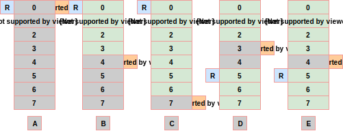

.. _how_it_works:

How it works
============

This section shows different buffer corner cases and provides basic understanding how data are managed internally.

    
    Different buffer corner cases

Let's start with reference of abbreviations in picture:

* ``R`` represents `Read` pointer. Read on read/write operations. Modified on read operation only
* ``W`` represents `Write` pointer. Read on read/write operations. Modified on write operation only
* ``S`` represents `Size` of buffer. Used on all operations, never modified (atomic value)

    * Valid number of ``W`` and ``R`` pointers are between ``0`` and ``S - 1``

* Buffer size is ``S = 8``, thus valid number range for ``W`` and ``R`` pointers is ``0 - 7``.
    
    * ``R`` and ``W`` numbers overflow at ``S``, thus valid range is always ``0, 1, 2, 3, ..., S - 2, S - 1, 0, 1, 2, 3, ..., S - 2, S - 1, 0, ...``
    * Example ``S = 4``: ``0, 1, 2, 3, 0, 1, 2, 3, 0, 1, ...``

* Maximal number of bytes buffer can hold is always ``S - 1``, thus example buffer can hold up to ``7`` bytes
* ``R`` and ``W`` pointers always point to the next read/write operation
* When ``W == R``, buffer is considered empty.
* When ``W == R - 1``, buffer is considered full.
    
    * ``W == R - 1`` is valid only if ``W`` and ``R`` overflow at buffer size ``S``.
    * Always add ``S`` to calculated number and then use modulus ``S`` to get final value
        
.. note::

    Example 1, add ``2`` numbers: ``2 + 3 = (3 + 2 + S) % S = (3 + 2 + 4) % 4 = (5 + 4) % 4 = 1``

    Example 2, subtract ``2`` numbers: ``2 - 3 = (2 - 3 + S) % S = (2 - 3 + 4) % 4 = (-1 + 4) % 4 = 3``

    
    Different buffer corner cases

Different image cases:

* Case **A**: Buffer is empty as ``W == R = 0 == 0``
* Case **B**: Buffer holds ``W - R = 4 - 0 = 4`` bytes as ``W > R``
* Case **C**: Buffer is full as ``W == R - 1`` or ``7 == 0 - 1`` or ``7 = (0 - 1 + S) % S = (0 - 1 + 8) % 8 = (-1 + 8) % 8 = 7``

    * ``R`` and ``W`` can hold ``S`` different values, from ``0`` to ``S - 1``, that is modulus of ``S``
    * Buffer holds ``W - R = 7 - 0 = 7`` bytes as ``W > R``
* Case **D**: Buffer holds ``S - (R - W) = 8 - (5 - 3) = 6`` bytes as ``R > W``
* Case **E**: Buffer is full as ``W == R - 1`` (``4 = 5 - 1``) and holds ``S - (R - W) = 8 - (5 - 4) ) = 7`` bytes

.. toctree::
    :maxdepth: 2