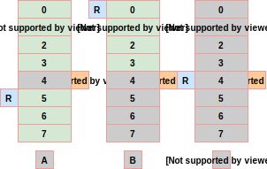
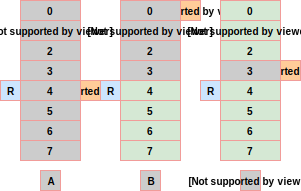

DMA for embedded systems
========================

One of the key features of LwRB library is that it can be seamlessly integrated with DMA controllers on embedded systems.

.. note::

    DMA stands for *Direct Memory Access* controller and is usually used to off-load CPU.
    More about DMA is available on `Wikipedia <https://en.wikipedia.org/wiki/Direct_memory_access>`_.

DMA controllers normally use source and destination memory addresses to transfer data in-between.
This features, together with LwRB, allows seamless integration and zero-copy of application data at interrupts after DMA transfer has been completed.
Some manual work is necessary to be handled, but this is very minor in comparison of writing byte-by-byte to buffer at (for example) each received character.

Below are ``2`` common use cases:

* DMA transfers data from LwRB memory to (usually) some hardware IP
* DMA transfers data from hardware IP to memory

Zero-copy data from LwRB memory
^^^^^^^^^^^^^^^^^^^^^^^^^^^^^^^

This describes how to pass LwRB output memory address as pointer to DMA (or any other processing function).
After data is successfully processed, application can skip processed data and mark buffer as free for new data being written to it.

    Data transfer from memory to hardware IP

* Case **A**: Initial state, buffer is full and holds ``7`` bytes
* Case **B**: State after skipping ``R`` pointer for ``3`` bytes. Buffer now holds ``4`` remaining bytes
* Case **C**: Buffer is empty, no more memory available for read operation

Code example:

.. literalinclude:: ../examples_src/example_skip_1.c
    :language: c
    :linenos:
    :caption: Skip buffer data after usage

Part **A** on image clearly shows that not all data bytes are linked in single contiguous block of memory.
To send all bytes from lwrb, it might be necessary to repeat procedure multiple times

.. literalinclude:: ../examples_src/example_skip_2.c
    :language: c
    :linenos:
    :caption: Skip buffer data for non-contiguous block

Zero-copy data to LwRB memory
^^^^^^^^^^^^^^^^^^^^^^^^^^^^^

Similar to reading data from buffer with zero-copy overhead, it is possible to write to lwrb with zero-copy overhead too.
Only difference is that application now needs pointer to write memory address and length of maximal number of bytes to directly copy into buffer.
After successful processing, buffer advance operation is necessary to manually increase write pointer and to increase number of bytes in buffer.

* Case **A**: Initial state, buffer is empty as ``R == W``

    * Based on ``W`` pointer position, application could write ``4`` bytes to contiguous block of memory
* Case **B**: State after advancing `W` pointer for `4` bytes. Buffer now holds `4` bytes and has ``3`` remaining available
* Case **C**: Buffer is full, no more free memory available for write operation

Code example:

.. literalinclude:: ../examples_src/example_advance_1.c
    :language: c
    :linenos:
    :caption: Advance buffer pointer for manually written bytes

Example for DMA transfer from memory
^^^^^^^^^^^^^^^^^^^^^^^^^^^^^^^^^^^^

This is an example showing pseudo code for implementing data transfer using DMA with zero-copy overhead.
For read operation purposes, application gets direct access to LwRB read pointer and length of contiguous memory.

It is assumed that after DMA transfer completes, interrupt is generated (embedded system) and buffer is skipped in the interrupt.

.. note::

    Buffer skip operation is used to mark sent data as processed and to free memory for new writes to buffer

.. literalinclude:: ../examples_src/example_dma_skip.c
    :language: c
    :linenos:
    :caption: DMA usage with buffer

.. tip::
    Check `STM32 UART DMA TX RX Github <https://github.com/MaJerle/stm32-usart-uart-dma-rx-tx>`_ repository for use cases.

.. toctree::
    :maxdepth: 2
