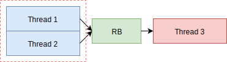
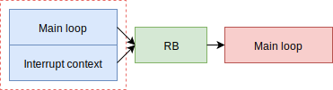
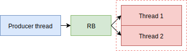
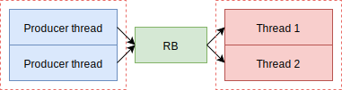

.. _thread_safety:

Thread safety
=============

Ring buffers are effectively used in embedded systems with or without operating systems.
Common problem most of implementations have is linked to multi-thread environment (when using OS) or reading/writing from/to interrupts.
This is linked to common question *What happens if I write to buffer while another thread is reading from it?*

One of the main requirements (beside being lightweight) of *LwRB* was to allow *read-while-write* or *write-while-read* operations.
This can be (and it is) achieved only when there is single write entry point and single read exit point.

.. figure:: ../static/images/buff_thread_safety_single_read_write.svg
    :align: center
    :alt: Write and read operation with single entry and exit points

    Write and read operation with single entry and exit points

This is most often used as *pipe* to write (for example) raw data to the buffer allowing another task
to process the data from another thread.

.. note::
    No race-condition is introduced when application uses LwRB with single write entry and single read exit point.

Thread safety gets broken when application does one of the following:

* Uses multiple write entry points to the single LwRB instance
* Uses multiple read exit points to the single LwRB instance
* Uses multiple read/write exit/entry points to the same LwRB instance

    Write operation to same LwRB instance from 2 threads.
    Write protection is necessary to ensure thread safety.

    Write operation to same LwRB instance from main loop and interrupt context.
    Write protection is necessary to ensure thread safety.

    Read operation from same LwRB instance from 2 threads.
    Read protection is necessary to ensure thread safety.

    Read and write operations are executed from multiple threads.
    Both, read and write, operations require exclusive access.

Above use cases are examples when thread safety gets broken. Application must ensure
exclusive access only to the part in *dashed-red* rectangle.

.. literalinclude:: ../examples_src/example_thread_safety.c
    :language: c
    :linenos:
    :caption: Thread safety example

Read and write operations can be used simultaneously hence it is perfectly valid if
access is granted to *read* operation while *write* operation from one thread takes place.

.. note::
    ``2`` different mutexes are used for read and write due to the implementation,
    allowing application to use buffer in *read-while-write* and *write-while-read* mode.
    Mutexes are used to prevent *write-while-write* and *read-while-read* operations respectively

.. tip::
    For *multi-entry-point-single-exit-point* use case, *read* mutex is not necessary.
    For *single-entry-point-multi-exit-point* use case, *write* mutex is not necessary.

.. tip::
   Functions considered as *read* operation are ``read``, ``skip``, ``peek`` and ``linear read``.
   Functions considered as *write* operation are ``write``, ``advance`` and ``linear write``.

.. toctree::
    :maxdepth: 2