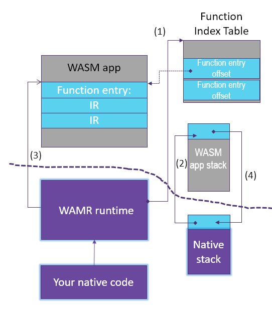

Embedding WAMR guideline
=====================================

**Note**: This document is about how to embed WAMR into C/C++ host applications, for other languages, please refer to: [Embed WAMR into Python](../language-bindings/go), [Embed WAMR into Go](../language-bindings/go).

All the embedding APIs supported by the runtime are defined under folder [core/iwasm/include](../core/iwasm/include). The API details are available in the header files.

## Embed WAMR into developer's project

WAMR is designed to be easy embeddable in any project, a typical way of building WAMR is to use cmake, developer can configure features by setting cmake variables and then include the script `runtime_lib.cmake` under folder [build-scripts](../build-scripts) in his CMakeList.txt, for example:
``` cmake
set (WAMR_BUILD_PLATFORM "linux")
set (WAMR_BUILD_TARGET "X86_64")
set (WAMR_BUILD_INTERP 1)
set (WAMR_BUILD_FAST_INTERP 1)
set (WAMR_BUILD_AOT 1)
set (WAMR_BUILD_LIBC_BUILTIN 1)
set (WAMR_BUILD_LIBC_WASI 1)
set (WAMR_BUILD_SIMD 1)
set (WAMR_ROOT_DIR path/to/wamr/root)

include (${WAMR_ROOT_DIR}/build-scripts/runtime_lib.cmake)
add_library(vmlib ${WAMR_RUNTIME_LIB_SOURCE})

target_link_libraries (your_project vmlib)
```
Examples can be found in [CMakeLists.txt of linux platform](../product-mini/platforms/linux/CMakeLists.txt) and [other platforms](../product-mini/platforms). The available features to configure can be found in [Build WAMR vmcore](./build_wamr.md#wamr-vmcore-cmake-building-configurations).

Developer can also use Makefile to embed WAMR, by defining macros and including directories, and adding the source files, examples can be found in [makefile of alios-things platform](../product-mini/platforms/alios-things/aos.mk) and [makefile of nuttx platform](../product-mini/platforms/nuttx/wamr.mk).

## The runtime initialization

``` C
  char *buffer, error_buf[128];
  wasm_module_t module;
  wasm_module_inst_t module_inst;
  wasm_function_inst_t func;
  wasm_exec_env_t exec_env;
  uint32 size, stack_size = 8092, heap_size = 8092;

  /* initialize the wasm runtime by default configurations */
  wasm_runtime_init();

  /* read WASM file into a memory buffer */
  buffer = read_wasm_binary_to_buffer(…, &size);

  /* add line below if we want to export native functions to WASM app */
  wasm_runtime_register_natives(...);

  /* parse the WASM file from buffer and create a WASM module */
  module = wasm_runtime_load(buffer, size, error_buf, sizeof(error_buf));

  /* create an instance of the WASM module (WASM linear memory is ready) */
  module_inst = wasm_runtime_instantiate(module, stack_size, heap_size,
                                         error_buf, sizeof(error_buf));
```

The `wasm_runtime_init()`  uses the default memory allocator os_malloc/os_free function from the [`core/shared/platform`](../core/shared/platform) for the runtime memory management.

WAMR supports to restrict its all memory allocations in a raw buffer. It ensures the dynamic memories used by the WASM applications won't harm the system availability, which is extremely important for embedded systems. This can be done by using `wasm_runtime_full_init()`. This function also allows you to configure the native API's for exporting to WASM app, and set the maximum thread number when multi-thread feature is enabled.

Refer to the following sample:

```c
/* the native functions that will be exported to WASM app */
static NativeSymbol native_symbols[] = {
    EXPORT_WASM_API_WITH_SIG(display_input_read, "(*)i"),
    EXPORT_WASM_API_WITH_SIG(display_flush, "(iiii*)")
};

/* all the runtime memory allocations are retricted in the global_heap_buf array */
static char global_heap_buf[512 * 1024];
RuntimeInitArgs init_args;
memset(&init_args, 0, sizeof(RuntimeInitArgs));

/* configure the memory allocator for the runtime */
init_args.mem_alloc_type = Alloc_With_Pool;
init_args.mem_alloc_option.pool.heap_buf = global_heap_buf;
init_args.mem_alloc_option.pool.heap_size = sizeof(global_heap_buf);

/* configure the native functions being exported to WASM app */
init_args.native_module_name = "env";
init_args.n_native_symbols = sizeof(native_symbols) / sizeof(NativeSymbol);
init_args.native_symbols = native_symbols;

/* set maximum thread number if needed when multi-thread is enabled,
   the default value is 4 */
init_args.max_thread_num = max_thread_num;

/* initialize runtime environment with user configurations*/
if (!wasm_runtime_full_init(&init_args)) {
    return -1;
}
```

## Native calls WASM functions and passes parameters

After a module is instantiated, the runtime embedder can lookup the target WASM function by name, and create execution environment to call the function.

```c
  /* lookup a WASM function by its name
     The function signature can NULL here */
  func = wasm_runtime_lookup_function(module_inst, "fib", NULL);

  /* creat an execution environment to execute the WASM functions */
  exec_env = wasm_runtime_create_exec_env(module_inst, stack_size);
```

There are several ways to call WASM function:

1. Function call with parameters in an array of 32 bits elements and size:

```c
  uint32 argv[2];

  /* arguments are always transferred in 32-bit element */
  argv[0] = 8;

  /* call the WASM function */
  if (wasm_runtime_call_wasm(exec_env, func, 1, argv) ) {
      /* the return value is stored in argv[0] */
      printf("fib function return: %d\n", argv[0]);
  }
  else {
      /* exception is thrown if call fails */
      printf("%s\n", wasm_runtime_get_exception(module_inst));
  }
```

The parameters are transferred in an array of 32 bits elements. For parameters that occupy 4 or fewer bytes, each parameter can be a single array element. For parameters in types like double or int64, each parameter will take two array elements. The function return value will be sent back in the first one or two elements of the array according to the value type. See the sample code below:

```c
  uint32 argv[6];
  char arg1 = 'a';
  int arg2 = 10;
  double arg3 = 1.0;
  int64 arg4 = 100;
  double ret;

  argv[0] = arg1;
  argv[1] = arg2;

  /**
   * use memory copy for 8-byte parameters rather than
   * *(double*)(&argv[2]) = arg3 here because some archs
   * like ARM, MIPS require the address must be 8-byte aligned.
   * Or use the aligned malloc or compiler align attribute
   * to ensure the array address is 8-byte aligned
   */
  memcpy(&argv[2], &arg3, sizeof(arg3));
  memcpy(&argv[4], &arg4, sizeof(arg4));

  /* attention: the arg number is 6 here since both
                arg3 and arg4 each takes 2 elements */
  wasm_runtime_call_wasm(exec_env, func, 6, argv);

  /* if the return value is type of 8 bytes, it takes
     the first two array elements */
  memcpy(&ret, &argv[0], sizeof(ret));
```

2. Function call with results and arguments both in `wasm_val_t` struct and size:

```c
  uint32 num_args = 1, num_results = 1;
  wasm_val_t args[1], results[1];

  /* set the argument type and value */
  args[0].kind = WASM_I32;
  args[0].of.i32 = 8;

  /* call the WASM function */
  if (wasm_runtime_call_wasm_a(exec_env, func, num_results, results, num_args, args)) {
      /* the return value is stored in results */
      printf("fib function return: %d\n", results[0].of.i32);
  }
  else {
      /* exception is thrown if call fails */
      printf("%s\n", wasm_runtime_get_exception(module_inst));
  }
```

3. Function call with variant argument support:

```c
  uint32 num_args = 1, num_results = 1;
  wasm_val_t results[1];

  /* call the WASM function */
  if (wasm_runtime_call_wasm_v(exec_env, func, 1, results, 1, 8)) {
      /* the return value is stored in results */
      printf("fib function return: %d\n", results[0].of.i32);
  }
  else {
      /* exception is thrown if call fails */
      printf("%s\n", wasm_runtime_get_exception(module_inst));
  }
```

## Pass buffer to WASM function

If we need to transfer a buffer to WASM function, we can pass the buffer address through a parameter. **Attention**: The sandbox will forbid the WASM code to access outside memory, we must **allocate the buffer from WASM instance's own memory space and pass the buffer address in instance's space (not the runtime native address)**.

There are two runtime APIs available for this purpose.

```c
/**
 * malloc a buffer from instance's private memory space.
 *
 * return: the buffer address in instance's memory space (pass to the WASM funciton)
 * p_native_addr: return the native address of allocated memory
 * size: the buffer size to allocate
 */
uint32_t
wasm_runtime_module_malloc(wasm_module_inst_t module_inst,
                           uint32_t size, void **p_native_addr);

/**
 * malloc a buffer from instance's private memory space,
 * and copy the data from another native buffer to it.
 *
 * return: the buffer address in instance's memory space (pass to the WASM funciton)
 * src: the native buffer address
 * size: the size of buffer to be allocated and copy data
 */
uint32_t
wasm_runtime_module_dup_data(wasm_module_inst_t module_inst,
                             const char *src, uint32_t size);

/* free the memory allocated from module memory space */
void
wasm_runtime_module_free(wasm_module_inst_t module_inst, uint32_t ptr);
```

Usage sample:

```c
char * buffer = NULL;
uint32_t buffer_for_wasm;

buffer_for_wasm = wasm_runtime_module_malloc(module_inst, 100, &buffer);
if (buffer_for_wasm != 0) {
    uint32 argv[2];
    strncpy(buffer, "hello", 100); /* use native address for accessing in runtime */
    argv[0] = buffer_for_wasm;     /* pass the buffer address for WASM space */
    argv[1] = 100;                 /* the size of buffer */
    wasm_runtime_call_wasm(exec_env, func, 2, argv);

    /* it is runtime embedder's responsibility to release the memory,
       unless the WASM app will free the passed pointer in its code */
    wasm_runtime_module_free(module_inst, buffer_for_wasm);
}
```

## Pass structured data to WASM function

We can't pass structure data or class objects through the pointer since the memory layout can different in two worlds. The way to do it is serialization. Refer to [export_native_api.md](./export_native_api.md) for the details.

## Execute wasm functions in multiple threads

The `exec_env` is not thread safety, it will cause unexpected behavior if the same `exec_env` is used in multiple threads. However, we've provided two ways to execute wasm functions concurrently:

- You can use `pthread` APIs in your wasm application, see [pthread library](./pthread_library.md) for more details.

- The `spawn exec_env` and `spawn thread` APIs are available, you can use these APIs to manage the threads in native:

  *spawn exec_env:*

  `spawn exec_env` API spawns a `new_exec_env` base on the original `exec_env`, use can use it in other threads:

  ```C
  new_exec_env = wasm_runtime_spawn_exec_env(exec_env);

    /* Then you can use new_exec_env in your new thread */
    module_inst = wasm_runtime_get_module_inst(new_exec_env);
    func_inst = wasm_runtime_lookup_function(module_inst, ...);
    wasm_runtime_call_wasm(new_exec_env, func_inst, ...);

  /* you need to use this API to manually destroy the spawned exec_env */
  wasm_runtime_destroy_spawned_exec_env(new_exec_env);
  ```

  *spawn thread:*

  You can also use `spawn thread` API to avoid manually manage the spawned exec_env:

  ```C
  wasm_thread_t wasm_tid;
  void *wamr_thread_cb(wasm_exec_env_t exec_env, void *arg)
  {
    module_inst = wasm_runtime_get_module_inst(exec_env);
    func_inst = wasm_runtime_lookup_function(module_inst, ...);
    wasm_runtime_call_wasm(exec_env, func_inst, ...);
  }
  wasm_runtime_spawn_thread(exec_env, &wasm_tid, wamr_thread_cb, NULL);
  /* Use wasm_runtime_join_thread to join the spawned thread */
  wasm_runtime_join_thread(wasm_tid, NULL);
  ```

**Note1: You can manage the maximum number of threads can be created:**

```C
init_args.max_thread_num = THREAD_NUM;
/* If this init argument is not set, the default maximum thread number is 4 */
```

**Note2: The wasm application should be built with `--shared-memory` and `-pthread` enabled:**

```bash
  /opt/wasi-sdk/bin/clang -o test.wasm test.c -nostdlib -pthread    \
    -Wl,--shared-memory,--max-memory=131072                         \
    -Wl,--no-entry,--export=__heap_base,--export=__data_end         \
    -Wl,--export=__wasm_call_ctors,--export=${your_func_name}
```

  **Note3: The pthread library feature should be enabled while building the runtime:**

  ```bash
  cmake .. -DWAMR_BUILD_LIB_PTHREAD=1
  ```

[Here](../samples/spawn-thread) is a sample to show how to use these APIs.

## The deinitialization procedure

```
  wasm_runtime_destroy_exec_env(exec_env);
  wasm_runtime_deinstantiate(module_inst);
  wasm_runtime_unload(module);
  wasm_runtime_destroy();

```

## Native calling WASM function working flow


