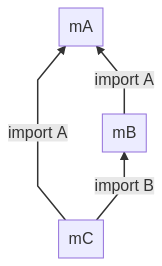

# Multiple Modules as Dependencies

A WASM module can _import_ _functions_, _globals_, _memories_ and _tables_ from other modules as dependencies. A module can also _export_ those entities for other modules like a library.

WAMR loads all dependencies recursively according to the _import section_ of a module.

> WAMR only implements the load-time dynamic linking. Please refer to [dynamic linking](https://webassembly.org/docs/dynamic-linking/) for more details.

WAMR follows [WASI Command/Reactor Model](https://github.com/WebAssembly/WASI/blob/main/design/application-abi.md#current-unstable-abi). The WASI model separates modules into commands and reactors. A Command is the main module that requires exports of reactors(submodules).

if `WASM_ENABLE_LIBC_WASI` is enabled, any module imports a WASI APIs, like `(import "wasi_snapshot_preview1" "XXX")`, should follow restrictions of the _WASI application ABI_:

- a main module(a command) should include `_start()`
- a submodule(a reactor) should include `_initialize()`
- both a command and a reactor should include an exported `memory`

## Multi-Module Related APIs

### Register a module

```c
bool
wasm_runtime_register_module(const char *module_name,
                             wasm_module_t module,
                             char *error_buf,
                             uint32_t error_buf_size);
```

It is used to register a _module_ with a _module_name_ to WASM runtime, especially for the main module, which is loaded by `wasm_runtime_load()` and doesn't have a chance to tell runtime its _module name_.

WAMR will get submodules' names(according to the _import section_ of the main module) and load .wasm files from the filesystem or stream and then register them internally.

### Find a registered module

```c
wasm_module_t
wasm_runtime_find_module_registered(
    const char *module_name);
```

It is used to check whether a module with a given _module_name_ has been registered before or not. Return the module if yes.

### Module reader and destroyer

```c
typedef bool (*module_reader)(const char *module_name,
                              uint8_t **p_buffer,
                              uint32_t *p_size);

typedef void (*module_destroyer)(uint8_t *buffer,
                                 uint32_t size);

void
wasm_runtime_set_module_reader(const module_reader reader,
                               const module_destroyer destroyer);
```

WAMR hopes that the native host or embedding environment loads/unloads the module WASM files by themselves and only passes runtime the binary content without worrying about filesystem or storage issues. `module_reader` and `module_destroyer` are two callbacks called when dynamic-loading/unloading submodules. Developers must implement the two callbacks by themselves.

### Call function of a submodule

```c
wasm_function_inst_t
wasm_runtime_lookup_function(wasm_module_inst_t const module_inst,
                             const char *name,
                             const char *signature);
```

Multi-module allows one to look up an exported function of a submodule. There are two ways to indicate the function _name_:

- parent function name only by default, used to look up the function of the parent module
- submodule name, function name and two $ symbols, e.g. `$submodule_name$function_name`, used to lookup function of submodule
- `signature` can be NULL

## Example

### Attributes in C/C++

Suppose there are three C files, _mA.c_, _mB.c_ and _mC.c_. Each of them exports functions and imports from others except mA.

import/export with two kinds of `__attribute__`:

- `__attribute__((import_module("MODULE_NAME"))) __attribute__((import_name("FUNCTION_NAME")))`. to indicate dependencies of the current module.

- `__attribute__((export_name("FUNCTION_NAME")))`. to expose functions.

```C
// mA.c
__attribute__((export_name("A1"))) int
A1()
{
    return 11;
}
```

```C
// mB.c
__attribute__((import_module("mA")))
__attribute__((import_name("A1"))) extern int
A1();

__attribute__((export_name("B1"))) int
B1()
{
    return 21;
}
```

### Compile Options

to generate a wasm module as a command

```
$ /path/to/wasi-sdk/bin/clang -o command.wasm main_module.c
```

to generate a wasm module as a reactor

```
$ /path/to/wasi-sdk/bin/clang -mexec-model=reactor -o reactor.wasm submodule.c
```

In the above case, _mA_ and _mB_ are reactors(submodules), _mC_ is the command(main module). Their _import relationships_ will be like:



### libvmlib

We need to enable _WAMR_BUILD_MULTI_MODULE_ option when building WAMR vmlib. Please ref to [Build WAMR core](./build_wamr.md) for a thoughtful guide.

### code

After all the preparation, we can call some functions from native code with APIs

First, create two callbacks to load WASM module files into memory and unload them later

```c
static bool
module_reader_cb(const char *module_name, uint8 **p_buffer, uint32 *p_size)
{
  // ...
  *p_buffer = (uint8_t *)bh_read_file_to_buffer(wasm_file_path, p_size);
  // ...
}

static void
module_destroyer_cb(uint8 *buffer, uint32 size)
{
  BH_FREE(buffer);
}
```

Second, create a large buffer and tell WAMR malloc any resource only from this buffer later.

More details

```c
static char sandbox_memory_space[10 * 1024 * 1024] = { 0 };
```

Third, put all together. Please refer to [main.c](../samples/multi-module/src/main.c)
