# WAMR-IDE (Experimental)

## Introduction

The WAMR-IDE is an Integrated Development Environment to develop WebAssembly application with coding, compiling and source debugging support. It contains 3 components: `VSCode extension`, `wasm-toolchain docker image` and `wasm-debug-server docker image`.

- `VSCode extension` is an `vscode` extension, with which user can build and manage projects, develop `wasm application`, including `building`, `running` and `debugging`.

- `WASM-toolchain` is a docker image which provides building environment for wasm.

- `WASM source debug server` is a docker image which provides running and source debugging environment for wasm application.

---

## How to setup WAMR IDE

Note: Please ensure that the scripts under `resource` directories have
execution permission. While on git they have x bits, you might have dropped
them eg. by copying them from Windows.
Similarly, do not drop execution permission when copying `lldb` binaries
under `resource/debug/bin`.

#### 1. Install `VSCode` on host.

- make sure the version of [vscode](https://code.visualstudio.com/Download) you installed is at least _1.59.0_

#### 2. Install `Docker` on host.

    1. [Windows: Docker Desktop](https://docs.docker.com/desktop/windows/install/)
    2. [Ubuntu: Docker Engine](https://docs.docker.com/engine/install/ubuntu)
       ```xml
       OS requirements:
       To install Docker Engine, you need the 64-bit version of one of these Ubuntu versions:
       - Ubuntu Impish 21.10
       - Ubuntu Hirsute 21.04
       - Ubuntu Focal 20.04(LTS)
       - Ubuntu Bionic 18.04(LTS)
       ```

#### 3. Build docker images

We have 2 docker images which should be built or loaded on your host, `wasm-toolchain` and `wasm-debug-server`. To build these 2 images, please enter the `WASM-Debug-Server/Docker` & `WASM-Toolchain/Docker`, then execute the `build_docker_image` script respectively.

Windows (powershell):

```batch
$ cd .\WASM-Toolchain\Docker
$ .\build_docker_image.bat
$ cd .\WASM-Debug-Server\Docker
$ .\build_docker_image.bat
```

Linux:

```shell
$ cd ./WASM-Toolchain/Docker
$ ./build_docker_image.sh
$ cd ./WASM-Debug-Server/Docker
$ ./build_docker_image.sh
```

#### After building, you can find `wasm-toolchain` and `wasm-debug-server` docker images on your local

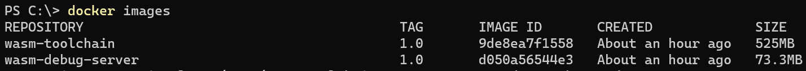

#### If building docker images fail during the process

Sometimes building the Docker images may fail due to bad network conditions. If the `wasm-toolchain` and `wasm-debug-server` images do not exist after building, please build them manually. Fix the proxy setting if needed and execute the following command to build docker images.

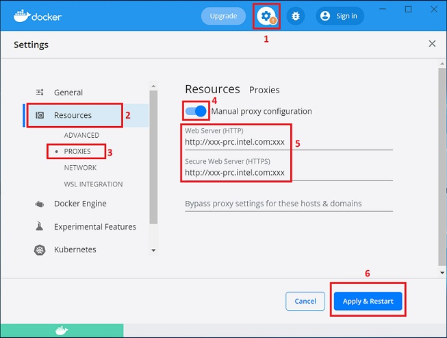

> Note: please correctly replace example proxy address with your own before you run manually.

```xml
$ cd .\docker_images\wasm-debug-server
$ docker build --no-cache --build-arg http_proxy=http://proxy.example.com:1234
--build-arg https_proxy=http://proxy.example.com:1234 -t wasm-debug-server:1.0 .
```

```xml
$ cd .\docker_images\wasm-toolchain
$ docker build --no-cache --build-arg http_proxy=http://proxy.example.com:1234
--build-arg https_proxy=http://proxy.example.com:1234 -t wasm-toolchain:1.0 .
```

#### If you encounter the problem `failed to solve with frontend dockerfile.v0: failed to create LLB definition`, please config your docker desktop

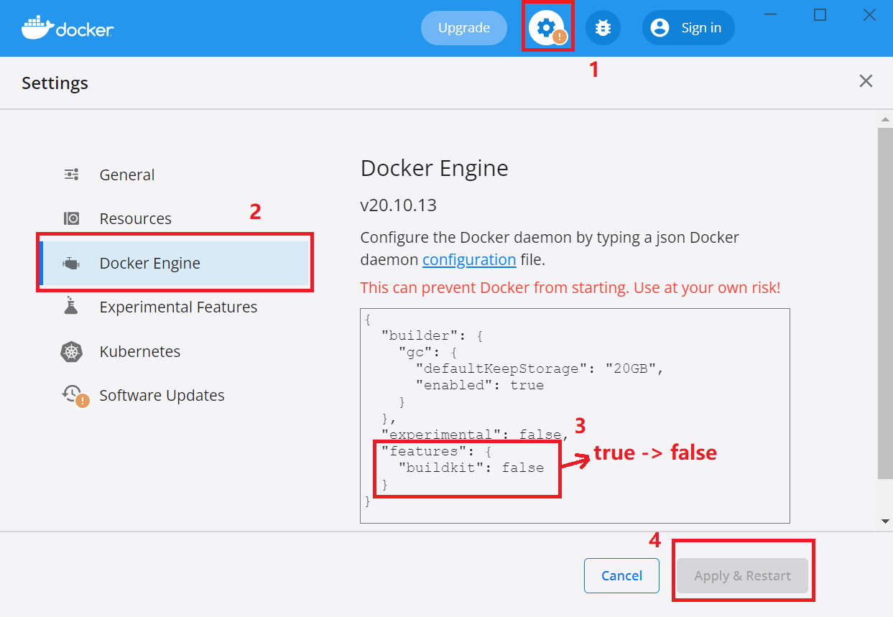

#### Points To Remember

- Make sure that the `wasm-toolchain:1.0` and `wasm-debug-server:1.0` docker images are both successfully built before using `WAMR IDE`, otherwise `Build`, `Run` and `Debug` will not work.

#### 4. Generate wamride extension package file

`wamride-1.0.0.vsix` can be packaged by [`npm vsce`](https://code.visualstudio.com/api/working-with-extensions/publishing-extension).

```shell
$ npm install -g vsce
$ cd VSCode-Extension
$ rm -rf node_modules
$ npm install
$ vsce package
```

Note that patched `lldb` should be built and put into the `VSCode-Extension/resource/debug` folder before your package or extension debug process if you want to enable `source debugging` feature.
Please follow this [instruction](../../doc/source_debugging.md#debugging-with-interpreter) to build `lldb`.
Please follow this [instruction](./VSCode-Extension/resource/debug/README.md)
to copy the binaries.

> **You can also debug the extension directly follow this [instruction](./VSCode-Extension/README.md) without packing the extension.**

#### 5. Install extension from vsix

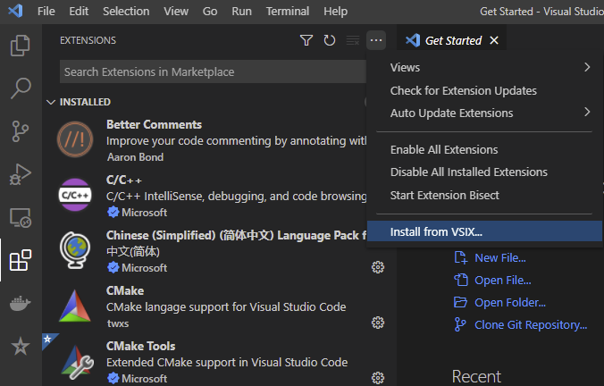

select `wamride-1.0.0.vsix` which you have packed on your host.

---

## How to use `wamr-ide`

#### `WAMR-IDE` extension contains 2 components as following picture showing. `WAMR IDE` for workspace and project management and `Current Project` for project's execution.

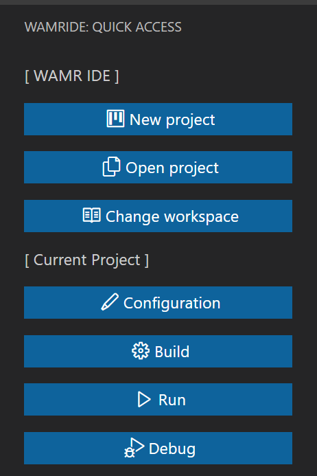

### Project Execution

#### 1. New project

When you click `New project` button, the extension will pop up a message box at the bottom right of the screen as following:

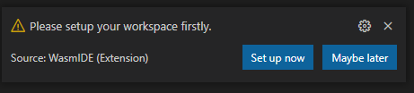

You can click `Set up now` and select the target folder to create project workspace, or you click `Maybe later` to close the message box.

> Note that your selected workspace folder should be **empty** or the folder you have set up as workspace.

After setting up workspace, extension will prompt successful message:

```xml
Workspace has been set up successfully!
```

Then click `New project` button again, a new page will show as following.

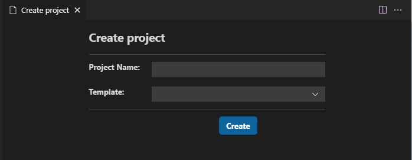

Enter the `Project name` and select the `Template`, then click `Create` button. A new project will be generated and opened in your current `VS Code window` or in a new `VS Code window`.

> Opening in current windows or a new one depends on whether your `vscode's explorer` is empty or not. If empty, open in current window, or open in the new vscode window.

A new initialized project is as following picture shows.

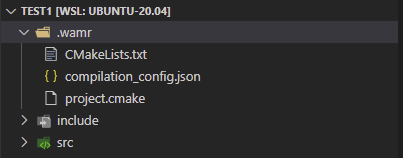

`.wamr` is the project configuration folder which contains 3 files, `CMakeLists.txt`, `project.cmake`, and `compilation_config.json`. `CMakeLists.txt` is used to build `wasm target` and the `project.cmake` is included in `CMakeLists.txt`. `compilation_config.json` includes the user's customized configuration such as folders which should be added in the include path.

#### 2. Open project

Click `Open project` button, `quick-pick-box` will show as following. All projects under your current workspace will be shown and can be selected.

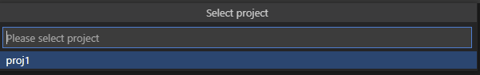

#### 3. Change workspace

Click `Change workspace` button, a dialog will show as following. You can select 1 folder in file system as workspace, and the new workspace path will override previous workspace, and all new created projects will be generated in the new workspace.

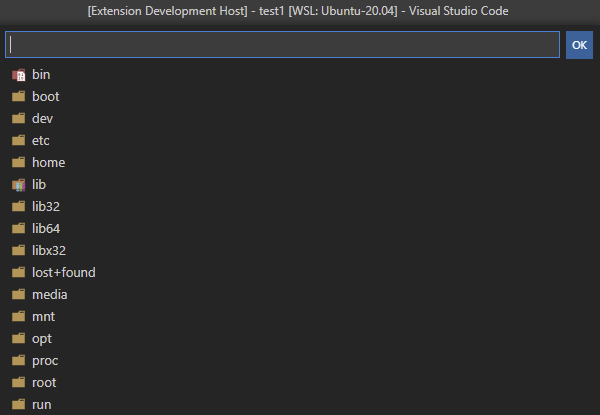

#### 4. Customize `include paths` and `exclude source files`

    Extension supports adding header file folder to `include path` and excluding source file from build.

- `Add to include path`

  - Move the cursor to the `folder` and right click, then `menus` will be shown as following. Click `Toggle state of path including`.

  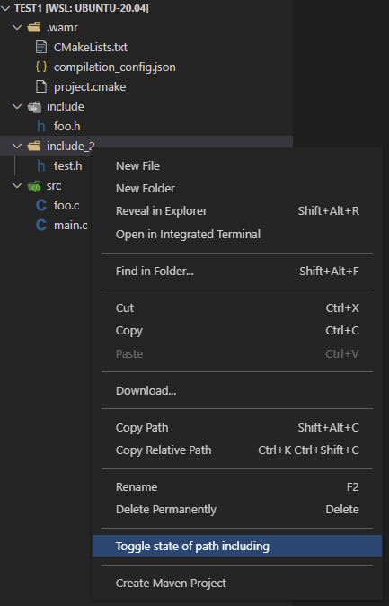

- `Exclude source file from build`

  - Move the cursor to the `source file` and right click, then `menus` will be shown as following. Click `Toggle state of excluding`.

  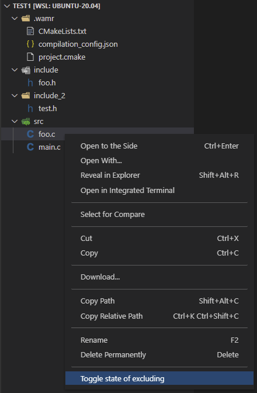

  #### After setting up `include path` and `exclude files`, the corresponding folder and files will be decorated with color and icon as following picture shows.

  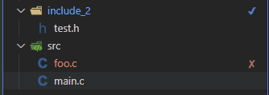

  At the same time, all added `include path` and `exclude files` will be saved in `.wamr/compilation_config.json` as json array.

  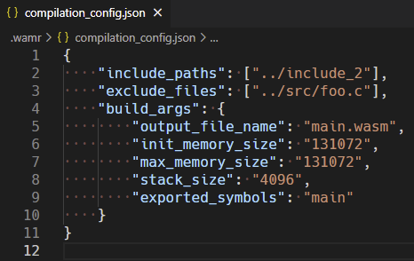

> `Toggle state of path including` just shows when selecting `folder` and hides with other resources.
>
> `Toggle state of excluding` just shows when selecting `[.c | .cpp | .cxx] source files` and hides with other resources.

### Current Project Management

#### 1. Configuration

Click `Configuration` button, a new page will be shown as following. You can config building target with `Include paths`, `Initial & Max linear memory`, `stack size`, `exported_symbols` and `include paths`, `exclude files`.

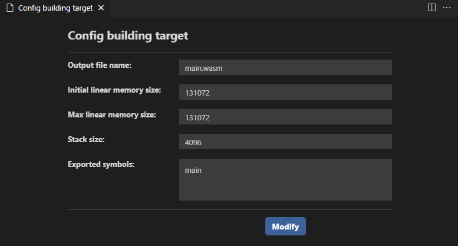

Then click `Modify` button to confirm, if configurations are modified successfully and following message will pop. Click `OK`, the page will be auto closed.

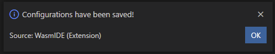

And all configuration will be saved in `.wamr/compilation_config.json`.

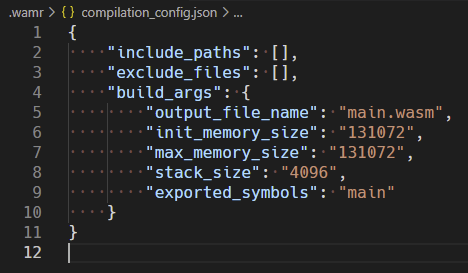

#### 2. `Build`

When you have completed coding and ready to build target, click `build` button and the `wasm-toolchain` will auto start a container and execute the building process.

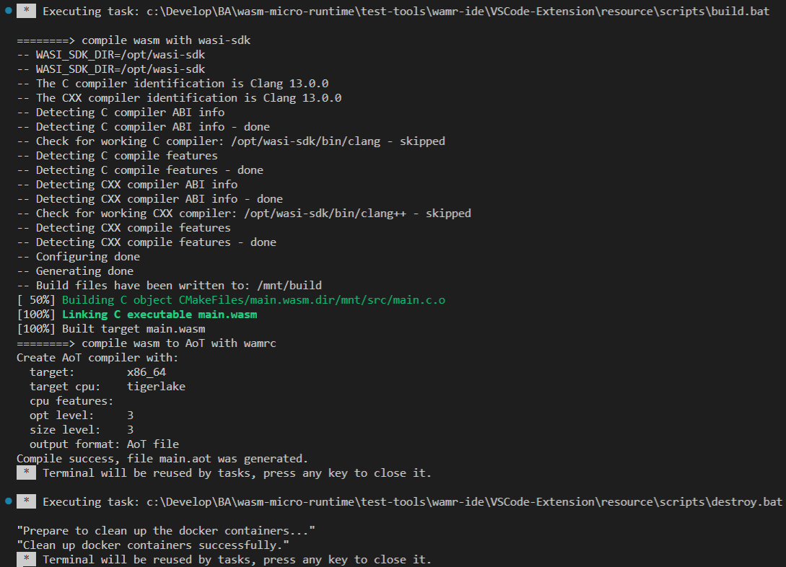

After successful building execution, `build` folder will be generated in `explorer`, in which `${output_file_name}.wasm` is exist.

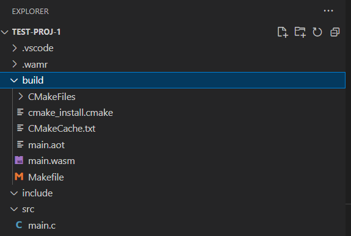

> Note that to start `docker service` firstly.

#### 3. Run

Click `Run` button and `wasm-debug-server` docker image will auto start a container and execute the running process.

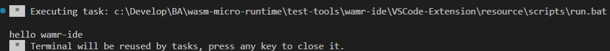

#### 4. Debug

Click `Debug` button will trigger start ip `wamr-debug-server` docker image, and boot up `lldb debug server` inside of iwasm. Then start a debugging session with configuration to connect. Tap `F11` or click `step into` to start debugging.

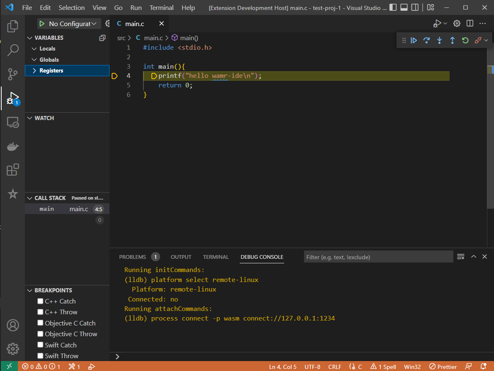

> Docker containers will be auto stopped and removed after the execution.
