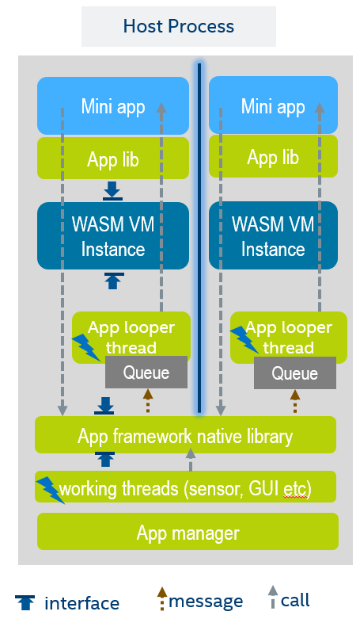
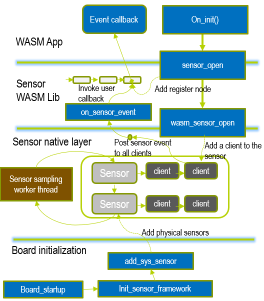

# Application framework

By using the WAMR VM core, we are flexible to build different application frameworks for the specific domains, although it would take quite some effort.

The WAMR has offered a comprehensive framework for programming WASM applications for device and IoT usages. The framework supports running multiple applications, that are based on the event driven programming model. Here are the supporting API sets by the [WAMR application framework library](../doc/wamr_api.md) :

- Timer,  Inter-app communication (request/response and pub/sub), Sensor, Connectivity and data transmission, 2D graphic UI

Browse the folder  [core/app-framework](./app-framework) for how to extend the application framework.


## Directory structure
This folder "app-native-shared" is for the source files shared by both WASM APP and native runtime  

- The c files in this directory are compiled into both the WASM APP and runtime.
- The header files for distributing to SDK are placed in the "bi-inc" folder.

This folder "template" contains a pre-defined directory structure for a framework component. The developers can copy the template folder to create new components to the application framework.  

Every other subfolder is framework component. Each component contains two library parts: **app and native**.  

- The "base" component provide timer API and inter-app communication support. It must be enabled if other components are selected.
- Under the "app" folder of a component, the subfolder "wa_inc" holds all header files that should be included by the WASM applications

## Application framework basic model

The app framework is built on top of two fundamental operations:

- [Native calls into WASM function](../../doc/embed_wamr.md)

- [WASM app calls into native API](../../doc/export_native_api.md)

Asynchronized programming model is supported for WASM applications

- Every WASM app has its own sandbox and thread

- Queue and messaging




## Customized building of app framework

A component can be compilation configurable to the runtime. The wamr SDK tool "build_sdk.sh" supports menu config to select app components for building a customized runtime.

A number of CMAKE variables are defined to control build of framework and components. You can create a cmake file for defining these variables and include it in the CMakeList.txt for your software, or pass it in "-x" argument when run the [build_sdk.sh](../../wamr-sdk/build_sdk.sh) for building the runtime SDK.

```cmake
set (WAMR_BUILD_APP_FRAMEWORK 1)
set (WAMR_BUILD_APP_LIST WAMR_APP_BUILD_BASE)
```

Variables:

- **WAMR_BUILD_APP_FRAMEWORK**: enable the application framework
- **WAMR_BUILD_APP_LIST**: the selected components to be built into the final runtime


The configuration file can be generated through the wamr-sdk menu config:

```bash
cd wamr-sdk
./build_sdk -n [profile] -i
```


## Create new components

Generally you should follow following steps to create a new component:

- Copy the “template” for creating a new folder

- Implement the app part

  - If your component exports native function to WASM, ensure your created a header file under app for declaring the function prototype.
  - If you component provides header files for the WASM applications to include, ensure it is placed under subfolder "wa_inc".

- Implement the native part

  - If your native function is exported to WASM, you need to create an inl file for the registration. It can be any file name, assuming the file name is "my_component.inl" here:

    ```c
    //use right signature for your functions
    EXPORT_WASM_API_WITH_SIG(wasm_my_component_api_1, "(i*~)i"),
    EXPORT_WASM_API_WITH_SIG(wasm_my_component_api_2, "(i)i"),
    ```

  - Ensure "wasm_lib.cmake" is provided as it will be included by the WAMR SDK building script

  - Add a definition in "wasm_lib.cmake" for your component, e.g.

    ```cmake
    add_definitions (-DAPP_FRAMEWORK_MY_COMPONENT)
    ```

- Modify the file [app_ext_lib_export.c](./app_ext_lib_export.c) to register native APIs exported for the new introduced component. Skip it if not exporting native functions.

  ```
  #include "lib_export.h"

  ...
  #ifdef APP_FRAMEWORK_MY_COMPONENT // this definition is created in wasm_lib.cmake
      #include "my_component_native_api.h"
  #endif

  static NativeSymbol extended_native_symbol_defs[] = {
  ...
  #ifdef APP_FRAMEWORK_MY_COMPONENT
      #include "my_component.inl"
  #endif
  };
  ```


## Sensor component working flow


