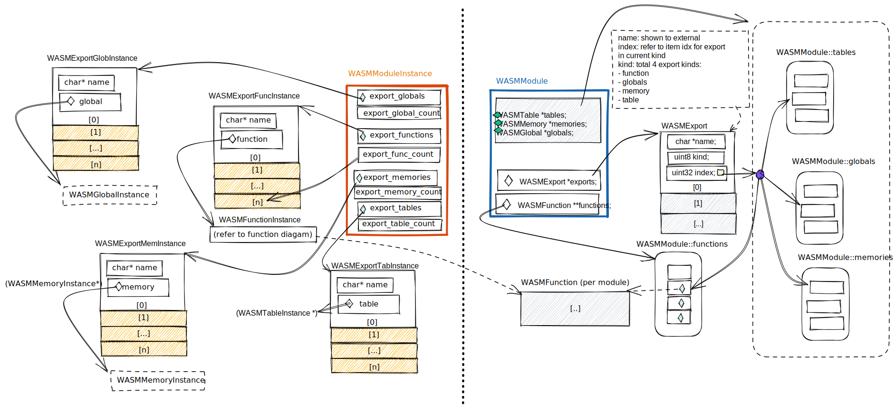

# Wasm exports
The internal data structure for Wasm exports:  
  

## Setup exports for Module 
The array data structure pointed by `WASMModule::exports` is setup during loading a module. Basically the runtime will load the exports sections from the module file content, and construct an array of C struct `WASMExport`.   

A `WASMExport` item contains three elements that map the Wasm file exports section structure:
- name: the name shown to external
- kind: total 4 export types: function, globals, memory, table
- index: As all the 4 export types are organized in array, this refers to index in target export type 

## Function exports
### use function exports
function exports are often used in two situations:  
    1. **call by host**: runtime API `wasm_runtime_lookup_function` will walk through the array of `WASMModuleInstance::export_functions` and compare the exported name with given target symbol name in the function parameter. If any array item matches the name, it then returns the value of field `function` which points to associated function instance (WASMFunctionInstance)  
    2. **import by another module**: During linking multiple modules, the runtime saves the pointer of exported WASMFunctionInstance in the local WASMFunctionInstance of importing module.

### setup for instance
The data structure pointed by `WASMModuleInstance::export_functions` is set up during instantiating module instance.

The runtime will walk through the `WASMModule::exports` array and find all the item with kind equal to "function". Create a node of `WASMExportFuncInstance` for each matching, find the associated `WASMFunctionInstance` object and save its address in the field `function`.
