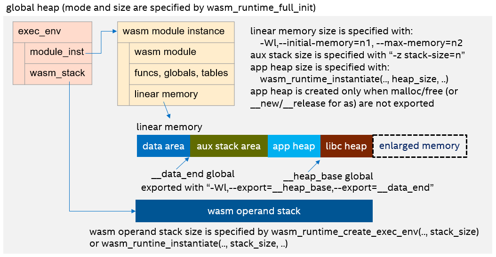

# Memory model and memory usage tunning

References:
- [Blog: Understand WAMR heap](https://bytecodealliance.github.io/wamr.dev/blog/understand-the-wamr-heaps/)
- [Blog: Understand WAMR stacks](https://bytecodealliance.github.io/wamr.dev/blog/understand-the-wamr-stacks/)

## The memory model

The memory model of WAMR can be basically described as below:

</img>

Note:
- **global heap**: the heap to allocate memory for runtime data structures, including wasm module, wasm module instance, exec env, wasm operand stack and so on. It is initialized by `wasm_runtime_init` or `wasm_runtime_full_init`. And for `wasm_runtime_full_init`, developer can specify the memory allocation mode with `RuntimeInitArgs *init_args`: allocate memory from a user defined byte buffer, from user defined allocation function, or from the platform's os_malloc function. Refer to [wasm_export.h](../core/iwasm/include/wasm_export.h#L98-L141) and [Embedding WAMR guideline](./embed_wamr.md#the-runtime-initialization) for more details. And developer can use `wasm_runtime_malloc/wasm_runtime_free` to allocate/free memory from/to the global heap.
- **wasm operand stack**: the stack to store the operands required by wasm bytecodes as WebAssembly is based on a stack machine. If the exec_env is created by developer with `wasm_runtime_create_exec_env`, then its size is specified by `wasm_runtime_create_exec_env`, otherwise if the exec_env is created by runtime internally, e.g. by `wasm_application_execute_main` or `wasm_application_execute_func`, then the size is specified by `wasm_runtime_instantiate`.
- **linear memory**: a contiguous, mutable array of raw bytes. It is created with an initial size but might be grown dynamically. For most compilers, e.g. wasi-sdk, emsdk, rustc or asc, normally it includes three parts, data area, auxiliary stack area and heap area. For wasi-sdk, the initial/max size can be specified with `-Wl,--initial-memory=n1,--max-memory=n2`, for emsdk, the initial/max size can be specified with `-s INITIAL_MEMORY=n1 -s MAXIMUM_MEMORY=n2 -s ALLOW_MEMORY_GROWTH=1` or `-s TOTAL_MEMORY=n`, and for asc, they can be specified with `--initialMemory` and `--maximumMemory` flags.
  - If the memory access boundary check with hardware trap feature is enabled, e.g. in Linux/MacOS/Windows x86-64 by default, the linear memory is allocated by `os_mmap` from virtual address space instead of global heap.
- **aux stack**: the auxiliary stack resides in linear memory to store some temporary data when calling wasm functions, for example, calling a wasm function with complex struct arguments. For wasi-sdk, the size can be specified with `-z stack-size=n`, for emsdk, the size can be specified with `-s TOTAL_STACK=n`.
- **app heap and libc heap**: the heap to allocate memory for wasm app, note that app heap is created only when the malloc/free functions (or __new/__release functions for AssemblyScript) are not exported and runtime can not detect the libc heap. To export the malloc/free functions, for wasi-sdk and emsdk, developer can use `-Wl,--export=malloc -Wl,--export=free` options, for asc, developer can use `--exportRuntime` option. For app heap, the size is specified by `wasm_runtime_instantiate`. It is recommended to export the malloc/free functions and disable app heap. However, if you are using [the old pthread implementation](./pthread_impls.md), you might need some workaround to avoid the libc heap as mentioned in [WAMR pthread library](./pthread_library.md). And developer can use `wasm_runtime_module_malloc/wasm_runtime_module_free` to allocate/free memory from/to app heap (or libc heap if malloc/free functions are exported).
- **__data_end global and __heap_base global**: two globals exported by wasm application to indicate the end of data area and the base address of libc heap. For WAMR, it is recommended to export them as when there are no possible memory grow operations, runtime will truncate the linear memory into the size indicated by `__heap_base`, so as to reduce the footprint, or at least one page (64KB) is required by linear memory.

## Tune the memory usage

Normally there are some methods to tune the memory usage:
- set the global heap size with `wasm_runtime_full_init`
- set the wasm operand stack size with `wasm_runtime_create_exec_env` or `wasm_runtime_instantiate`
- set the linear memory size
- set the auxiliary stack size
- export `malloc/free` functions to use libc heap and disable app heap
- set the app heap size with `wasm_runtime_instantiate`
- use `nostdlib` mode, add `-Wl,--strip-all`: refer to [How to reduce the footprint](./build_wasm_app.md#2-how-to-reduce-the-footprint) of building wasm app for more details
- use XIP mode, refer to [WAMR XIP (Execution In Place) feature introduction](./xip.md) for more details
