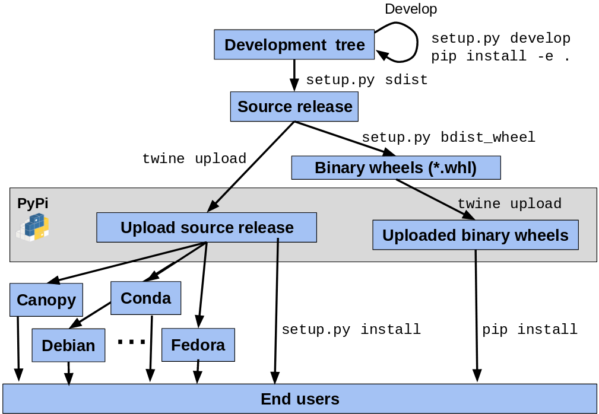

# how to implement a python binding of WAMR

A python language binding of Wasm runtime allows its users to call a set of APIs of
the runtime from the python world. Those APIs maybe implemented in C, C++, or Rust.

In the WAMR case, a python binding allows APIs in `core/iwasm/include/wasm_c_api.h`
to be used in the python scripts. To achieve that, we will create two kinds
of stuff: wrappers of structured data types and wrappers of functions under the
help of _ctypes_.

Cyptes is a tool in the standard library for creating Python bindings. It
provides a low-level toolset for loading shared libraries and marshaling
data between Python and C. Other options include _cffi_, _pybind11_,
_cpython_ and so on. Because we tend to make the binding depending on least
items. The built-in module, _ctypes_, is a good choice.

## General rules to marshal

The core of the idea of a language binding is how to translate different
representations of types in different language.

### load libraries

The `ctypes` supports locating a dynamic link library in a way similar to the
compiler does.

Currently, `ctypes.LoadLibrary` supports:

- `CDLL`. Those libraries use the standard C calling conversion.
- `OleDLL` and `WinDLL`. Those libraries use the `stdcall` calling conversion on
  Windows only

### fundamental datatypes

_ctypes_ provides [primitive C compatiable data types](https://docs.python.org/3/library/ctypes.html#fundamental-data-types).
Like `c_bool`, `c_byte`, `c_int`, `c_long` and so on.

> `c_int` represents the _C_ `signed int` datatype. On platforms where
> `sizeof(int) == sizeof(long)` it is an alias to `c_long`.

| c datatypes         | ctypes                  |
| ------------------- | ----------------------- |
| bool                | c_bool                  |
| byte_t              | c_ubyte                 |
| char                | c_char                  |
| float32_t           | c_float                 |
| float64_t           | c_double                |
| int32_t             | c_int32                 |
| int64_t             | c_int64                 |
| intptr_t            | c_void_p                |
| size_t              | c_size_t                |
| uint8_t             | c_uint8                 |
| uint32_t            | c_uint32                |
| void                | None                    |
| wasm_byte_t         | c_ubyte                 |
| wasm_externkind_t   | c_uint8                 |
| wasm_memory_pages_t | c_uint32                |
| wasm_mutability_t   | c_bool                  |
| wasm_table_size_t   | c_uint32                |
| wasm_valkind_t      | c_uint8                 |
| wasm_data_type\*    | POINTER(wasm_data_type) |

- `c_void_p` only represents `void *` only
- `None` represents `void` in function parameter lists and return lists

### structured datatypes

Create a corresponding concept for every native structured data type includes
`enum`, `struct` and `union`, in the python world.

#### Enum types

For example, if there is a `enum wams_mutability_enum` in native.

```c
typedef uint8_t wams_mutability_t;
enum wams_mutability_enum {
  WASM_CONST,
  WASM_VAR
};
```

Use `ctypes.int`(or any integer types in ctypes) to represents its value directly.

```python
# represents enum wams_mutability_enum
wasm_mutability_t = c_uint8

WASM_CONST = 0
WASM_VAR = 1
```

> C standard only requires "Each enumerated type shall be compatible with char,
> a signed integer type, or an unsigned integer type. The choice of the integer
> type is implementation-defined, but shall be capable of representing the
> values of all the members of the enumeration.

#### Struct types

If there is a `struct wasm_byte_vec_t` in native(in C).

```c
typedef struct wasm_byte_vec_t {
  size_t size;
  wasm_byte_t *data;
  size_t num_elems;
  size_t size_of_elem;
} wasm_byte_vec_t;
```

Use `ctypes.Structure` to create its corresponding data type in python.

```python
class wasm_byte_vec_t(ctypes.Structure):
  _fileds_ = [
    ("size", ctypes.c_size_t),
    ("data", ctypes.POINTER(c_ubyte)),
    ("num_elems", ctypes.c_size_t),
    ("size_of_elem", ctypes.c_size_t),
  ]
```

a list of `Structures`

| name              |
| ----------------- |
| wasm_engine_t     |
| wasm_store_t      |
| wasm_limits_t     |
| wasm_valtype_t    |
| wasm_functype_t   |
| wasm_globaltype_t |
| wasm_tabletype_t  |
| wasm_memorytype_t |
| wasm_externtype_t |
| wasm_importtype_t |
| wasm_exporttype_t |
| wasm_ref_t        |
| wasm_ref_t        |
| wasm_frame_t      |
| wasm_trap_t       |
| wasm_foreign_t    |
| WASMModuleCommon  |
| WASMModuleCommon  |
| wasm_func_t       |
| wasm_global_t     |
| wasm_table_t      |
| wasm_memory_t     |
| wasm_extern_t     |
| wasm_instance_t   |

not supported `struct`

- wasm_config_t

If there is an anonymous `union` in native.

```c
typedef struct wasm_val_t {
  wasm_valkind_t kind;
  union {
    int32_t i32;
    int64_t i64;
    float32_t f32;
    float64_t f64;
  } of;
} wasm_val_t;
```

Use `ctypes.Union` to create its corresponding data type in python.

```python
class _OF(ctypes.Union):
  _fields_ = [
    ("i32", ctypes.c_int32),
    ("i64", ctypes.c_int64),
    ("f32", ctypes.c_float),
    ("f64", ctypes.c_double),
  ]

class wasm_val_t(ctypes.Structure):
  _anonymous_ = ("of",)
  _fields_ = [
    ("kind", ctypes.c_uint8)
    ("of", _OF)
  ]
```

### wrappers of functions

Foreign functions (C functions) can be accessed as attributes of loaded shared
libraries or an instance of function prototypes. Callback functions(python
functions) can only be accessed by instantiating function prototypes.

For example,

```c
void wasm_name_new(wasm_name_t* out, size_t len, wasm_byte_t [] data);
```

Assume there are:

- `class wasm_name_t` of python represents `wasm_name_t` of C
- `libiwasm` represents loaded _libiwasm.so_

If to access a c function like an attribute,

```python
def wasm_name_new(out, len, data):
  _wasm_name_new = libiwasm.wasm_name_new
  _wasm_name_new.argtypes = (ctypes.POINTER(wasm_name_t), ctypes.c_size_t, ctypes.POINTER(ctypes.c_ubyte))
  _wasm_name_new.restype = None
  return _wasm_name_new(out, len, data)
```

Or to instantiate a function prototype,

```python
def wasm_name_new(out, len, data):
  return ctypes.CFUNCTYPE(None, (ctypes.POINTER(wasm_name_t), ctypes.c_size_t, ctypes.POINTER(ctypes.c_ubyte)))(
              ("wasm_name_new", libiwasm), out, len, data)
```

Now it is able to create a `wasm_name_t` with `wasm_name_new()` in python.

Sometimes, need to create a python function as a callback of c.

```c
wasm_trap_t* (*wasm_func_callback_t)(wasm_val_vec_t* args, wasm_val_vec_t *results);
```

Use `cyptes.CFUNCTYPE` to create a _pointer of function_

```python
def hello(args, results):
  print("hello from a callback")

wasm_func_callback_t = ctypes.CFUNCTYPE(c_size_t, POINTER(wasm_val_vec_t), POINTER(wasm_val_vec_t))
hello_callback = wasm_func_callback_t(hello)
```

or with a decorator

```python
def wasm_func_cb_decl(func):
  return @ctypes.CFUNCTYPE(ctypes.POINTER(wasm_trap_t), (ctypes.POINTER(wasm_val_vec_t), ctypes.POINTER(wasm_val_vec_t)))(func)

@wasm_func_cb_decl
def hello(args, results):
  print("hello from a callback")
```

### programming tips

#### `struct` and `ctypes.Structure`

There are two kinds of `cytes.Structure` in `binding.py`.

- has `__field__` definition. like `class wasm_byte_vec_t(Structure)`
- doesn't have `__field__` definition. like `class wasm_config_t(Structure)`

Since, `ctypes` will create its C world _mirror_ variable according to `__field__`
information, `wasm_config_t()` will only create a python instance without binding
to any C variable. `wasm_byte_vec_t()` will return a python instance with an internal
C variable.

That is why `pointer(wasm_config_t())` is a NULL pointer which can not be dereferenced.

#### deal with pointers

`byref()` and `pointer()` are two functions can return a pointer.

```python
x = ctypes.c_int(2)

# use pointer() to creates a new pointer instance which would later be used in Python
x_ptr = ctypes.pointer(x)
...
struct_use_pointer = Mystruct()
struct_use_pointer.ptr = x_ptr

# use byref() pass a pointer to an object to a foreign function call
func(ctypes.byref(x))
```

The main difference is that `pointer()` does a lot more work since it
constructs a real pointer object. It is faster to use `byref(`) if don't need
the pointer object in Python itself(e.g. only use it as an argument to pass
to a function).

There is no doubt that `wasm_xxx_new()` which return type is `ctypes.POINTER`
can return a pointer. Plus, the return value of `wasm_xxx_t()` can also be
used as a pointer without casting by `byref` or `pointer`.

#### array

In [ctypes document](https://docs.python.org/3/library/ctypes.html#arrays),
it states that "The recommended way to create array types is by multiplying a
data type with a positive integer". So _multiplying a data type_ should be a
better way to create arrays

```python
from ctypes import *

class POINT(Structure):
    _fields_ = ("x", c_int), ("y", c_int)

# multiplying a data type
# type(TenPointsArrayType) is <class '_ctypes.PyCArrayType'>
TenPointsArrayType = POINT * 10

# Instances are created in the usual way, by calling the class:
arr = TenPointsArrayType()
arr[0] = POINT(3,2)
for pt in arr:
    print(pt.x, pt.y)
```

On both sides, it is OK to assign an array to a pointer.

```c
char buf[128] = {0};
char *ptr = buf;
```

```python
binary = wasm_byte_vec_t()
binary.data = (ctypes.c_ubyte * len(wasm)).from_buffer_copy(wasm)
```

#### exceptions and traps

Interfaces of _wasm-c-api_ have their return values to represent failures.
The python binding should just keep and transfer them to callers instead of
raising any additional exception.

The python binding should raise exceptions when the python partial is failed.

#### readonly buffer

```python
with open("hello.wasm", "rb") as f:
    wasm = f.read()
    binary = wasm_byte_vec_t()
    wasm_byte_vec_new_uninitialized(byref(binary), len(wasm))
    # create a ctypes instance (byte[] in c) and copy the content
    # from wasm(bytearray in python)
    binary.data = (ctypes.c_ubyte * len(wasm)).from_buffer_copy(wasm)
```

in the above example, `wasm` is a python-created readable buffer. It is not
writable and needs to be copied into a ctype array.

#### variable arguments

A function with _variable arugments_ makes it hard to specify the required
argument types for the function prototype. It leaves us one way to call it
directly without any arguments type checking.

```python
libc.printf(b"Hello, an int %d, a float %f, a string %s\n", c_int(1), c_doulbe(3.14), "World!")
```

#### Use `c_bool` to represent `wasm_mutability_t `

- `True` for `WASM_CONST`
- `False` for `WASM_VALUE`

#### customize class builtins

- `__eq__` for comparation.
- `__repr__` for printing.

### bindgen.py

`bindge.py` is a tool to create WAMR python binding automatically. `binding.py`
is generated. We should avoid modification on it. Additional helpers should go
to `ffi.py`.

`bindgen.py` uses _pycparser_. Visit the AST of `core/iwasm/include/wasm_c_api.h`
created by _gcc_ and generate necessary wrappers.

```python
from pycparser import c_ast

class Visitor(c_ast.NodeVisitor):
  def visit_Struct(self, node):
    pass

  def visit_Union(self, node):
    pass

  def visit_TypeDef(self, node):
    pass

  def visit_FuncDecl(self, node):
    pass

ast = parse_file(...)
v = Visitor()
v.visit(ast)
```

Before running _bindgen.py_, the shared library _libiwasm.so_ should be generated.

```bash
$ cd /path/to/wamr/repo
$ # if it is in linux
$ pushd product-mini/platforms/linux/
$ cmake -S . -B build ..
$ cmake --build build --target iwasm
$ popd
$ cd binding/python
$ python utils/bindgen.py
```

`wasm_frame_xxx` and `wasm_trap_xxx` only work well when enabling `WAMR_BUILD_DUMP_CALL_STACK`.

```bash
$ cmake -S . -B build -DWAMR_BUILD_DUMP_CALL_STACK=1 ..
```

## OOP wrappers

Based on the above general rules, there will be corresponding python
APIs for every C API in `wasm_c_api.h` with same name. Users can do procedural
programming with those.

In next phase, we will create OOP APIs. Almost follow the
[C++ version of wasm_c_api](https://github.com/WebAssembly/wasm-c-api/blob/master/include/wasm.hh)

## A big list

| WASM Concept | Procedural APIs                | OOP APIs   | OOP APIs methods |
| ------------ | ------------------------------ | ---------- | ---------------- |
| XXX_vec      | wasm_xxx_vec_new               |            | list             |
|              | wasm_xxx_vec_new_uninitialized |            |                  |
|              | wasm_xxx_vec_new_empty         |            |                  |
|              | wasm_xxx_vec_copy              |            |                  |
|              | wasm_xxx_vec_delete            |            |                  |
| valtype      | wasm_valtype_new               | valtype    | \_\_init\_\_     |
|              | wasm_valtype_delete            |            | \_\_del\_\_      |
|              | wasm_valtype_kind              |            | \_\_eq\_\_       |
|              | wasm_valtype_copy              |            |                  |
|              | _vector methods_               |            |                  |
| functype     | wasm_functype_new              | functype   |                  |
|              | wasm_functype_delete           |            |                  |
|              | wasm_functype_params           |            |                  |
|              | wasm_functype_results          |            |                  |
|              | wasm_functype_copy             |            |                  |
|              | _vector methods_               |            |                  |
| globaltype   | wasm_globaltype_new            | globaltype | \_\_init\_\_     |
|              | wasm_globaltype_delete         |            | \_\_del\_\_      |
|              | wasm_globaltype_content        |            | \_\_eq\_\_       |
|              | wasm_globaltype_mutability     |            |                  |
|              | wasm_globaltype_copy           |            |                  |
|              | _vector methods_               |            |                  |
| tabletype    | wasm_tabletype_new             | tabletype  | \_\_init\_\_     |
|              | wasm_tabletype_delete          |            | \_\_del\_\_      |
|              | wasm_tabletype_element         |            | \_\_eq\_\_       |
|              | wasm_tabletype_limits          |            |                  |
|              | wasm_tabletype_copy            |            |                  |
|              | _vector methods_               |            |                  |
| memorytype   | wasm_memorytype_new            | memorytype | \_\_init\_\_     |
|              | wasm_memorytype_delete         |            | \_\_del\_\_      |
|              | wasm_memorytype_limits         |            | \_\_eq\_\_       |
|              | wasm_memorytype_copy           |            |                  |
|              | _vector methods_               |            |                  |
| externtype   | wasm_externtype_as_XXX         | externtype |                  |
|              | wasm_XXX_as_externtype         |            |                  |
|              | wasm_externtype_copy           |            |                  |
|              | wasm_externtype_delete         |            |                  |
|              | wasm_externtype_kind           |            |                  |
|              | _vector methods_               |            |                  |
| importtype   | wasm_importtype_new            | importtype |                  |
|              | wasm_importtype_delete         |            |                  |
|              | wasm_importtype_module         |            |                  |
|              | wasm_importtype_name           |            |                  |
|              | wasm_importtype_type           |            |                  |
|              | wasm_importtype_copy           |            |                  |
|              | _vector methods_               |            |                  |
| exportype    | wasm_exporttype_new            | exporttype |                  |
|              | wasm_exporttype_delete         |            |                  |
|              | wasm_exporttype_name           |            |                  |
|              | wasm_exporttype_type           |            |                  |
|              | wasm_exporttype_copy           |            |                  |
|              | _vector methods_               |            |                  |
| val          | wasm_val_delete                | val        |                  |
|              | wasm_val_copy                  |            |                  |
|              | _vector methods_               |            |                  |
| frame        | wasm_frame_delete              | frame      |                  |
|              | wasm_frame_instance            |            |                  |
|              | wasm_frame_func_index          |            |                  |
|              | wasm_frame_func_offset         |            |                  |
|              | wasm_frame_module_offset       |            |                  |
|              | wasm_frame_copy                |            |                  |
|              | _vector methods_               |            |                  |
| trap         | wasm_trap_new                  | trap       |                  |
|              | wasm_trap_delete               |            |                  |
|              | wasm_trap_message              |            |                  |
|              | wasm_trap_origin               |            |                  |
|              | wasm_trap_trace                |            |                  |
|              | _vector methods_               |            |                  |
| foreign      | wasm_foreign_new               | foreign    |                  |
|              | wasm_foreign_delete            |            |                  |
|              | _vector methods_               |            |                  |
| engine       | wasm_engine_new                | engine     |                  |
|              | wasm_engine_new_with_args\*    |            |                  |
|              | wasm_engine_new_with_config    |            |                  |
|              | wasm_engine_delete             |            |                  |
| store        | wasm_store_new                 | store      |                  |
|              | wasm_store_delete              |            |                  |
|              | _vector methods_               |            |                  |
| module       | wasm_module_new                | module     |                  |
|              | wasm_module_delete             |            |                  |
|              | wasm_module_validate           |            |                  |
|              | wasm_module_imports            |            |                  |
|              | wasm_module_exports            |            |                  |
| instance     | wasm_instance_new              | instance   |                  |
|              | wasm_instance_delete           |            |                  |
|              | wasm_instance_new_with_args\*  |            |                  |
|              | wasm_instance_exports          |            |                  |
|              | _vector methods_               |            |                  |
| func         | wasm_func_new                  | func       |                  |
|              | wasm_func_new_with_env         |            |                  |
|              | wasm_func_delete               |            |                  |
|              | wasm_func_type                 |            |                  |
|              | wasm_func_call                 |            |                  |
|              | wasm_func_param_arity          |            |                  |
|              | wasm_func_result_arity         |            |                  |
|              | _vector methods_               |            |                  |
| global       | wasm_global_new                | global     |                  |
|              | wasm_global_delete             |            |                  |
|              | wasm_global_type               |            |                  |
|              | wasm_global_get                |            |                  |
|              | wasm_global_set                |            |                  |
|              | _vector methods_               |            |                  |
| table        | wasm_table_new                 | table      |                  |
|              | wasm_table_delete              |            |                  |
|              | wasm_table_type                |            |                  |
|              | wasm_table_get                 |            |                  |
|              | wasm_table_set                 |            |                  |
|              | wasm_table_size                |            |                  |
|              | _vector methods_               |            |                  |
| memory       | wasm_memory_new                | memory     |                  |
|              | wasm_memory_delete             |            |                  |
|              | wasm_memory_type               |            |                  |
|              | wasm_memory_data               |            |                  |
|              | wasm_memory_data_size          |            |                  |
|              | wasm_memory_size               |            |                  |
|              | _vector methods_               |            |                  |
| extern       | wasm_extern_delete             | extern     |                  |
|              | wasm_extern_as_XXX             |            |                  |
|              | wasm_XXX_as_extern             |            |                  |
|              | wasm_extern_kind               |            |                  |
|              | wasm_extern_type               |            |                  |
|              | _vector methods_               |            |                  |

not supported _functions_

- wasm_config_XXX
- wasm_module_deserialize
- wasm_module_serialize
- wasm_ref_XXX
- wasm_XXX_as_ref
- wasm_XXX_as_ref_const
- wasm_XXX_copy
- wasm_XXX_get_host_info
- wasm_XXX_set_host_info

## test

there will be two kinds of tests in the project

- unit test. located in `./tests`. driven by _unittest_. run by
  `$ python -m unittest` or `$ make test`.
- integration test. located in `./samples`.

The whole project is under test-driven development. Every wrapper function will
have two kinds of test cases. The first kind is a positive case. It checks a
wrapper function with expected and safe arguments combinations. Its goal is the
function should work well with expected inputs. Another kind is a negative
case. It feeds unexpected arguments combinations into a wrapper function. Arguments
should include but not be limited to `None`. It ensures that the function will
gracefully handle invalid input or unexpected behaviors.

## distribution

### package

Create a python package named `wamr`. Users should import it after installation
just like any other python module.

```python
from wamr import *
```

### PyPI

Refer to [tutorial provided by PyPA](https://packaging.python.org/en/latest/tutorials/packaging-projects/).
Steps to publish WAMR Python library:

1. Creating `pyproject.toml` tells build tools (like pip and build) what is
   required to build a project. An example .toml file uses _setuptools_

   ```toml
   [build-system]
   requires = [
       "setuptools>=42",
       "wheel"
   ]
   build-backend = "setuptools.build_meta"
   ```

2. Configuring metadata tells build tools about a package (such as the name
   and the version), as well as which code files to include

   - Static metadata (`setup.cfg`): guaranteed to be the same every time.
     It is simpler, easier to read, and avoids many common errors, like
     encoding errors.

   - Dynamic metadata (`setup.py`): possibly non-deterministic. Any items that
     are dynamic or determined at install-time, as well as extension modules
     or extensions to setuptools, need to go into setup.py.

   **_Static metadata should be preferred_**. Dynamic metadata should be used
   only as an escape hatch when necessary. setup.py used to be
   required, but can be omitted with newer versions of setuptools and pip.

3. Including other files in the distribution

   - For [source distribution](https://packaging.python.org/en/latest/glossary/#term-Source-Distribution-or-sdist):

     It's usually generated using `python setup.py sdist`, providing metadata
     and the essential source files needed for installing by a tool like pip,
     or for generating a Built Distribution.

     It includes our Python modules, pyproject.toml, metadata, README.md,
     LICENSE. If you want to control what goes in this explicitly,
     see [Including files in source distributions with MANIFEST.in](https://packaging.python.org/en/latest/guides/using-manifest-in/#using-manifest-in).

   - For [final built distribution](https://packaging.python.org/en/latest/glossary/#term-Built-Distribution)

     A Distribution format containing files and metadata that only need to be
     moved to the correct location on the target system, to be installed.
     e.g. `Wheel`

     It will have the Python files in the discovered or listed Python packages.
     If you want to control what goes here, such as to add data files,
     see [Including Data Files](https://setuptools.pypa.io/en/latest/userguide/datafiles.html) from the [setuptools docs](https://setuptools.pypa.io/en/latest/index.html).

4. Generating distribution archives. These are archives that are uploaded to
   the Python Package Index and can be installed by pip.

   example using `setuptools`

   ```shell
   python3 -m pip install --upgrade build
   python3 -m build
   ```

   generated files:

   ```shell
   dist/
     WAMR-package-0.0.1-py3-none-any.whl
     WAMR-package-0.0.1.tar.gz
   ```

   The `tar.gz` file is a _source archive_ whereas the `.whl file` is a
   _built distribution_. Newer pip versions preferentially install built
   distributions but will fall back to source archives if needed. You should
   always upload a source archive and provide built archives for compatibility
   reasons.

5. Uploading the distribution archives

   - Register an account on https://pypi.org.
   - To securely upload your project, you’ll need a
     [PyPI API token](https://pypi.org/help/#apitoken). It can create at
     [here](https://pypi.org/manage/account/#api-tokens), and the “Scope”
     the setting needs to be “Entire account”.
   - After registration, now twine can be used to upload the distribution packages.

     ```shell
     # install twine
     python3 -m pip install --upgrade twine
     # --repository is https://pypi.org/ by default.
     # You will be prompted for a username and password. For the username, use __token__. For the password, use the token value, including the pypi- prefix.
     twine upload dist/*
     ```

after all, the python binding will be installed with

```shell
$ pip install wamr
```

PS: A example lifecycle of a python package


## CI

There are several parts:

- code format check.
- test. include running all unit test cases and examples.
- publish built distribution.
