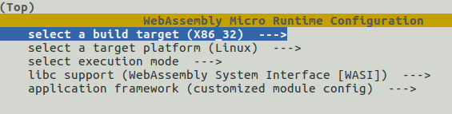

# WebAssembly Micro Runtime SDK 

Usually there are two tasks for integrating the WAMR into a particular project:

- Select what WAMR components (vmcore, libc, app-mgr, app-framework components) to be integrated, and get the associated source files added into the project building configuration
- Generate the APP SDK for developing the WASM apps on the selected libc and framework components

The **[WAMR SDK](./wamr-sdk)** tools is helpful to finish the two tasks quickly. It supports menu configuration for selecting WAMR components and builds the WAMR to a SDK package that includes **runtime SDK** and **APP SDK**. The runtime SDK is used for building the native application and the APP SDK should be shipped to WASM application developers.


**Note**: [WASI-SDK](https://github.com/WebAssembly/wasi-sdk/releases) version 7 and above should be installed before building the WAMR SDK.


### SDK profile and configuration file

A SDK profile presents a configuration of build parameters for the selection of CPU architecture, software platforms, execution mode, libc and application framework components. The profile configurations are saved in a cmake file that will be included by the WAMR SDK building tool `build_sdk.sh`.

Here is the default configuration file [wamr-sdk/wamr_config_default.cmake](./wamr_config_default.cmake):

```
set (WAMR_BUILD_PLATFORM "linux")
set (WAMR_BUILD_TARGET X86_64)
set (WAMR_BUILD_INTERP 1)
set (WAMR_BUILD_AOT 1)
set (WAMR_BUILD_JIT 0)
set (WAMR_BUILD_LIBC_BUILTIN 1)
set (WAMR_BUILD_LIBC_WASI 0)
set (WAMR_BUILD_APP_FRAMEWORK 1)
set (WAMR_BUILD_APP_LIST WAMR_APP_BUILD_BASE)
```


Execute following command to build the WAMR SDK for a configuration profile:

```
cd wamr-sdk
./build_sdk.sh -n [profile name] -x [config file path]
```

The output directory structure of a SDK package with profile name "simple":

```
simple/
├── app-sdk
│   ├── libc-builtin-sysroot
│   │   ├── include
│   │   └── share
│   └── wamr-app-framework
│       ├── include
│       │   ├── bi-inc
│       │   └── wa-inc
│       ├── lib
│       └── share
└── runtime-sdk
    ├── include
    │   └── bi-inc
    └── lib
```


Like the WAMR samples, a project probably has its own pre-defined SDK configuration file.  The project building script can call the `build_sdk.sh` by passing the configuration file name to the build_sdk.sh to generate its own WAMR SDK package.


### Menu configuration for building SDK

Menu configuration is supported for easy integration of runtime components and application libraries for  the target architecture and platform. Run following command to start the menu config.

```
cd wamr-sdk
./build_sdk.sh -i -n [profile name]
```

  The argument "-i" will make the command enter menu config mode as depicted below.



After the menu configuration is finished, the profile config file is saved and the building process is automatically started. When the building gets successful, the SDK package is generated under folder $wamr-sdk/out/{profile}, and the header files of configured components were copied into the SDK package.


### Build WASM applications with APP-SDK

The folder “**app-sdk**” under the profile output directory contains all the header files and WASM library for developing the WASM application. For C/C++ based WASM applications, the developers can use conventional cross-compilation procedure to build the WASM application.  According to the profile selection of libc, following cmake toolchain files under folder [wamr-sdk/app](./app) are available for cross compiling WASM application:

- ` wamr_toolchain.cmake` 
- `wasi_toolchain.cmake`


Refer to [build WASM applications](../doc/build_wasm_app.md) for the details.


### Use Runtime SDK to build native application

The output folder "**runtime-sdk**" contains all the header files and library files for integration with project native code. 

You can link the pre-built library:
``` cmake
link_directories(${SDK_DIR}/runtime-sdk/lib)
include_directories(${SDK_DIR}/runtime-sdk/include)
# ......
target_link_libraries (your_target vmlib -lm -ldl -lpthread)
```

This method can also be used when you don't use cmake

You can refer to this sample: [CMakeLists.txt](../samples/simple/CMakeLists.txt).

> NOTE: If you are familiar with how to configure WAMR by cmake and don't want to build the SDK, you can set the related settings on the top of your `CMakeLists.txt`, then the `runtime_lib.cmake` will not load settings from the SDK.


### Integrate WAMR without pre-built WAMR library

Use the provided `runtime_lib.cmake` file:

You can include `${WAMR_ROOT}/cmake/runtime_lib.cmake` in your project's `CMakeLists.txt` file:

``` cmake
include (${WAMR_ROOT}/cmake/runtime_lib.cmake)
add_library (vmlib ${WAMR_RUNTIME_LIB_SOURCE})
# ......
target_link_libraries (your_target vmlib -lm -ldl -lpthread)
```

You can refer to to product-mini building for Linux: [`product-mini/platforms/linux/CMakeLists.txt`](../product-mini/platforms/linux/CMakeLists.txt).

> 
