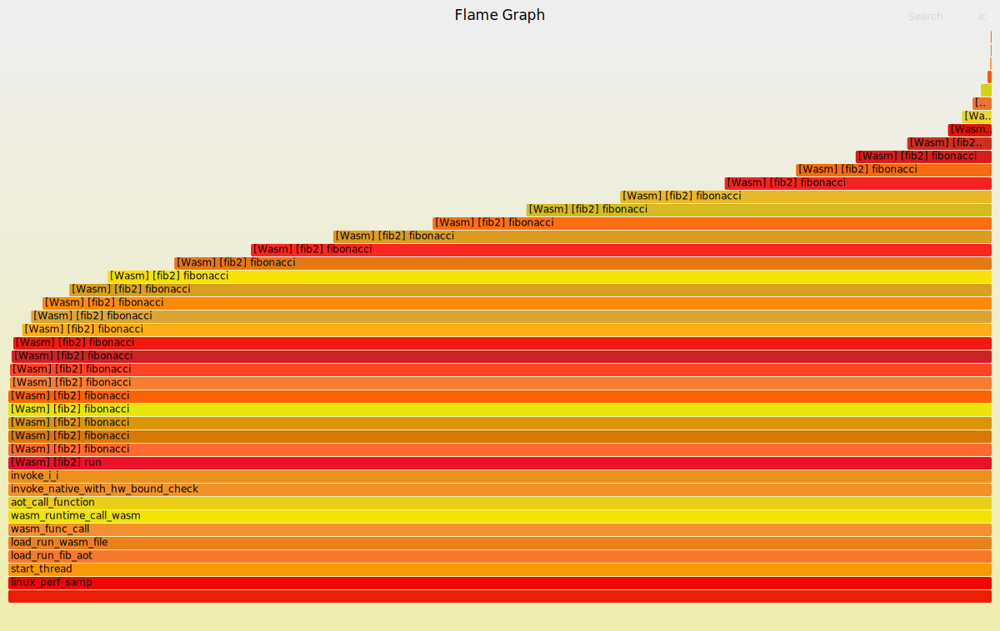

# linux perf sample introduction

This is a sample to show how to use the Linux perf tool to profile the execution of a WebAssembly application. And how to use the [Flamegraph](https://www.brendangregg.com/flamegraphs.html) tool to visualize the profiling result.

## Build and run the sample

There are two Wasm modules and their instance will be created and run in the sample. [The first module](./wasm/fib.c) is a simple Wasm module that calculates the Fibonacci number. [The second module](./wasm/ackermann.c) is a simple Wasm module that execute the Ackermann function. The target is enable to profile the execution of both two modules separately.

```bash
$ cmake -S . -B build
$ cmake --build build
```

### Profile the execution

```bash
$ cd build
$ perf record -k mono -g --output=perf.data -- ./linux_perf_sample
```

Enable to use `perf report --stdio` to do a quick analysis of the profiling result.

### Visualize the profiling result

Need to download Flamegraph tool from [Flamegraph](https://github.com/brendangregg/FlameGraph/releases/tag/v1.0) firstly.

```bash
$ perf script > out.perf
$ ./FlameGraph/stackcollapse-perf.pl out.perf > out.folded
$ ./FlameGraph/flamegraph.pl out.folded > perf.svg
```

In this result, you'll see two modules' profiling result and all wasm functions are named as "aot_func#N" which is a little hard to distinguish.


### Separate profiling result

[process_folded_data.py](../../test-tools/flame-graph-helper/process_folded_data.py) is a script can a) translate "aot_func#N" into its original function name in name sections, b) separate the profiling result of different modules.

In this sample, we want to separate `fib` and `ackermann` profiling data from _out.folded_. In [demo](host/demo.c), we decide to name the module of `fib1.wasm` as `fib2` and the module of `ackermann1.wasm` as `ackermann2`.

```bash
$ python process_folded_data.py --wabt_home /opt/wabt --wasm_names fib2=./fib1.wasm,ackermann2=./ackermann1.wasm out.folded
-> write into out.fib2.translated
-> write into out.ackermann2.translated
-> write into out.translated
```

More scenarios:

if only using one wasm during profiling, the script can be used like this:

```bash
$ python process_folded_data.py --wabt_home /opt/wabt --wasm <wasm_file> --folded <folded_file>
```

if only using one wasm during profiling and specify the module name via APIs, the script can be used like this:

```bash
$ python process_folded_data.py --wabt_home /opt/wabt --wasm_names <module name>=<wasm_file> --folded <folded_file>
```

if only using one wasm during profiling and specify the module name, which is same with the basename of wasm file, via APIs, the script can be used like this:

```bash
$ python process_folded_data.py --wabt_home /opt/wabt --wasm <wasm_file> --folded <folded_file>
```

if using multiple wasm during profiling and specify module names, which are same with basename of wasm files, via APIs, the script can be used like this:

```bash
$ python process_folded_data.py --wabt_home /opt/wabt --wasm <wasm_file> --wasm <wasm_file> --wasm <wasm_file> --folded <folded_file>
```

if using multiple wasm during profiling and specify module names via APIs, the script can be used like this:

```bash
$ python process_folded_data.py --wabt_home /opt/wabt --wasm_names <module_name>=<wasm_file>,<module_name>=<wasm_file>,<module_name>=<wasm_file> --folded <folded_file>
```

Now we have two flame-graphs for two wasm modules:




## Reference

- [perf_tune](../../doc/perf_tune.md)
