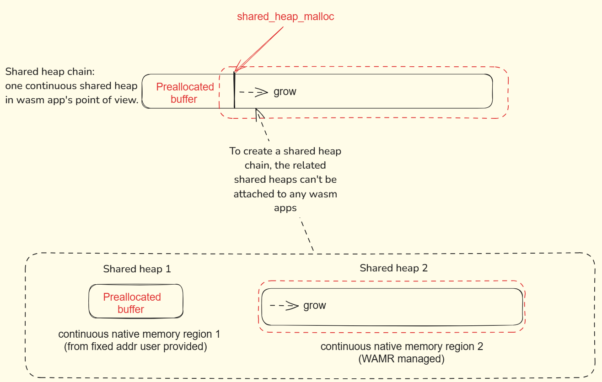

# Shared heap Sample introduction

This is a sample to show how to use the shared heap feature in WAMR. The shared heap feature allows multiple WASM instances to share the same memory space. This feature is useful when you want to run multiple WASM instances in the same process and share data between them. The sandbox nature of WASM is still maintained in the shared heap by WAMR. But the data management and correct data synchronization in shared heap is relied on the user's implementation.

> Note: The shared heap feature is experimental feature, it should be used with caution. It's optional and only available when building WAMR with the CMake cache variable `WAMR_BUILD_SHARED_HEAP` set to 1.

## Build and run the sample

To build the shared heap used in multi thread sample and the shared heap chain sample with following commands:

```bash
cmake -S . -B build
cmake --build build
```

For the shared heap sample, it demonstrates how to create a shared heap and use it shares data between two WASM instances, which would satisfy most of the use cases. Use the following commands to run the sample:

```bash
cd build
./shared_heap_test
```

For the shared heap chain sample. It chains a pre-allocated heap and a normal shared heap to one chain(linked list) as a whole and attaches/detaches all together, and pass the WASM address directly between two WASM instances. Use the following commands to run the sample:

```bash
cd build
./shared_heap_chain_test
```

## How to use shared heap

The shared heap is an advanced feature in WAMR that gives the user flexibility to share data between multiple WASM instances(it will be the same address mapping for different WASM instance) or between WebAssembly and the host without incurring any copy overhead. The shared heap can be regarded as an extension of the WebAssembly linear memory. But it also heavily relies on the user's implementation to manage the shared data correctly. The following are some takeaway points to help the user use the shared heap correctly.

### Create and manage shared heap

You can create a shared heap by calling the `wasm_runtime_create_shared_heap(SharedHeapInitArgs *init_args)` API. And based on the `init_args`, you can create a shared heap in two ways:

1. WAMR managed shared heap: when only `init_args.size` is given and `init_args.pre_allocated_addr` stays as NULL, WAMR will allocate a shared heap(not from the linear memory) with the given size. The shared heap will be managed by WAMR, the wasm app or host(WAMR users) can dynamically manage memory from it by calling `wasm_runtime_shared_heap_malloc()` and `wasm_runtime_shared_heap_free()` on demand. Only the memory allocated from the shared heap is valid and can be shared, not the unallocated part of shared heap memory. And it will be automatically freed when runtime is destroyed(when `wasm_runtime_destroy()` is called).

2. Preallocated shared heap: the user can also use a pre-allocated memory(it can be allocated from the system heap, or is a static global buffer, the correctness of its accessibility and size needs to be ensured by the user) as a shared heap by giving `init_args.pre_allocated_addr` and `init_args.size`. This kind of shared heap serves as an area for data exchange, primarily between the host and WebAssembly. Any data within this area can be directly accessed by both sides (assuming the layout of the data structure is known). For instance, the host can store large structured variables in this space, allowing the WebAssembly application to operate on them without the need for copying. And the pre-allocated memory will relies on user to manage its life cycle.

After creation, the shared heap can be attached to a WASM instance(an additional segment appended to the end of the linear memory) by calling `wasm_runtime_attach_shared_heap(wasm_module_inst_t module_inst, wasm_shared_heap_t shared_heap)`. And it can be detached by calling `wasm_runtime_detach_shared_heap(wasm_module_inst_t module_inst)`. So that the data sharing can only happen between the WASM instances that have the same shared heap attached, complete by user's choice.

#### Shared heap chain

Sometimes you may want to use multiple shared heaps to attach together as a chain(linked list) and to share data more flexibly. You can call `wasm_runtime_chain_shared_heaps(wasm_shared_heap_t head, wasm_shared_heap_t body)` to chain two shared heaps together. The shared heap list remains one continuous shared heap in wasm app's point of view. To create a shared heap chain, the shared heaps can't be currently attached to any WASM instance.

> PS: At most one shared heap in shared heap list can be  WAMR managed shared heap, the rest have to be the pre-allocated shared heap.


