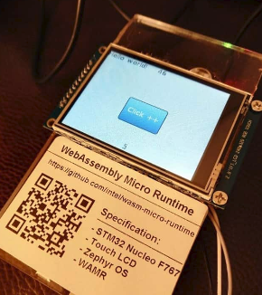
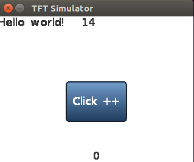

"littlevgl" sample introduction
==============
This sample demonstrates that a graphic user interface application in WebAssembly by compiling the LittlevGL v5.3, an open-source embedded 2d graphic library into the WASM bytecode.

In this sample, the whole LittlevGL v5.3 source code is built into the WebAssembly code with the user application. The platform interfaces defined by LittlevGL is implemented in the runtime and registered for WASM application through calling wasm_runtime_full_init().

```C
static NativeSymbol native_symbols[] = {
    EXPORT_WASM_API_WITH_SIG(display_input_read, "(*)i"),
    EXPORT_WASM_API_WITH_SIG(display_flush, "(iiii*)"),
    EXPORT_WASM_API_WITH_SIG(display_fill, "(iiii*)"),
    EXPORT_WASM_API_WITH_SIG(display_vdb_write, "(*iii*i)"),
    EXPORT_WASM_API_WITH_SIG(display_map, "(iiii*)"),
    EXPORT_WASM_API_WITH_SIG(time_get_ms, "()i")
};
```

The runtime component supports building target for Linux and Zephyr/STM Nucleo board. The beauty of this sample is the WebAssembly application can have identical display and behavior when running from both runtime environments. That implies we can do majority of application validation from desktop environment as long as two runtime distributions support the same set of application interface.


Below pictures show the WASM application is running on an STM board with an LCD touch panel.






The number on top will plus one each second, and the number on the bottom will plus one when clicked. When users click the blue button, the WASM application increases the counter, and the latest counter value is displayed on the top banner of the touch panel.

The sample also provides the native Linux version of application without the runtime under folder "vgl-native-ui-app". It can help to check differences between the implementations in native and WebAssembly.

Test on Linux
================================

Install required SDK and libraries
--------------
- 32 bit SDL(simple directmedia layer) (Note: only necessary when `WAMR_BUILD_TARGET` is set to `X86_32` when building WAMR runtime)
Use apt-get:
  ```bash
  sudo apt-get install libsdl2-dev:i386
  ```
Or download source from www.libsdl.org:
  ```bash
  ./configure C_FLAGS=-m32 CXX_FLAGS=-m32 LD_FLAGS=-m32
  make
  sudo make install
  ```
- 64 bit SDL(simple directmedia layer) (Note: only necessary when `WAMR_BUILD_TARGET` is set to `X86_64` when building WAMR runtime)
Use apt-get:
  ```bash
  sudo apt-get install libsdl2-dev
  ```
Or download source from www.libsdl.org:
  ```bash
  ./configure
  make
  sudo make install
  ```

Build and Run
--------------

- Build
  ```bash
  ./build.sh
  ```
    All binaries are in "out", which contains "host_tool", "vgl_native_ui_app", "ui_app.wasm" "ui_app_no_wasi.wasm "and "vgl_wasm_runtime".
- Run the native Linux build of the lvgl sample (no wasm)
  ```bash
  ./vgl_native_ui_app
  ```

- Run WASM VM Linux applicaton & install WASM APP
 First start vgl_wasm_runtime in server mode.
  ```bash
  ./vgl_wasm_runtime -s
  ```
 Then install and uninstall wasm APPs by using host tool.
  ```bash
  ./host_tool -i ui_wasi -f ui_app_wasi.wasm
  ./host_tool -q
  ./host_tool -u ui_wasi
  ./host_tool -i ui_no_wasi -f ui_app_builtin_libc.wasm
  ./host_tool -q
  ./host_tool -u ui_no_wasi
  ```

Test on Zephyr
================================
We can use a STM32 NUCLEO_F767ZI  board with ILI9341 display and XPT2046 touch screen to run the test. Then use host_tool to remotely install wasm app into STM32.
- Build WASM VM into Zephyr system
  a. clone zephyr source code
  Refer to [Zephyr getting started](https://docs.zephyrproject.org/latest/getting_started/index.html).

  ```bash
  west init zephyrproject
  cd zephyrproject/zephyr
  git checkout zephyr-v2.3.0
  cd ..
  west update
  ```

  b. copy samples
  ```bash
  cd zephyr/samples/
  cp -a <wamr_root>/samples/littlevgl/vgl-wasm-runtime vgl-wasm-runtime
  cd vgl-wasm-runtime/zephyr_build
  ```
  c. create a link to wamr root dir
  ```bash
  ln -s <wamr_root> wamr
  ```

d. build source code
  Since ui_app incorporated LittlevGL source code, so it needs more RAM on the device to install the application.  It is recommended that RAM SIZE not less than 380KB. In our test use nucleo_f767zi, which is supported by Zephyr. Since the littlevgl wasm app is quite big (~100KB in wasm format and ~200KB in AOT format ), there isn't enough SRAM to build interpreter and AOT together. You can only choose one of them:

  - Interpreter
  ```bash
  mkdir build && cd build
  source ../../../../zephyr-env.sh
  cmake -GNinja -DBOARD=nucleo_f767zi -DWAMR_BUILD_INTERP=1 -DWAMR_BUILD_AOT=0 ..
  ninja flash
  ```

  - AOT
  ```bash
  mkdir build && cd build
  source ../../../../zephyr-env.sh
  cmake -GNinja -DBOARD=nucleo_f767zi -DWAMR_BUILD_INTERP=0 -DWAMR_BUILD_AOT=1 ..
  ninja flash
  ```

- Hardware Connections

```
+-------------------+-+------------------+
|NUCLEO-F767ZI       | ILI9341  Display  |
+-------------------+-+------------------+
| CN7.10             |         CLK       |
+-------------------+-+------------------+
| CN7.12             |         MISO      |
+-------------------+-+------------------+
| CN7.14             |         MOSI      |
+-------------------+-+------------------+
| CN11.1             | CS1 for ILI9341   |
+-------------------+-+------------------+
| CN11.2             |         D/C       |
+-------------------+-+------------------+
| CN11.3             |         RESET     |
+-------------------+-+------------------+
| CN9.25             |    PEN interrupt  |
+-------------------+-+------------------+
| CN9.27             |  CS2 for XPT2046  |
+-------------------+-+------------------+
| CN10.14            |    PC UART RX     |
+-------------------+-+------------------+
| CN11.16            |    PC UART RX     |
+-------------------+-+------------------+
```

- Install WASM application to Zephyr using host_tool
First, connect PC and STM32 with UART. Then install to use host_tool.
  ```bash
  sudo ./host_tool -D /dev/ttyUSBXXX -i ui_app -f ui_app_builtin_libc.wasm
  # /dev/ttyUSBXXX is the UART device, e.g. /dev/ttyUSB0
  ```
**Note**: WASI is unavailable on zephyr currently, so you have to use the ui_app_builtin_libc.wasm which doesn't depend on WASI.

- Install AOT version WASM application
  ```bash
  wamrc --target=thumbv7 --target-abi=eabi --cpu=cortex-m7 -o ui_app_no_wasi.aot ui_app_builtin_libc.wasm
  ./host_tool -D /dev/ttyUSBXXX -i ui_app -f ui_app_no_wasi.aot
  ```

