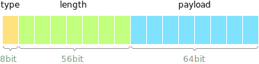
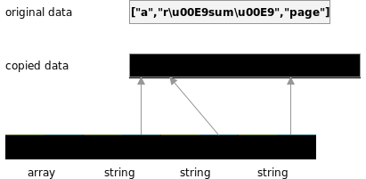
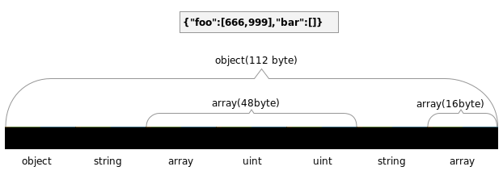
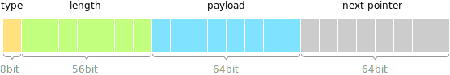
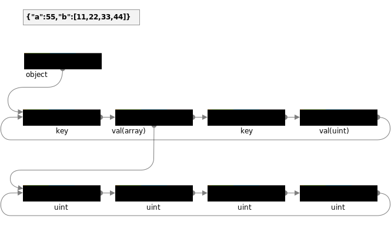

Data Structures
===============

yyjson consists of two types of data structures: immutable and mutable.

|          | Immutable  | Mutable        |
|----------|------------|----------------|
| Document | yyjson_doc | yyjson_mut_doc |
| Value    | yyjson_val | yyjson_mut_val |

- Immutable data structures are returned when reading a JSON document. They cannot be modified.
- Mutable data structures are created when building a JSON document. They can be modified.
- yyjson also provides some functions to convert between these two types of data structures.

Please note that the data structures described in this document are considered private, and it is recommended to use the public API to access them.

---------------
## Immutable Value
Each JSON value is stored in an immutable `yyjson_val` struct:
```c
struct yyjson_val {
    uint64_t tag;
    union {
        uint64_t    u64;
        int64_t     i64;
        double      f64;
        const char *str;
        void       *ptr;
        size_t      ofs;
    } uni;
}
```


The type of the value is stored in the lower 8 bits of the `tag`.<br/>
The size of the value, such as string length, object size, or array size, is stored in the higher 56 bits of the `tag`.

Modern 64-bit processors are typically limited to supporting fewer than 64 bits for RAM addresses ([Wikipedia](https://en.wikipedia.org/wiki/RAM_limit)). For example, Intel64, AMD64, and ARMv8 have a 52-bit (4PB) physical address limit. Therefore, it is safe to store the type and size information within the 64-bit `tag`.

## Immutable Document
A JSON document stores all strings in a **contiguous** memory area.<br/> 
Each string is unescaped in-place and ended with a null-terminator.<br/>
For example:




A JSON document stores all values in another **contiguous** memory area.<br/>
The `object` and `array` containers store their own memory usage, allowing easy traversal of the child values.<br/>
For example:



---------------
## Mutable Value
Each mutable JSON value is stored in an `yyjson_mut_val` struct:
```c
struct yyjson_mut_val {
    uint64_t tag;
    union {
        uint64_t    u64;
        int64_t     i64;
        double      f64;
        const char *str;
        void       *ptr;
        size_t      ofs;
    } uni;
    yyjson_mut_val *next;
}
```


The `tag` and `uni` fields are the same as the immutable value, and the `next` field is used to build a linked list.


## Mutable Document
A mutable JSON document is composed of multiple `yyjson_mut_val`.

The child values of an `object` or `array` are linked as a cycle,<br/>
the parent holds the **tail** of the circular linked list, enabling yyjson to perform operations `append`, `prepend` and `remove_first` in constant time.

For example:




---------------
## Memory Management

A JSON document (`yyjson_doc`, `yyjson_mut_doc`) is responsible for managing the memory of all its JSON values and strings. When a document it is no longer needed, it is important for the user to call `yyjson_doc_free()` or `yyjson_mut_doc_free()` to free the memory associated with it.

A JSON value (`yyjson_val`, `yyjson_mut_val`) has the same lifetime as its document. The memory is managed by its
 document and and cannot be freed independently.

For more information, refer to the API documentation.
