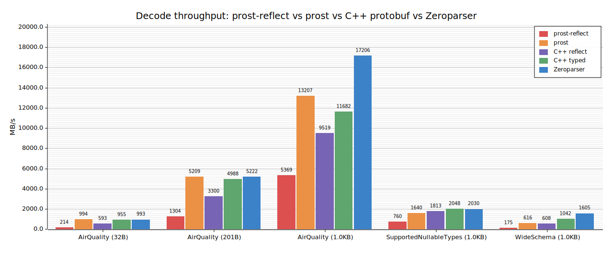

# Zeroparser

Zero-copy, single-pass protobuf parser driven by a `DescriptorProto`. Parses
nested messages in one O(N) traversal; all string and byte values borrow from
the input buffer.

Ships as part of the [Zerobus SDK](https://github.com/databricks/zerobus-sdk)
behind the optional `zeroparser` feature flag — there is no standalone
`zeroparser` crate on crates.io.

## Why

`prost-reflect`'s `DynamicMessage` is convenient when you have a schema only at
runtime, but each decode allocates a tree of owned values. Zeroparser keeps the
same "schema known only at runtime" property while avoiding those allocations:
fields are stored in two pre-sized arrays indexed via a per-descriptor field
cache, and `&str`/`&[u8]` values point straight into the input.

## Benchmark

`cargo bench --features zeroparser --bench zeroparser_bench_plot` writes
`bench_plot.svg`:



Five decoders on the same bytes, each parsing and walking every field once
(the streaming-ingestion case — no field skipping). Three carry a
runtime-only schema (`prost-reflect`, C++ Reflection, Zeroparser); two are
compile-time-typed (`prost`, C++ generated accessors).

| Schema                 | Record size | prost-reflect | prost      | C++ reflect | C++ typed  | Zeroparser  |
| ---------------------- | ----------- | ------------- | ---------- | ----------- | ---------- | ----------- |
| AirQuality             | 32 B        | ~214 MB/s     | ~954 MB/s  | ~593 MB/s   | ~955 MB/s  | ~1010 MB/s  |
| AirQuality             | ~200 B      | ~1283 MB/s    | ~4942 MB/s | ~3300 MB/s  | ~4988 MB/s | ~5366 MB/s  |
| AirQuality             | 1 KB        | ~5438 MB/s    | ~13491 MB/s| ~9519 MB/s  | ~11682 MB/s| ~18686 MB/s |
| SupportedNullableTypes | 1 KB        | ~763 MB/s     | ~1618 MB/s | ~1813 MB/s  | ~2048 MB/s | ~2057 MB/s  |
| WideSchema             | 1 KB        | ~176 MB/s     | ~624 MB/s  | ~608 MB/s   | ~1042 MB/s | ~1621 MB/s  |

Vs runtime-schema peers, Zeroparser is 4–9x faster than `prost-reflect` and
1.1–2.8x faster than C++ Reflection. Vs compile-time-typed peers
(`prost`, C++ typed), it keeps pace on small messages and pulls ahead on
larger/wider ones — despite carrying a runtime descriptor that they don't.
The advantage widens with field count: the WideSchema row (100 device-telemetry
fields) makes per-message overhead the bottleneck for reflection-based decoders
— `prost-reflect` drops to ~176 MB/s while Zeroparser holds ~1.6 GB/s (~9x). It
is also the one schema where Zeroparser outruns even C++'s generated accessors
(~1621 vs ~1042 MB/s), because its pre-sized field cache and zero-copy
`&str`/`&[u8]` layout amortize best when there are many fields to touch.

Each Rust measurement is averaged over 3 trials in-bench; C++ values come from
an out-of-tree harness against libprotobuf 32.1 — AirQuality and
SupportedNullableTypes are the mean of 6 runs, WideSchema the mean of 3 (see
`benches/README.md`).

Measured on: Apple M4 Max (16-core, arm64), 64 GB RAM, macOS 26.4.1, rustc
1.90.0, libprotobuf 32.1, clang++ from Apple Xcode.

## Quick start

Enable the feature in your `Cargo.toml`:

```toml
[dependencies]
databricks-zerobus-ingest-sdk = { version = "...", features = ["zeroparser"] }
```

Then:

```rust
use prost_types::DescriptorProto;
use databricks_zerobus_ingest_sdk::zeroparser::{
    parser::ParsedMessage, types::FieldValueRef, MessageRegistry, ParseResult,
};

# fn run(descriptor: DescriptorProto, bytes: &[u8]) -> ParseResult<()> {
let registry = MessageRegistry::from_descriptor(&descriptor);
let parsed = ParsedMessage::parse(bytes, &registry)?;

if let Some(FieldValueRef::String(s)) = parsed.get_scalar(1) {
    println!("field 1 = {s}");
}
# Ok(()) }
```

### API

| Method                             | Returns                                             |
| ---------------------------------- | --------------------------------------------------- |
| `has_field(field_num)`             | `bool`                                              |
| `get_scalar(field_num)`            | `Option<&FieldValueRef>`                            |
| `get_message(field_num)`           | `Option<&ParsedMessage>`                            |
| `get_repeated_scalars(field_num)`  | `&[FieldValueRef]`                                  |
| `get_repeated_messages(field_num)` | `&[ParsedMessage]`                                  |
| `get_map_entries(field_num)`       | `impl Iterator<Item=(&MapKeyRef, &ParsedMapValue)>` |

## Test and bench commands

From `rust/sdk/`:

```
cargo test --features zeroparser --lib                          # unit tests inline in src/zeroparser/*.rs
cargo test --features zeroparser --test zeroparser_e2e          # integration tests in src/zeroparser/tests/e2e.rs
cargo test --features zeroparser                                # everything: lib + integration + doc tests
cargo bench --features zeroparser --bench zeroparser_parser_bench   # full criterion sweep
cargo bench --features zeroparser --bench zeroparser_bench_plot     # produces bench_plot.svg
```

Or from anywhere in the workspace, `cargo test --workspace` covers it — the
`rust/tests` member enables the `zeroparser` feature on the SDK so the moved
tests run as part of normal CI.

Requires `protoc` on `PATH` for the build script (used to compile the test and
bench `.proto` files). On Debian/Ubuntu: `apt install protobuf-compiler`.

## Layout

```
rust/sdk/src/zeroparser/
  mod.rs                  — module entry: doc, mod decls, re-exports
  wire.rs                 — wire format, varint parsing, field decoding
  registry.rs             — MessageRegistry, field descriptor caching
  parser.rs               — single-pass recursive parser
  types.rs                — FieldValueRef, ComplexType, conversions
  errors.rs               — ParseError, ParseResult
  sparse_field_map.rs     — O(1) per-descriptor field lookup
  owned.rs                — owning wrapper
  tests/                  — integration tests (wired via [[test]] in sdk/Cargo.toml)
    e2e.rs
    common/mod.rs
    proto/                — proto2/proto3 fixtures compiled by sdk/build.rs
  benches/                — criterion sweep + MB/s bar plot
    parser_bench.rs       — full criterion sweep
    bench_plot.rs         — produces bench_plot.svg
    bench_plot.svg        — committed throughput plot (regenerated by bench_plot.rs)
    common/mod.rs
    proto/                — AirQuality, SupportedNullableTypes, WideSchema
```

The proto fixtures are compiled in `rust/sdk/build.rs` only when the
`zeroparser` feature is enabled (`CARGO_FEATURE_ZEROPARSER` env check), so
consumers without the feature don't pay for the proto build step.
