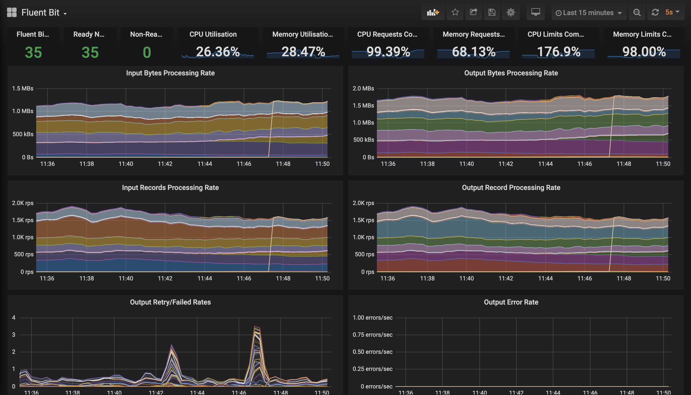

# Monitoring

Fluent Bit exposes [prometheus style
metrics](https://docs.fluentbit.io/manual/administration/monitoring).

These can be leveraged to create useful alerts in dashboards.

## Grafana Dashboard

The provided [example dashboard](./dashboard.json) is heavily inspired by [Banzai Cloud](https://banzaicloud.com/)'s [logging
operator dashboard](https://grafana.com/grafana/dashboards/7752) but with a few key
differences such as the use of the `instance` label (see [why
here](https://www.robustperception.io/controlling-the-instance-label)),
stacked graphs and a focus on Fluent Bit metrics.

## Alerts

Sample alerts are available [here](./alerts.yaml).
